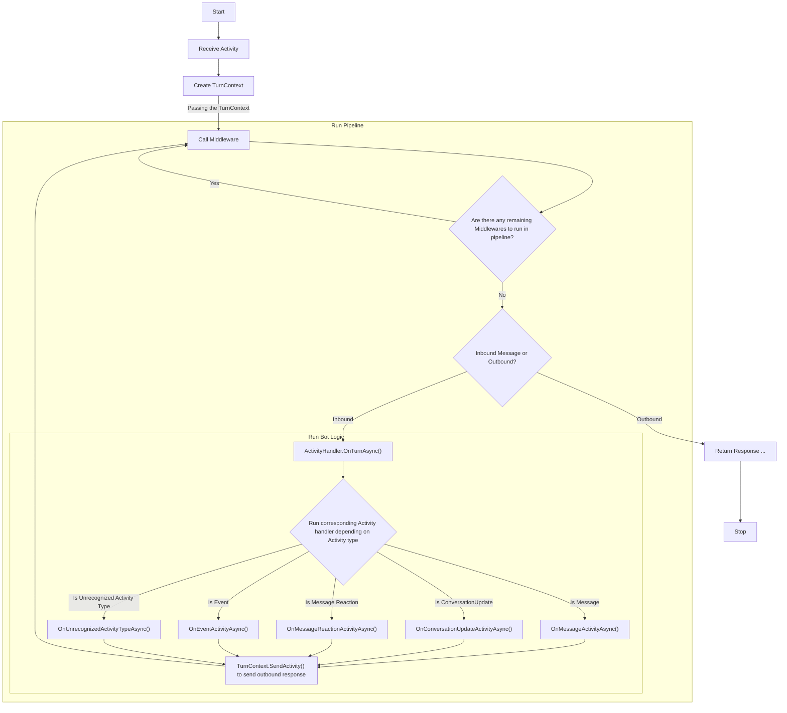

## `BotFrameworkAdapter.ProcessActivityAsync()`

```mermaid
    graph TD
    Start --> ReceiveActivity[Receive Activity]
    ReceiveActivity --> CreateTC[Create TurnContext]
    CreateTC --> |Passing the TurnContext|Middleware[Call Middleware]
    subgraph CallMiddleware[Run Pipeline]
    Middleware --> HasMiddlewareInQueue{Are there any remaining Middlewares to run in pipeline?} 
    HasMiddlewareInQueue --> |Yes| Middleware
    HasMiddlewareInQueue --> |No| InOrOut{"Inbound Message or Outbound?"}
    InOrOut --> |Inbound| BotLogic["ActivityHandler.OnTurnAsync()"]
        subgraph Run Bot Logic
            BotLogic --> CorrespondingActivityHandler{"Run corresponding Activity handler depending on Activity type"}
            CorrespondingActivityHandler --> |Is Message| OnMessage["OnMessageActivityAsync()"]
            CorrespondingActivityHandler --> |Is ConversationUpdate| OnConversationUpdate["OnConversationUpdateActivityAsync()"]
            CorrespondingActivityHandler --> |Is Message Reaction| OnMessageReaction["OnMessageReactionActivityAsync()"]
            CorrespondingActivityHandler --> |Is Event| OnEvent["OnEventActivityAsync()"]
            CorrespondingActivityHandler --> |Is Unrecognized Activity Type| OnUncrecognizedActivityType["OnUnrecognizedActivityTypeAsync()"]
        OnMessage --> SendActivity["TurnContext.SendActivity() to send response"]
        OnConversationUpdate --> SendActivity["TurnContext.SendActivity() to send response"]
        OnMessageReaction --> SendActivity["TurnContext.SendActivity() to send response"]
        OnEvent --> SendActivity["TurnContext.SendActivity() to send response"]
        OnUncrecognizedActivityType --> SendActivity["TurnContext.SendActivity() to send outbound response"]
        end
        SendActivity --> Middleware
    end
    InOrOut --> |Outbound| ReturnResponse[Return Response ...]
    ReturnResponse --> Stop
```