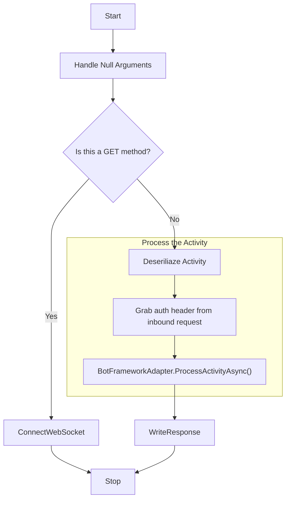

## `BotFrameworkHttpAdapter.ProcessAsync()`

```mermaid
    graph TD
    Start --> NullArgs[Handle Null Arguments]
    NullArgs --> IsGet{Is this a GET method?}
    IsGet -->|Yes| ConnectWebSocket
    IsGet -->|No| Deserialize[Deseriliaze Activity]
    subgraph Process the Activity
    Deserialize --> Auth[Grab auth header from inbound request]
    Auth --> ProcessActivityAsync["BotFrameworkAdapter.ProcessActivityAsync()"]
    end
    ProcessActivityAsync --> WriteResponse
    ConnectWebSocket --> Stop
    WriteResponse --> Stop
```