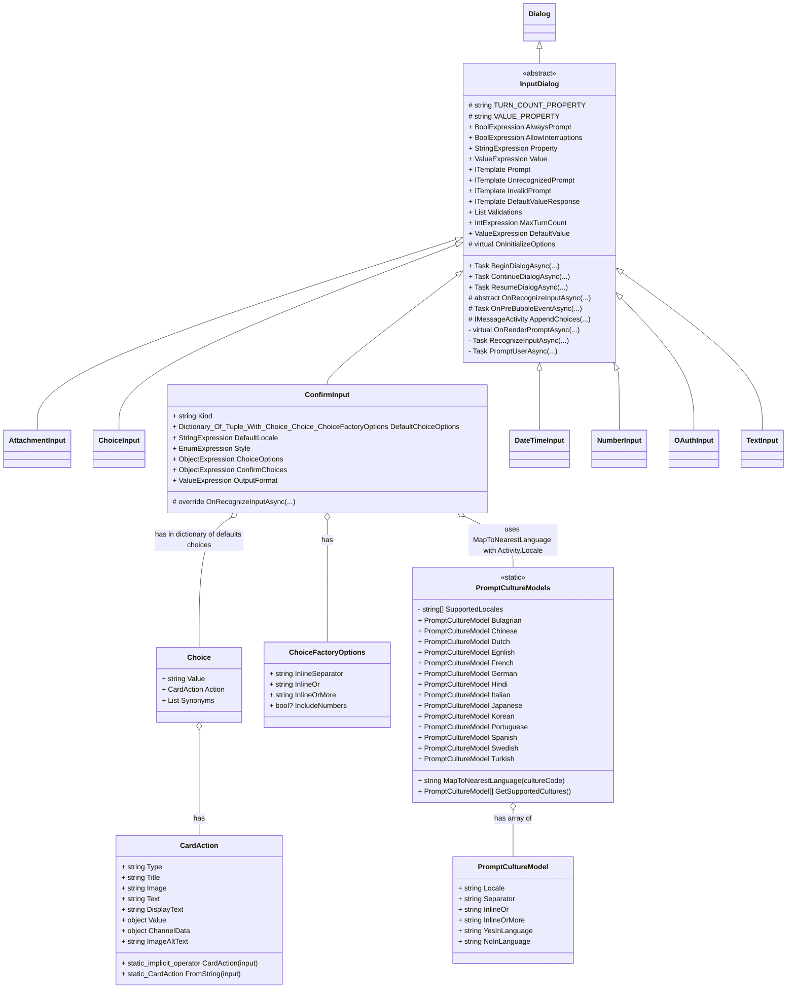

```mermaid
classDiagram

Dialog <|-- InputDialog
InputDialog <|-- AttachmentInput
InputDialog <|-- ChoiceInput
InputDialog <|-- ConfirmInput
InputDialog <|-- DateTimeInput
InputDialog <|-- NumberInput
InputDialog <|-- OAuthInput
InputDialog <|-- TextInput

ConfirmInput o-- Choice : has in dictionary of defaults choices
ConfirmInput o-- ChoiceFactoryOptions : has
ConfirmInput o-- PromptCultureModels : uses MapToNearestLanguage with Activity.Locale
PromptCultureModels o-- PromptCultureModel : has array of

Choice o-- CardAction : has

class InputDialog {
    <<abstract>>
    # string TURN_COUNT_PROPERTY
    # string VALUE_PROPERTY
    + BoolExpression AlwaysPrompt
    + BoolExpression AllowInterruptions
    + StringExpression Property
    + ValueExpression Value
    + ITemplate<Activity> Prompt
    + ITemplate<Activity> UnrecognizedPrompt
    + ITemplate<Activity> InvalidPrompt
    + ITemplate<Activity> DefaultValueResponse
    + List<BoolExpression> Validations
    + IntExpression MaxTurnCount
    + ValueExpression DefaultValue

    + Task<DialogTurnResult> BeginDialogAsync(...)
    + Task<DialogTurnResult> ContinueDialogAsync(...)
    + Task<DialogTurnResult> ResumeDialogAsync(...)
    # abstract OnRecognizeInputAsync(...)
    # Task<bool> OnPreBubbleEventAsync(...)
    # IMessageActivity AppendChoices(...)
    # virtual OnInitializeOptions
    - virtual OnRenderPromptAsync(...)
    - Task<InputState> RecognizeInputAsync(...)
    - Task<DialogTurnResult> PromptUserAsync(...)
}

class ConfirmInput {
    + string Kind
    + Dictionary_Of_Tuple_With_Choice_Choice_ChoiceFactoryOptions DefaultChoiceOptions
    + StringExpression DefaultLocale
    + EnumExpression<ListStyle> Style
    + ObjectExpression<ChoiceFactoryOptions> ChoiceOptions
    + ObjectExpression<ChoiceSet> ConfirmChoices
    + ValueExpression OutputFormat
    # override OnRecognizeInputAsync(...)

}

class PromptCultureModels {
    <<static>>
    - string[] SupportedLocales
    + PromptCultureModel Bulagrian
    + PromptCultureModel Chinese
    + PromptCultureModel Dutch
    + PromptCultureModel Egnlish
    + PromptCultureModel French
    + PromptCultureModel German
    + PromptCultureModel Hindi
    + PromptCultureModel Italian
    + PromptCultureModel Japanese
    + PromptCultureModel Korean
    + PromptCultureModel Portuguese
    + PromptCultureModel Spanish
    + PromptCultureModel Swedish
    + PromptCultureModel Turkish
    + string MapToNearestLanguage(cultureCode)
    + PromptCultureModel[] GetSupportedCultures()
}

class PromptCultureModel {
    + string Locale
    + string Separator
    + string InlineOr
    + string InlineOrMore
    + string YesInLanguage
    + string NoInLanguage
}

class Choice {
    + string Value
    + CardAction Action
    + List<string> Synonyms
}

class CardAction {
    + string Type
    + string Title
    + string Image
    + string Text
    + string DisplayText
    + object Value
    + object ChannelData
    + string ImageAltText
    + static_implicit_operator CardAction(input)
    + static_CardAction FromString(input)
}

class ChoiceFactoryOptions {
    + string InlineSeparator
    + string InlineOr
    + string InlineOrMore
    + bool? IncludeNumbers
}
```

