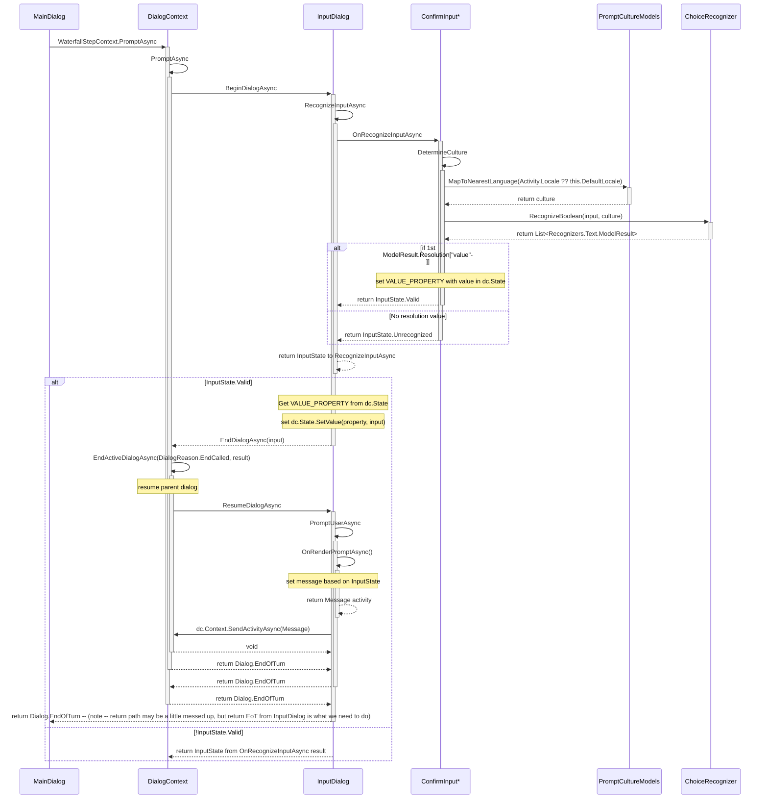
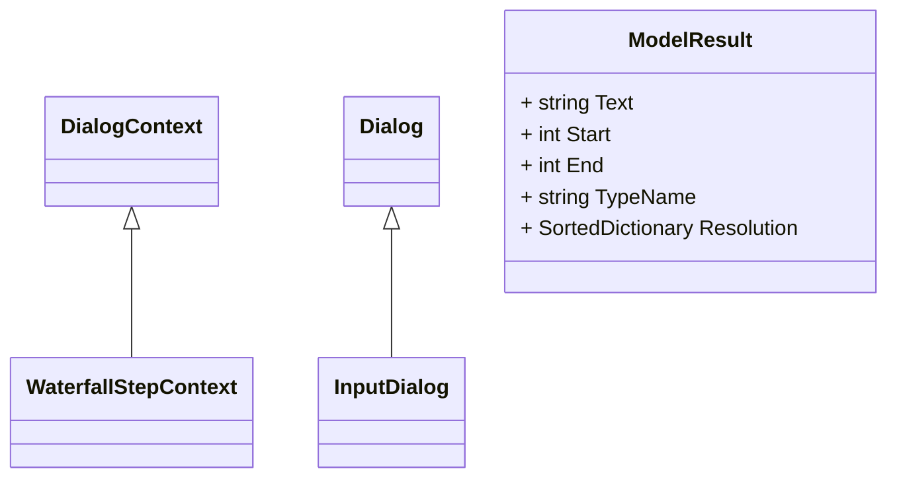

```mermaid
sequenceDiagram
participant MainDialog
participant DialogContext
participant InputDialog
participant ConfirmInput as ConfirmInput*
participant PromptCultureModels
participant ChoiceRecognizer

MainDialog ->>+ DialogContext : WaterfallStepContext.PromptAsync 
    DialogContext ->>+ DialogContext : PromptAsync
        DialogContext ->>+ InputDialog : BeginDialogAsync
            InputDialog ->>+ InputDialog : RecognizeInputAsync
                InputDialog ->>+ ConfirmInput : OnRecognizeInputAsync
                    ConfirmInput ->>+ ConfirmInput : DetermineCulture
                        ConfirmInput ->>+ PromptCultureModels : MapToNearestLanguage(Activity.Locale ?? this.DefaultLocale)
                        PromptCultureModels -->>- ConfirmInput : return culture
                    
                    ConfirmInput ->>+ ChoiceRecognizer : RecognizeBoolean(input, culture)
                    ChoiceRecognizer -->>- ConfirmInput : return List<Recognizers.Text.ModelResult>
                    
                    alt if 1st ModelResult.Resolution["value"]
                        Note over ConfirmInput : set VALUE_PROPERTY with value in dc.State
                        ConfirmInput -->>- InputDialog : return InputState.Valid
                    else No resolution value
                        ConfirmInput -->>- InputDialog : return InputState.Unrecognized
                    end
                
                InputDialog -->>- InputDialog : return InputState to RecognizeInputAsync

                alt InputState.Valid
                    Note over InputDialog: Get VALUE_PROPERTY from dc.State
                    Note over InputDialog: set dc.State.SetValue(property, input)
                    InputDialog -->>- DialogContext : EndDialogAsync(input)
                        
                        DialogContext ->>+ DialogContext : EndActiveDialogAsync(DialogReason.EndCalled, result)
                        
                        Note over DialogContext: resume parent dialog
                        DialogContext ->>+ InputDialog: ResumeDialogAsync
                            InputDialog ->>+ InputDialog : PromptUserAsync
                                InputDialog ->>+ InputDialog : OnRenderPromptAsync()
                                    Note over InputDialog : set message based on InputState
                                InputDialog -->>- InputDialog : return Message activity

                                InputDialog ->> DialogContext : dc.Context.SendActivityAsync(Message)
                                DialogContext -->>- InputDialog : void

                                DialogContext -->>- InputDialog : return Dialog.EndOfTurn
                            InputDialog -->>- DialogContext: return Dialog.EndOfTurn

                        DialogContext -->>- InputDialog: return Dialog.EndOfTurn
        InputDialog -->>- MainDialog: return Dialog.EndOfTurn -- (note -- return path may be a little messed up, but return EoT from InputDialog is what we need to do)

                else !InputState.Valid
                    InputDialog -->> DialogContext : return InputState from OnRecognizeInputAsync result
                end

```                 
- `ConfirmInput` can be any of the `InpuDialog` subclasses

```mermaid
classDiagram
DialogContext <|-- WaterfallStepContext

Dialog <|-- InputDialog

class ModelResult {
    + string Text
    + int Start
    + int End
    + string TypeName
    + SortedDictionary<string, object> Resolution
}
```