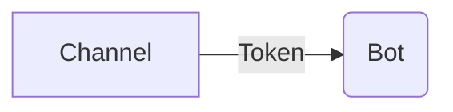
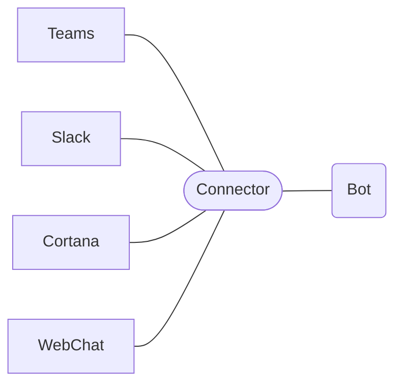
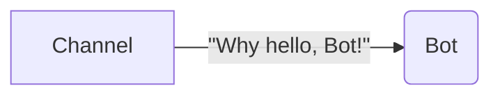
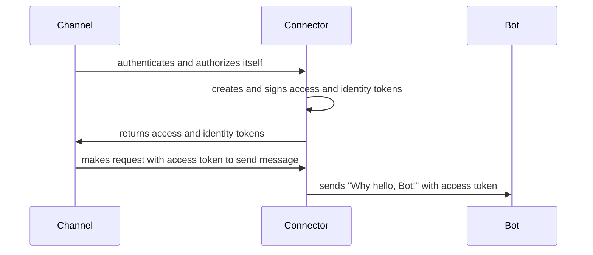
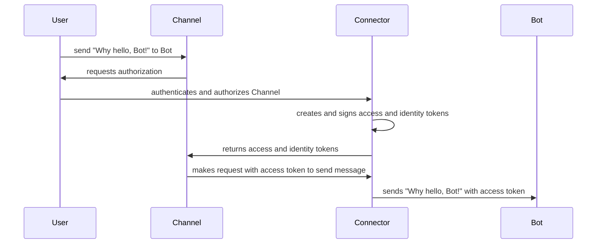
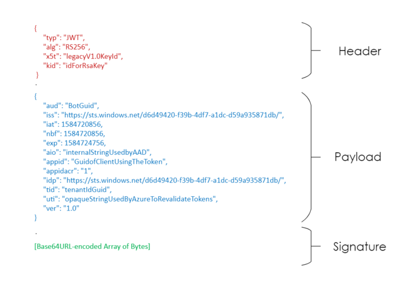

# Channel-to-Bot Authentication and Authorization

In order for Channels and Bots built using the Bot Framework SDK to communicate with each other securely, the framework implements OAuth 2.0 authorization flows with [OpenID Connect](https://openid.net/connect/) authentication. For a Channel to send activities to a Bot, the Bot must receive a Token, detailing that the Channel is authorized to send activites to the Bot.

When using the Bot Framework SDK and the default `BotFrameworkAdapter` (i.e. not a custom adapter), the Activity flow includes the Connector layer in between the Channel and Bot. The Connector is part of Azure Bot Service in the cloud, that allows Bots to exhange messages with multiple Channels configured through the Azure portal.

___

## **Scenario: User Sends a Message from Channel to Bot**

### **Overview of Channel to Bot Auth Flow**

*User at Channel sends message to Bot*

OAuth participants in this scenario:
- **Channel**: OAuth Client
- **Connector**: Authorization Server (AS) or Identity Provider (IdP)
- **Bot**: Protected Resource or the external service the client is trying to access

For more information on OAuth fundamentals regarding what exactly the components in OAuth flows are, see [Azure Active Directory V2 Protocols documentation](https://docs.microsoft.com/en-us/azure/active-directory/develop/active-directory-v2-protocols).

Depending on the request scenario, the User or the Channel itself first authenticates to the authorization endpoint of the Connector (`"/oauth2/v2.0/authorize"`), then authorizes the Channel to send messages to the Bot. To ensure the security of this authorization, the Connector, following [OpenID Connect](https://openid.net/connect/) standards, implements [JSON Object Signing and Encryption](https://www.iana.org/assignments/jose/jose.xhtml) (JOSE) specifications; after the Channel authenticates and authorizes at the Connector, the Connector creates an access token and identity token, [asymmetrically signing](https://openid.net/specs/openid-connect-core-1_0.html#Signing) both. 

*Channel Acting on Behalf of Itself*

*Channel Activing on Behalf of User*

The Channel's request hits the Bot's `"api/messages"` endpoint, where the SDK verifies the validity of the Token before allowing the request to process with the Bot's business logic. 

### Details on Signing in Auth Flows

#### **JWT Anatomy**
Tokens issued by the Bot Framework in auth flows are structured tokens conforming to [JSON Web Token](https://tools.ietf.org/html/rfc7519) (JWT, conversationally prounounced as "jot") formatting. The anatomy of a JWT is: `header.payload.signature`, with the three parts separated by periods. Each value between the periods are Base64URL-encoded. 

*Decoded JWT Anatomy - Example Token that a Bot Receives on an Inbound Request*

- **Header** - JSON Object used to describe information about the rest of the token and describes the cryptographic operations applied.
- **Payload** - JSON Object with a set of claims about the authorization.
- **Signature** - [JSON Web Signature (JWS)] (https://tools.ietf.org/html/draft-jones-json-web-signature-04). Optional.

In order to prevent the token from being maliciously manipulated, the Connector ensures to sign all tokens issued.

For definition on each of the claims in the payload, see [Microsoft identity platform access tokens](https://docs.microsoft.com/en-us/azure/active-directory/develop/access-tokens).

___

### **Verifying Tokens from Inbound Requests to Your Bot in the SDK**

