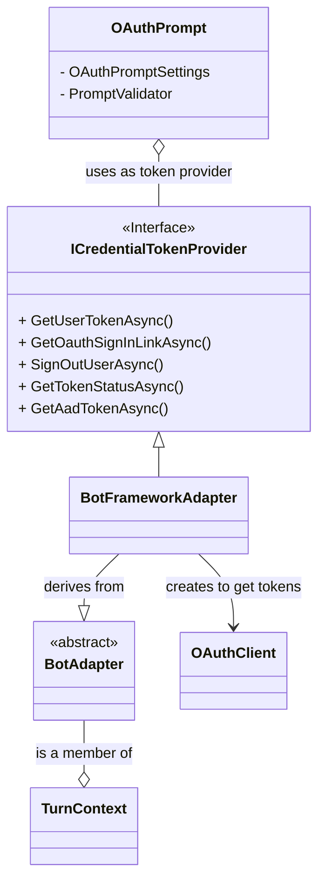

`OAuthPrompt` uses a `BotFrameworkAdapter` that implements `ICredentialTokenProvider` to acquire tokens.

```mermaid
    classDiagram
        class OAuthPrompt {
            - OAuthPromptSettings
            - PromptValidator
        }

        class BotAdapter {
        }
        <<abstract>> BotAdapter

        class ICredentialTokenProvider {
            + GetUserTokenAsync()
            + GetOauthSignInLinkAsync()
            + SignOutUserAsync()
            + GetTokenStatusAsync()
            + GetAadTokenAsync()
        }
        <<Interface>> ICredentialTokenProvider

        OAuthPrompt o-- ICredentialTokenProvider: uses as token provider
        BotFrameworkAdapter --|> BotAdapter: derives from
        BotAdapter --o TurnContext: is a member of
        ICredentialTokenProvider <|-- BotFrameworkAdapter
        BotFrameworkAdapter --> OAuthClient : creates to get tokens
```