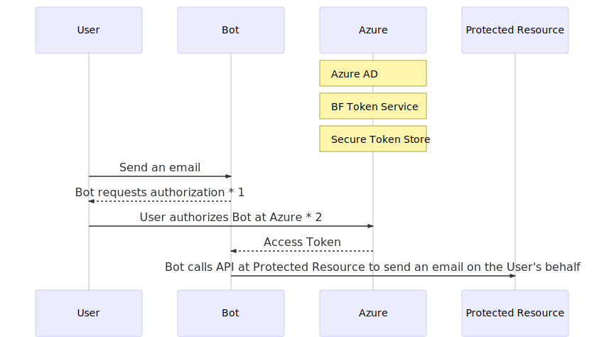
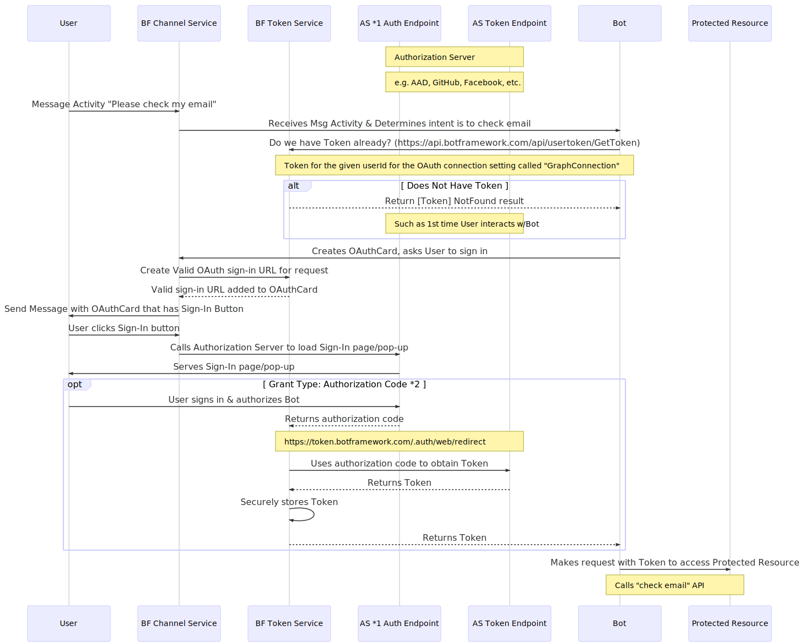
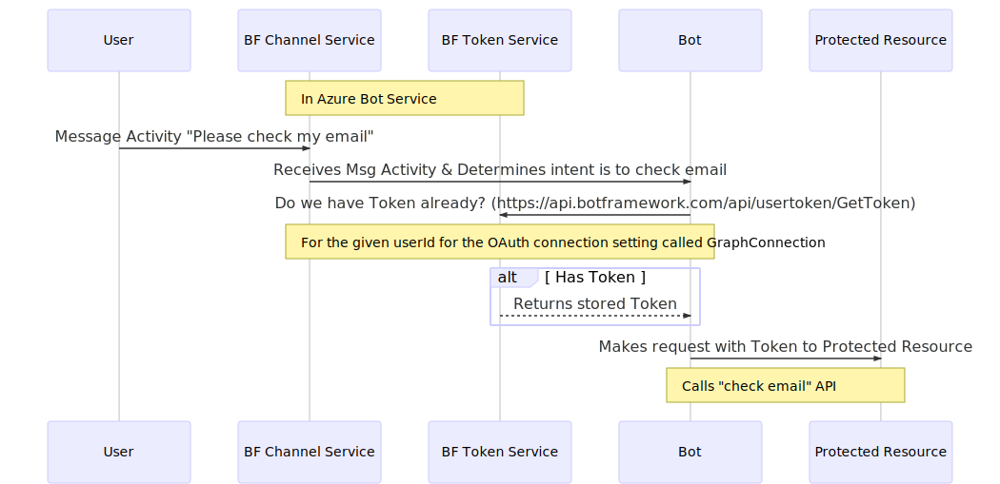
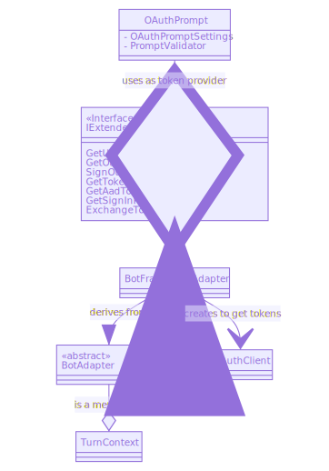
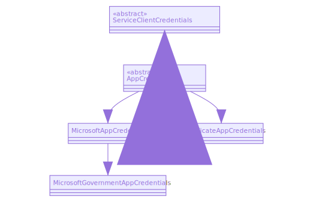
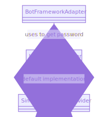
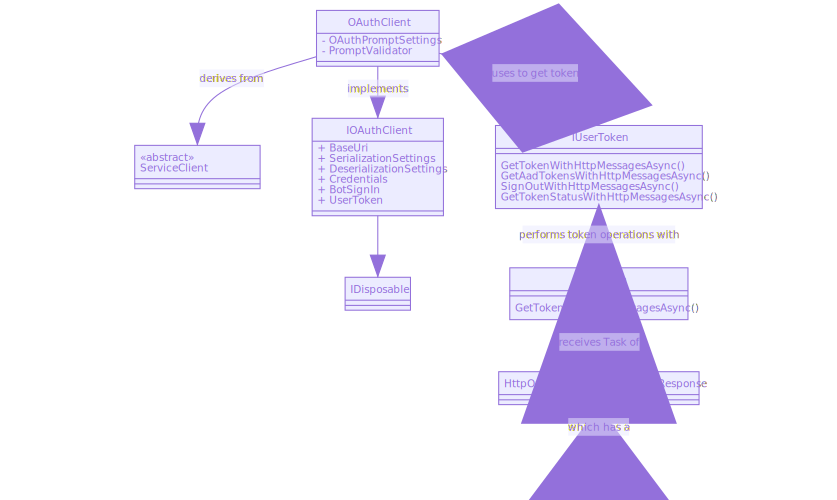
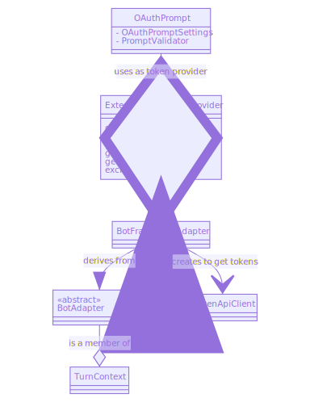
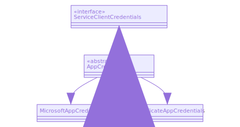
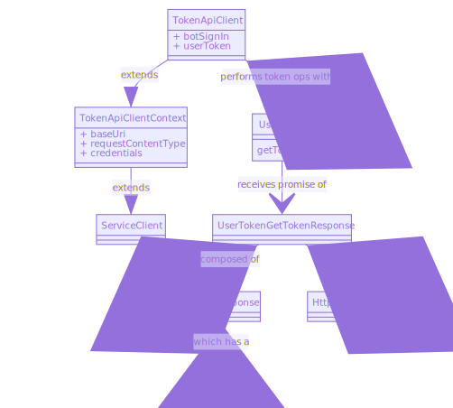

# Authentication in Bot Framework
How authentication is integrated into the Bot Framework.

- [High Level Authorization Flow](#high-level-authorization-flow)
- [Adding Authentication to Your Bot](#adding-authentication-to-your-bot)
- [Architecture of Authentication in Bot Framework](#architecture-of-authentication-in-bot-framework)
- [`OAuthPrompt`](#oauthprompt-behavioral-flow-charts)

___

## **High Level Authorization Flow**

Within Bot Framework, an OAuth flow typically boils down to your **bot** wanting to access a **protected resource** on behalf of the **user** (i.e. the **resource owner**). In order to do this, we must verify that the user is someone who has the authority to access the protected resource, and can in turn also delegate part of their authority to the bot to access the resource.

The protected resource accepts an access *token* as "proof" that the bot has been delegated permission to access it. The token acts as a limited-access key. 

The access token is used, because:
- It does not expose the user's log-in credentials for the protected resource to the bot
    - Bot cannot impersonate user
- Provides scopes (subset of functions or permissions) that the user allows the bot to perform
    - This thus allows the user to limit the actions the bot can do on his/her behalf
    - For example, a bot may be granted permission to read your social media contacts, but it cannot send messages to them or delete any of them

**Giving Bot Access to the Proteced Resource**

Goal:

Another participant in the OAuth flow is the **authorization server (AS)** or identity provider (IdP). An Azure Active Directory (AAD) app is an example of an identity provider in the cloud. AAD:
- Authenticates users
- Provides access tokens to authorized clients

You can register AS/IdP to your bot from within Azure Bot Service.

The protected resource trusts tokens issued from specified authorization servers. (OAuth protocol does not specify how the trust is established between the protected resource and the authorization server, only that it does happen--allowing for flexibility at the same time as mandating what is necessary for security.)
When a user wants the bot to access the protected resource, the bot sends the user to the authorization server to allow the user to authorize the bot to access the resource. Once authorized, the authorization server sends the acess token to the bot. The bot can now use the external service, making sure to include the token in its calls to the resrouce's API.

**Authenticating**

**Issue Token to Authorized Bot and Make Request with Token on Behalf of User**

**High Level View of OAuth Flow in Bot Framework**

Sequence diagram of the authentication and authorization flow that takes place when a user asks a bot to send an email on their behalf.

For more information on foundational OAuth concepts, see [Azure Active Directory V2 Protocols documentation](https://docs.microsoft.com/en-us/azure/active-directory/develop/active-directory-v2-protocols).
___

## **Adding Authentication to Your Bot**
Contains diagrams of adding authentication to your bot as described by examples in BF documentation.

*Click to view diagrams of the following articles:*
- *[User authentication within a conversation](#example-scenario-described-in-user-authentication-within-a-conversation-docs)*
- *[Add authentciation to your bot via Azure Bot Service](#example-scenario-described-in-add-authentication-to-your-bot-via-azure-bot-service)*
___

### **Example scenario described in [User authentication within a conversation](https://docs.microsoft.com/en-us/azure/bot-service/bot-builder-concept-authentication?view=azure-bot-service-4.0) docs**

Illustrating example in [User authentication within a conversation](https://docs.microsoft.com/en-us/azure/bot-service/bot-builder-concept-authentication?view=azure-bot-service-4.0#about-the-bot-framework-token-service), deep diving into the details of OAuth flow with the user, Bot Framework Token Service and the bot.

> "For example, a bot that can check a user's recent emails, using the Microsoft Graph API, will require an Azure Active Directory user token. At design time, the bot developer would register an Azure Active Directory application with the Bot Framework Token Service (via the Azure Portal), and then configure an OAuth connection setting (named `GraphConnection`) for the bot."

#### Goal

It's helpful to preview the architecture in [this block diagram](../ActivityFlow/README.md#activity-flow-participants) of participants in the flow of an activity and in the [Authenctication doc](https://docs.microsoft.com/en-us/azure/bot-service/bot-builder-concept-authentication?view=azure-bot-service-4.0) example before diving into the detailed "OAuth dance" in the sequence diagram following.

#### Detailed View

**OAuth Flow - no access token stored in Token Service's Token Storage yet**

1. Authorization Server (AS).
    * The AS can be within Azure, such as using AAD as our token provider, or outside of Azure as well, like in the case of using GitHub as the AS.
2. There are many different authorization grants, or OAuth flows, that detail how exactly how to use the identity of the owner of the protected resource in exchange for an access token (e.g. authorization code, client credentials, device code, refresh token, implicit, etc.)

**OAuth Flow - access token already stored in Token Service's Token Storage**

___
### **Example scenario described in [Add authentication to your bot via Azure Bot Service](https://docs.microsoft.com/en-us/azure/bot-service/bot-builder-authentication?view=azure-bot-service-4.0&tabs=csharp)**

This section diagrams the concepts introduced in the [Add authentication to your bot via Azure Bot Service](https://docs.microsoft.com/en-us/azure/bot-service/bot-builder-authentication?view=azure-bot-service-4.0&tabs=csharp), which is linked in our [authentication samples](https://github.com/microsoft/BotBuilder-Samples/tree/master/samples)' READMEs. 

**Higher Level**

* AAD is an Identity Provider, used as the authorization server to which:
    * User authenticates their identity to, and authorizes bot to act on their behalf
    * If authenticated, then auth server provides the bot with an access token
* Protected Resource separately sepcifies which auth servers it trusts to issue Tokens
* Bot can use the token obtained from auth server in its requests to access the protected resource's APIs

**Detailed View**

* *Created automatically when creating a Web App Bot in Azure Portal
* ** Auth Server can be AAD, GitHub, Uber, FB, etc. 
    * Auth Server simply must be a provider that the Protected Resource trusts and can consume Tokens issued from

___

## Architecture of Authentication in Bot Framework
Class diagrams and flow charts exlaining the structure of `OAuthPrompt` authentication and authorization in the Bot Framework.

- [Channel to Bot Authentication](https://docs.microsoft.com/en-us/azure/bot-service/rest-api/bot-framework-rest-connector-authentication?view=azure-bot-service-4.0)
- [OAuthPrompt](#OAuthPrompt-architecture)

___

## Channel to Bot Authentication
See [Authentication](https://docs.microsoft.com/en-us/azure/bot-service/rest-api/bot-framework-rest-connector-authentication?view=azure-bot-service-4.0) docs for more details.

___

## `OAuthPrompt` Architecture
Class diagrams and flow charts illustrating the structural components related to authentication using an `OAuthPrompt`.

### **Adapter and `TurnContext`**

On `TurnContext` Initialization

`OAuthPrompt` has various methods* that uses `BotAdapter` within its logic:

* `OAuthPrompt` uses `BotFrameworkAdapter` as its implementation of `BotAdapter`. Methods in `OAuthPrompt` that use this adapter: `BeginDialogAsync()`, `GetUserTokenAsync()`, `SignUserOutAsync()`, `SendOAuthCardAsync()`, `RecognizeTokenAsync()`

### **Class Diagrams of `OAuthPrompt` and How It Acquires Tokens**
- [C#](#c-how-oauthprompt-retrieves-a-token)
- [JS](#js-how-oauthprompt-retrieves-a-token)

Notes:
- These class diagrams obscure some class properties in order to better highlight the portions related specifically to authentication and authorization.
- Class diagrams are *read from top to bottom* (regarding the relativity of which class the link notes pertain to)

#### **C#: How `OAuthPrompt` Retrieves a Token:**

`OAuthPrompt` uses a `BotFrameworkAdapter` that implements `ICredentialTokenProvider` to acquire tokens.

#### Use `AppCredentials` to create an `OAuthClient`
- The `OAuthPrompt`'s `ICredentialTokenProvider` creates an `OAuthClient` to send a request to get a token.
- You must use `ServiceClientCredentials` in order to initialize an `OAuthClient` instance.

#### `AppCredentials` Class Diagram

* `ServiceClientCredentials` is an [MS REST class](https://docs.microsoft.com/en-us/dotnet/api/microsoft.rest.serviceclientcredentials?view=azure-dotnet).

#### Participants Involved in Building `AppCredentials`

#### `BotFrameworkAdapter` Creates `OAuthClient`

You can see a more formal flow chart on creating an `OAuthClient` logic [here](./AuthArchitectureInBotFramework/OAuthPrompt/CreatingOAuthClientInMoreDetail.md).

#### `OAuthClient` Class Diagram

* `HttpOperationResponseTokenResponse` should be `HttpOperationResponse<TokenResponse>` (diagram tool breaks on special chars in class diagram).
* `ServiceClient` is an [MS REST class](https://docs.microsoft.com/en-us/dotnet/api/microsoft.rest.serviceclient-1?view=azure-dotnet).

#### **JS: How `OAuthPrompt` Retrieves a Token:**

`OAuthPrompt` uses a `BotFrameworkAdapter` that implements `ExtendedUserTokenProvider` to acquire tokens.

#### Use `AppCredentials` to create a `TokenApiClient`
- The `OAuthPrompt`'s `ExtendedUserTokenProvider` creates a `TokenApiClient` to send a request to get a token.
- You must use `ServiceClientCredentials` in order to initialize an `TokenApiClient` instance.

#### `AppCredentials` Class Diagram

* `ServiceClientCredentials` is an [ms-rest interface](https://github.com/Azure/ms-rest-js/blob/master/lib/credentials/serviceClientCredentials.ts).

#### `BotFrameworkAdapter` Creates `TokenApiClient`

#### `TokenApiClient` Class Diagram

* `TokenApiClient` and `TokenApiClientContext` are classes generated by auto-rest.
* `ServiceClient` is an [msrest class](https://github.com/Azure/ms-rest-js/blob/master/lib/serviceClient.ts).

___

## `OAuthPrompt` Behavioral Flow Charts

- In order to access a **protected resource**, the **bot** must send the **user** to the **authorization server** or identity provider (in our samples we use AAD)
- Once user is at AAD, the user must:
    - Authenticate their identity (they are who they say they are)
    - Authorize the bot to access the protected resource on the user's behalf (delegating limited power, not the user's entire power, in the form of approving certain scopes)
        - In the process of designing the bot, you already specified *what scopes (permissions)* the bot would need to perform whatever function that bot was built to do, which are the scopes that the user is prompted to authorize
        - See [Add authentication to your bot via Azure Bot Service](https://docs.microsoft.com/en-us/azure/bot-service/bot-builder-authentication?view=azure-bot-service-4.0&tabs=csharp) for more detail on scopes
- Once authenticated and authorized, AAD sends the bot the token needed to access the protected resource

Bot Framework's `OAuthPrompt` provides a way to send the User to AAD in order to obtain a token. Bot developers do not have to manage token lifecycles, storage, nor proper redirects in the OAuth flow.

#### `OAuthPrompt.BeginDialogAsync()` Flow

")

#### `OAuthPrompt.ContinueDialogAsync()` Flow

*Higher Level*

")

*Detailed View*

    
Click to see Detailed View of `OAuthPrompt.ContinueDialog` Method

")

