# Communication between a channel and a bot that's using *`BotFrameworkAdapter`*

The canonical Bot Framework protocol when using the `BotFrameworkAdater` includes communication between the **Channel** (Teams, Cortana, Direct Line Speech, Facebook etc.), **Bot Framework Service**, **`BotFrameworkAdapter`**, and the **bot**.

The **Bot Framework Service** lives in the cloud and takes on the role of translating the data from the APIs of multiple supported Channels into the Bot Framework protocol in a form that your local bot code can understand. This allows your bot to communicate with multiple channels, without having to understand which Channel the data is coming from. You don't need to write several permutations of your bot specific to each channel, if it's a channel that's supported in the Service.

The `BotFrameworkAdapter` passes the Channels' information off in the form of Activities for your bot to consume. 

1. Default adapter used in the SDK is the `BotFrameworkAdapter`.
2. Bot derives from `ActivityHandler`, which implements `IBot`.
3. Protocol between Channel & Bot Framework Service:
    * Exact communication details between Channel and Bot Framework Service varies per channel.
    * For example, here could be an HTTP POST request.
4. We *know for certainty* this is an HTTP POST request. 
5. Bot Framework REST API call.
    * The `BotFrameworkAdapter` creates a `ConnectorClient` that allows the bot to send activities to users on Channels configured in ABS.
    * The `ConnectorClient` speaks with the BF Service, which exposes different endpoints that your bot can call via HTTP request. 
    * Example APIs:
        * Replying to an Activity will POST to `"v3/conversations/{conversationId}/activities/{activityId}"`
        * Sending to end of conversation will POST to `"/v3/directline/conversations/{conversationId}/activities"`
        * See [Bot Framework REST API reference](https://docs.microsoft.com/en-us/azure/bot-service/rest-api/bot-framework-rest-connector-api-reference?view=azure-bot-service-4.0) for more details.

# Communication between a channel and bot with a *customer adapter*

The Bot Framework SDK includes more recent work on custom adapters as well, such as for Facebook, Slack, Twilio, etc. 
* The communication between a channel and a customer adapter is direct, without the Bot Framework Service cloud layer in between. 
* The customer adapter does the same work as what the Bot Framework Service does in that it translates the channel's inbound data to the bot into a shape that the bot can consume, and also shapes calls outbound from your bot to the channel in a way that the channel can understand, but with the added bonus of less latency.
* Additionally, custom adapters may also allow you to have access to more of the 3rd party's native APIs, as the Bot Framework Service might possibly not be as up-to-date in all the latest endpoints the 3rd parties expose.
* The tradeoffs of using a custom adapter as opposed to the `BotFrameworkAdapter` are:
    * The one custom adapter only speaks to one channel (Slack Adapter can speak to Slack, but not Facebook)
    * You may have to do more of the heavy lifting. For example, if your bot sends a "hero card", the `BotFrameworkAdapter` knows how to translate that hero card into a "Teams hero card" that the Teams channel can consume, but if you use a custom adapter, you may have to do the work of transforming the bot's "hero card" to "Facebook hero card".

1. Core SDK includes custom adapters (e.g. Slack Adapter, Facebook Adapter, Twilio Adapter, etc.)
2. Bot derives from `ActivityHandler`, which implements `IBot`
3. Protocol between Channel & BF SDK:
    * Exact communication details between Channel and custom adapters in the BF SDK varies per channel.
    * For example, it could be an HTTP POST request to "api/facebook".
4. REST HTTP calls directly to the 3rd party service's APIs
    * It *does not* call the Bot Framework Service layer

___

# General Activity Flow through the Bot Framework

Detailed look into the SDK.

Iterating on this detailed diagram of the Activity Flow in the BF SDK, defined buckets help solidify knowledge of how the pieces fit on a higher level (draft):

1. Bots are essentially websites that are hosted in a Web App exposed over HTTP.
    - For example, your bot receives POST requests to its `"api/messages"` endpoint.

2. Calls from Bot to the Bot Framework Service are industry-standard REST API calls with JSON over HTTPS. See [Communication between a Channel and a Bot using the BotFrameworkAdapter](https://github.com/Zerryth/Mermaid/tree/master/MarkdownFiles/ActivityFlow#communication-between-a-channel-and-a-bot-thats-using-botframeworkadapter) and [Communication between Bot Framework Service and Bot](https://github.com/Zerryth/Mermaid/tree/master/MarkdownFiles/ActivityFlow#details-of-communication-between-bot-framework-service-and-bot) for more details.
    - For example, to Reply to Activity the Bot's Connector will `POST v3/conversations/{conversationId}/activities/{activityId}`.

