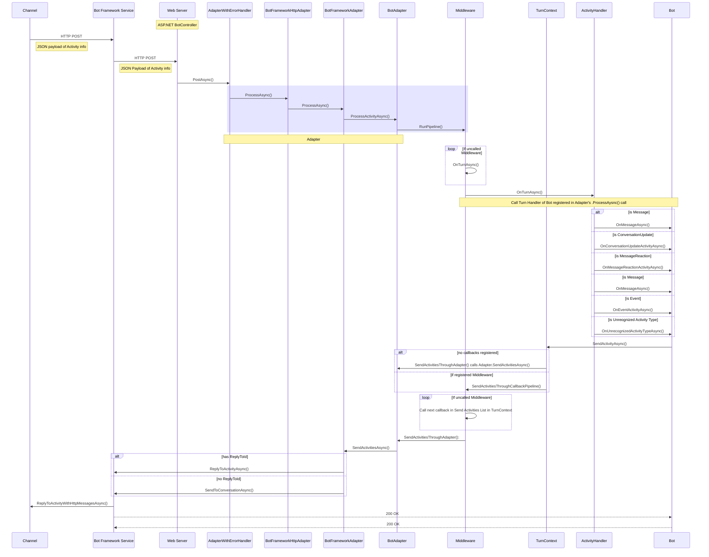

## Activity Flow
### *Modeled after the C# EchoBot example code in ['How bots work'](https://docs.microsoft.com/en-us/azure/bot-service/bot-builder-basics?view=azure-bot-service-4.0&tabs=csharp#bot-logic) documentation.*

