## Activity Flow
### *Modeled after the C# EchoBot example code in ['How bots work'](https://docs.microsoft.com/en-us/azure/bot-service/bot-builder-basics?view=azure-bot-service-4.0&tabs=csharp#bot-logic) documentation.*

#### C#:

#### JS:

___

C#

### `ProcessAsync()` Flow

___

### `ProcessActivityAsync()` Flow

___
___
### *Hierarchies that I looked into in order to better understand and learn about the Activity flow*

### EchoBot's Adapter Class Diagram

### MiddlewareSet Class Diagram

### TurnContext Class Diagram
