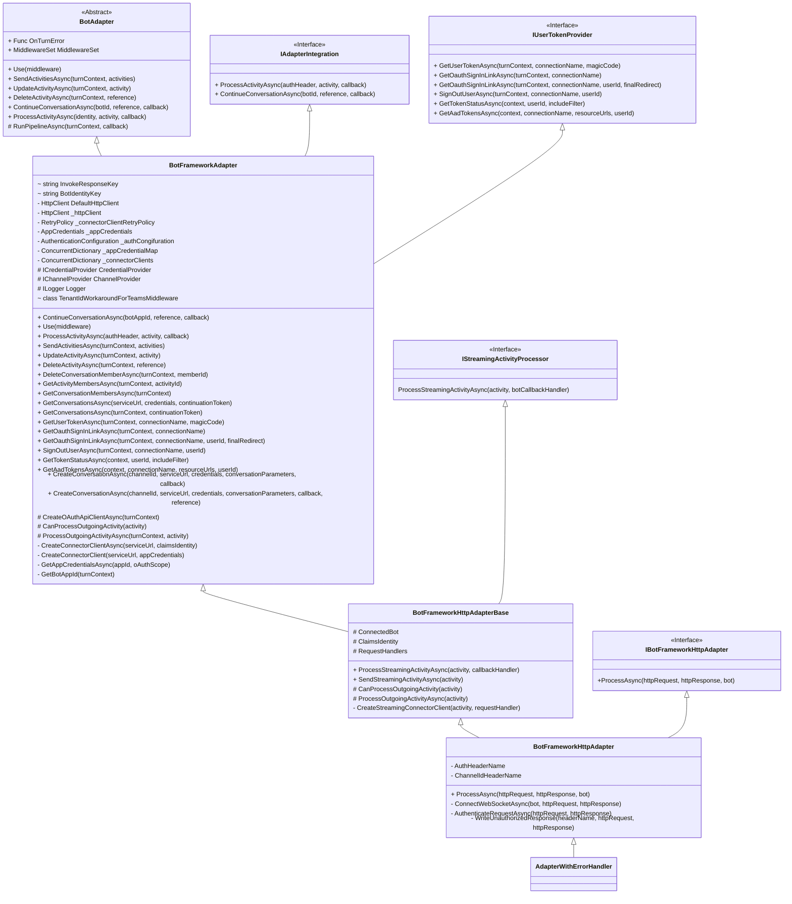

```mermaid
    classDiagram

        class BotAdapter {
            + Func<ITurnContext, Exception, Task> OnTurnError
            + MiddlewareSet MiddlewareSet
            + Use(middleware)
            + SendActivitiesAsync(turnContext, activities)
            + UpdateActivityAsync(turnContext, activity)
            + DeleteActivityAsync(turnContext, reference)
            + ContinueConversationAsync(botId, reference, callback)
            + ProcessActivityAsync(identity, activity, callback)
            # RunPipelineAsync(turnContext, callback)
        }
        <<Abstract>> BotAdapter

        class IAdapterIntegration {
            + ProcessActivityAsync(authHeader, activity, callback)
            + ContinueConversationAsync(botId, reference, callback)
        }
        <<Interface>> IAdapterIntegration

        class IUserTokenProvider {
            + GetUserTokenAsync(turnContext, connectionName, magicCode)
            + GetOauthSignInLinkAsync(turnContext, connectionName)
            + GetOauthSignInLinkAsync(turnContext, connectionName, userId, finalRedirect)
            + SignOutUserAsync(turnContext, connectionName, userId)
            + GetTokenStatusAsync(context, userId, includeFilter)
            + GetAadTokensAsync(context, connectionName, resourceUrls, userId)

        }
        <<Interface>> IUserTokenProvider
        
        class BotFrameworkAdapter {
            ~ string InvokeResponseKey
            ~ string BotIdentityKey
            - HttpClient DefaultHttpClient
            - HttpClient _httpClient
            - RetryPolicy _connectorClientRetryPolicy
            - AppCredentials _appCredentials
            - AuthenticationConfiguration _authCongifuration
            - ConcurrentDictionary<string, AppCredentials> _appCredentialMap
            - ConcurrentDictionary<string, ConnectorClient> _connectorClients
            # ICredentialProvider CredentialProvider
            # IChannelProvider ChannelProvider
            # ILogger Logger
            + ContinueConversationAsync(botAppId, reference, callback)
            + Use(middleware)
            + ProcessActivityAsync(authHeader, activity, callback)
            + SendActivitiesAsync(turnContext, activities)
            + UpdateActivityAsync(turnContext, activity)
            + DeleteActivityAsync(turnContext, reference)
            + DeleteConversationMemberAsync(turnContext, memberId)
            + GetActivityMembersAsync(turnContext, activityId)
            + GetConversationMembersAsync(turnContext)
            + GetConversationsAsync(serviceUrl, credentials, continuationToken)
            + GetConversationsAsync(turnContext, continuationToken)
            + GetUserTokenAsync(turnContext, connectionName, magicCode)
            + GetOauthSignInLinkAsync(turnContext, connectionName)
            + GetOauthSignInLinkAsync(turnContext, connectionName, userId, finalRedirect)
            + SignOutUserAsync(turnContext, connectionName, userId)
            + GetTokenStatusAsync(context, userId, includeFilter)
            + GetAadTokensAsync(context, connectionName, resourceUrls, userId)
            + CreateConversationAsync(channelId, serviceUrl, credentials, conversationParameters, callback)
            + CreateConversationAsync(channelId, serviceUrl, credentials, conversationParameters, callback, reference)
            # CreateOAuthApiClientAsync(turnContext)
            # CanProcessOutgoingActivity(activity)
            # ProcessOutgoingActivityAsync(turnContext, activity)
            - CreateConnectorClientAsync(serviceUrl, claimsIdentity)
            - CreateConnectorClient(serviceUrl, appCredentials)
            - GetAppCredentialsAsync(appId, oAuthScope)
            - GetBotAppId(turnContext)
            ~ class TenantIdWorkaroundForTeamsMiddleware
        }

        class IStreamingActivityProcessor {
            ProcessStreamingActivityAsync(activity, botCallbackHandler)
        }
        <<Interface>> IStreamingActivityProcessor
    
        class IBotFrameworkHttpAdapter {
            +ProcessAsync(httpRequest, httpResponse, bot)
        }
        <<Interface>> IBotFrameworkHttpAdapter
        

        class BotFrameworkHttpAdapterBase {
            # ConnectedBot
            # ClaimsIdentity
            # RequestHandlers
            + ProcessStreamingActivityAsync(activity, callbackHandler)
            + SendStreamingActivityAsync(activity)
            # CanProcessOutgoingActivity(activity)
            # ProcessOutgoingActivityAsync(activity)
            - CreateStreamingConnectorClient(activity, requestHandler)
        }

        class BotFrameworkHttpAdapter {
            - AuthHeaderName
            - ChannelIdHeaderName
            + ProcessAsync(httpRequest, httpResponse, bot)
            - ConnectWebSocketAsync(bot, httpRequest, httpResponse)
            - AuthenticateRequestAsync(httpRequest, httpResponse)
            - WriteUnauthorizedResponse(headerName, httpRequest, httpResponse)
        }

        BotFrameworkHttpAdapter <|-- AdapterWithErrorHandler

        BotFrameworkHttpAdapterBase <|-- BotFrameworkHttpAdapter
        IBotFrameworkHttpAdapter <|-- BotFrameworkHttpAdapter

        BotFrameworkAdapter <|-- BotFrameworkHttpAdapterBase
        IStreamingActivityProcessor <|-- BotFrameworkHttpAdapterBase

        BotAdapter <|-- BotFrameworkAdapter
        IAdapterIntegration <|-- BotFrameworkAdapter
        IUserTokenProvider <|-- BotFrameworkAdapter

```