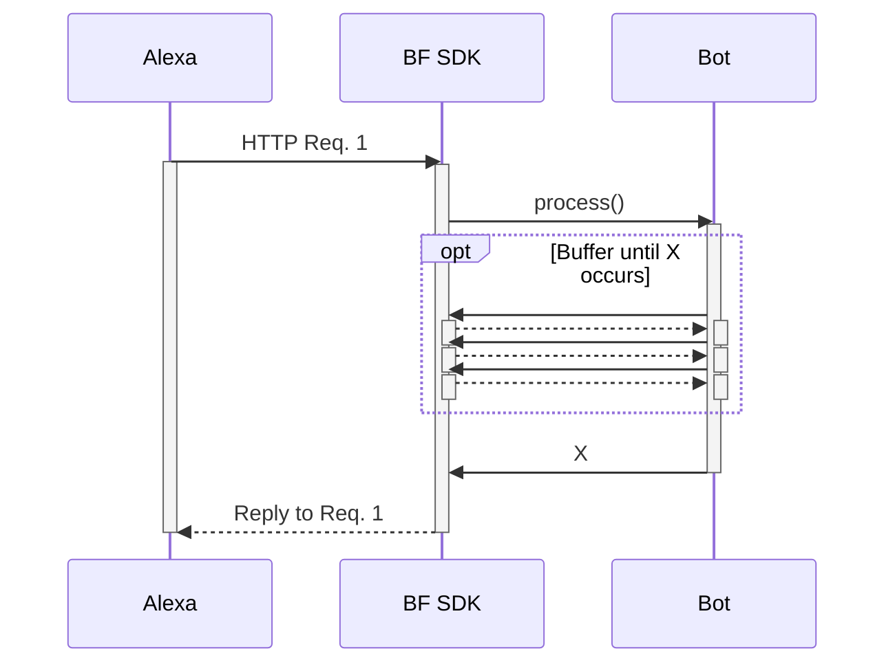

# Custom Adapters Protocol, Continued

Certain channels communicate with custom adapters, such as Alexa and Slack. It is the custom adapter's job to transform the data received from the Bot into the right data shape or enforce the expected protocol flow of the channel that custom adapter is communitcating with.

For some channels, like Slack, the channel follows the "Russian nesting doll" shape in it's request-response protocol, as illustrated in the [sequence diagram of Activity Flow using the BF Service and BotFrameworkAdapter](https://github.com/Zerryth/Mermaid/tree/master/MarkdownFiles/ActivityFlow#communication-between-a-channel-and-a-bot-thats-using-botframeworkadapter).

Many channels, however, such as for Alexa, Google, etc., actually follow a different protocol pattern, where the HTTP request is followed by by the HTTP response, with the bot's reply within that HTTP response (i.e. not a separate bot request that has the bot's reply, followed by the status code response). To satisfy this common request-reply pattern, some custom adapters will buffer between the customer adapter and bot, until the entirety of the reply to the the channel's original request is ready. See diagram below for clarification.

