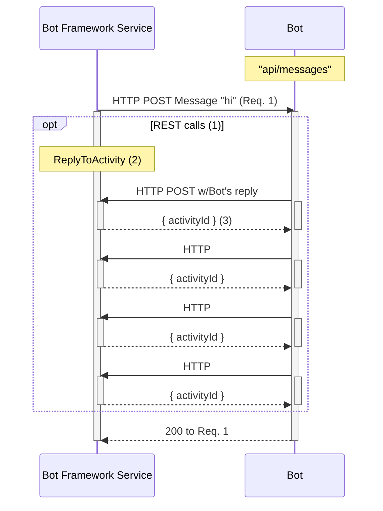

1. Calls from Bot to the Bot Framework Service are industry-standard REST API calls with JSON over HTTPS.
2. Example showing Bot calling the Bot Framework Service's `ReplyToActivity` endpoint (`POST v3/conversations/{conversationId}/activities/{activityId}`)
    * Bot can have 1 call in reply to Req. 1 (for example just Sending "Echo: 'hi'" message back) or the bot can have multiple REST calls in response to the Bot Framework Service's Req. 1, as illustrated with the subsequent HTTP calls from the bot.
3. A `ResourceResponse` that contains an id property which specifies the ID of the Activity that was sent to the bot.