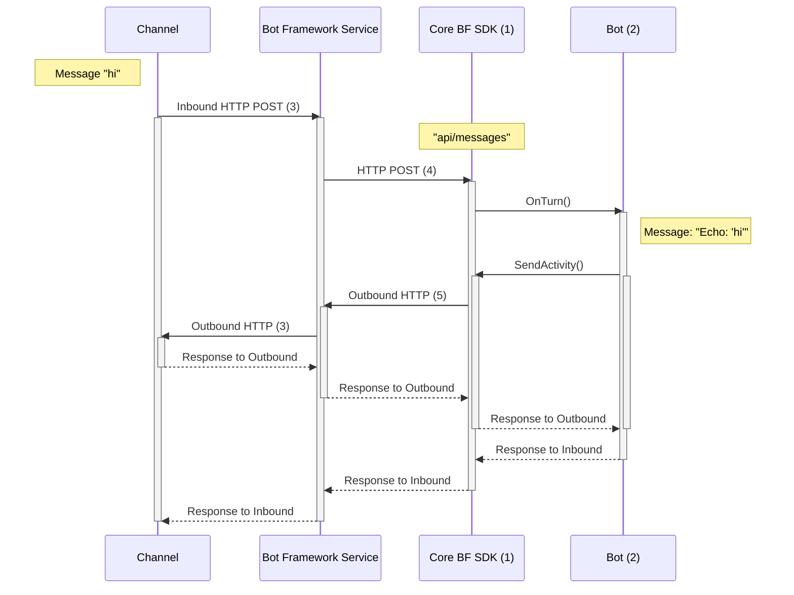

## **Communication between a Channel and Bot using the *`BotFrameworkAdapter`***
The canonical Bot Framework protocol includes communication between the **Channel** (Teams, Cortana, Direct Line Speech, Slack etc.), **Bot Framework Service**, **`BotFrameworkAdapter`**, and the **Bot**.

The **Bot Framework Service** lives in the cloud and takes on the role of translating the data from multiple Channels into the Bot Framework protocol in a form that your local Bot code can understand (and vice versa going from Bot to Channels). This allows your Bot to communicate with multiple Channels, without having to understand which Channel the data is coming from. You don't need to write several permutations of your Bot specific to *each* Channel, if the Channel is supported in the Service.

The `BotFrameworkAdapter` passes the Channels' information off in the form of Activities for your Bot to consume.

1. Default adapter used in the SDK is the `BotFrameworkAdapter`.
2. Bot derives from the `ActivityHandler` class from the SDK, which implements `IBot`.
3. Protocol between Channel & Bot Framework Service:
    * Exact communication details between Channel and Bot Framework Service varies per channel.
    * For example, here could be HTTP POST requests, which we illustrate in the diagram, or they could be another kind of REST call.
4. We *know for certainty* this is an HTTP POST request. 
5. Bot Framework REST API call.
    * The `BotFrameworkAdapter` creates a `ConnectorClient` that allows the Bot to send Activities to users on Channels configured in ABS.
    * The `ConnectorClient` speaks with the BF Service, which exposes different endpoints that your bot can call via HTTP request. 
    * Example APIs:
        * Replying to an Activity will POST to `"v3/conversations/{conversationId}/activities/{activityId}"`
        * Sending to end of conversation will POST to `"/v3/directline/conversations/{conversationId}/activities"`
        * See [Bot Framework REST API reference](https://docs.microsoft.com/en-us/azure/bot-service/rest-api/bot-framework-rest-connector-api-reference?view=azure-bot-service-4.0) for more details.