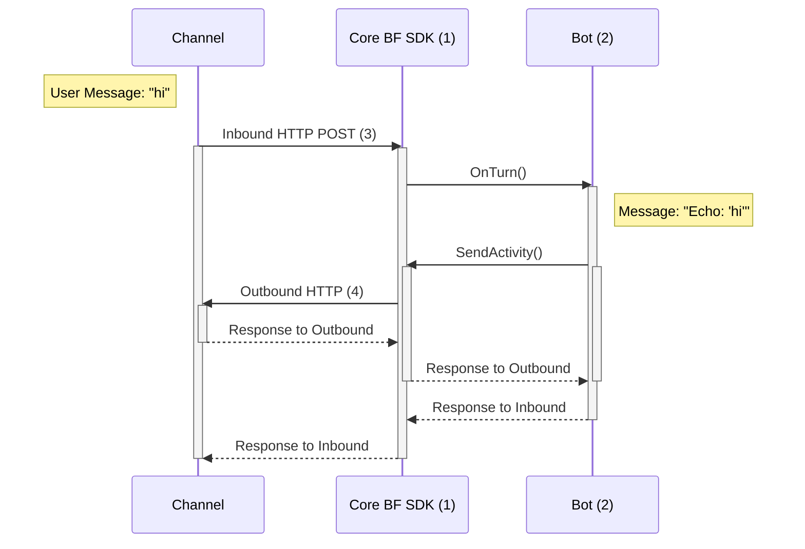

## **Communication between a channel and bot with a *customer adapter***
The Bot Framework SDK includes more recent work on custom adapters as well, such as for Slack, Facebook, Twilio, etc. 
* The communication between a Channel and a customer adapter is direct, **without the Bot Framework Service cloud layer in between**. 
* The customer adapter itself does the same work as what the Bot Framework Service does, in that it translates the Channel's inbound data to the Bot into a shape that the Bot can consume, and also shapes calls outbound from your Bot to the Channel in a way that the Channel can understand, but with the added bonus of less latency.
* Additionally, custom adapters may also allow you to have access to more of the 3rd party's native APIs, as the Bot Framework Service might possibly not be as up-to-date in all the latest endpoints the 3rd parties expose.
* The tradeoffs of using a custom adapter as opposed to the `BotFrameworkAdapter` are:
    * The one custom adapter only speaks to one Channel (e.g. Slack Adapter can speak to Slack, but not Facebook)
    * You may have to do more of the heavy lifting. For example, if your bot sends a "hero card", the `BotFrameworkAdapter` knows how to translate that hero card into a "Teams hero card" that the Teams Channel can consume, but if you use a custom adapter, you may have to do the work of transforming the Bot's "hero card" to "Facebook hero card".

1. Core SDK includes custom adapters (e.g. Slack Adapter, Facebook Adapter, Twilio Adapter, etc.)
2. Bot derives from `ActivityHandler`, which implements `IBot`
3. Protocol between Channel & BF SDK:
    * Exact communication details between Channel and custom adapters in the BF SDK varies per channel.
    * For example, it could be an HTTP POST request to "api/facebook".
4. REST HTTP calls directly to the 3rd party service's APIs
    * It *does not* call the Bot Framework Service layer