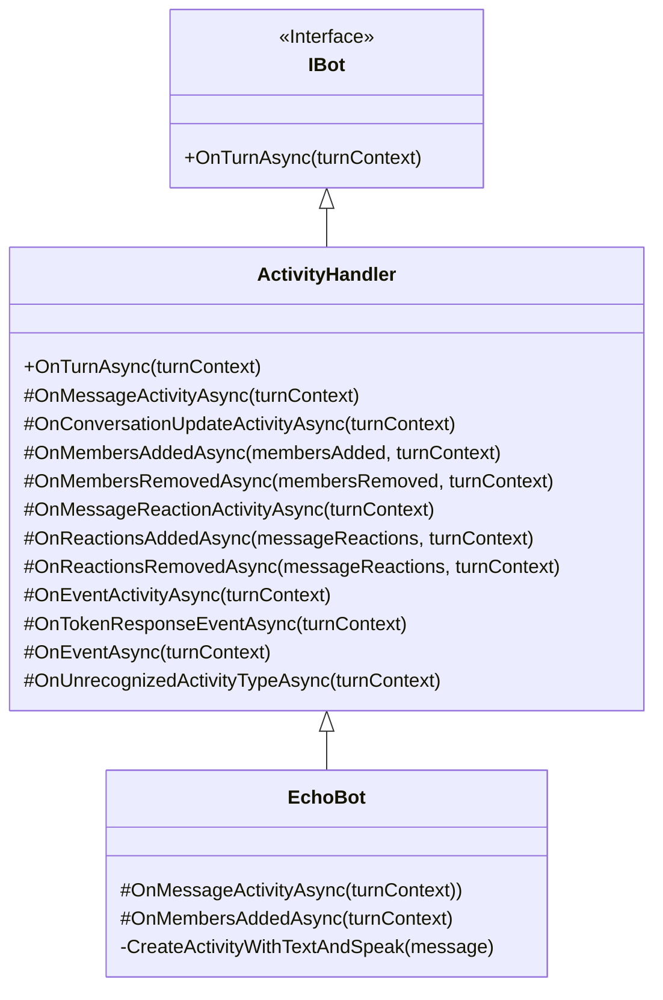

```mermaid
    classDiagram
    
    class ActivityHandler{
        +OnTurnAsync(turnContext)
        #OnMessageActivityAsync(turnContext)
        #OnConversationUpdateActivityAsync(turnContext)
        #OnMembersAddedAsync(membersAdded, turnContext)
        #OnMembersRemovedAsync(membersRemoved, turnContext)
        #OnMessageReactionActivityAsync(turnContext)
        #OnReactionsAddedAsync(messageReactions, turnContext)
        #OnReactionsRemovedAsync(messageReactions, turnContext)
        #OnEventActivityAsync(turnContext)
        #OnTokenResponseEventAsync(turnContext)
        #OnEventAsync(turnContext)
        #OnUnrecognizedActivityTypeAsync(turnContext)

    }

    class IBot{
        +OnTurnAsync(turnContext)
    }
    <<Interface>> IBot

    class EchoBot{
        #OnMessageActivityAsync(turnContext))
        #OnMembersAddedAsync(turnContext)
        -CreateActivityWithTextAndSpeak(message)
    }

    IBot <|-- ActivityHandler
    ActivityHandler <|-- EchoBot
```

Note: I've excluded including the cancellationToken parameter (in methods such as ones in ActivityHandler, EchoBot, etc.), as it just looked like it added noise