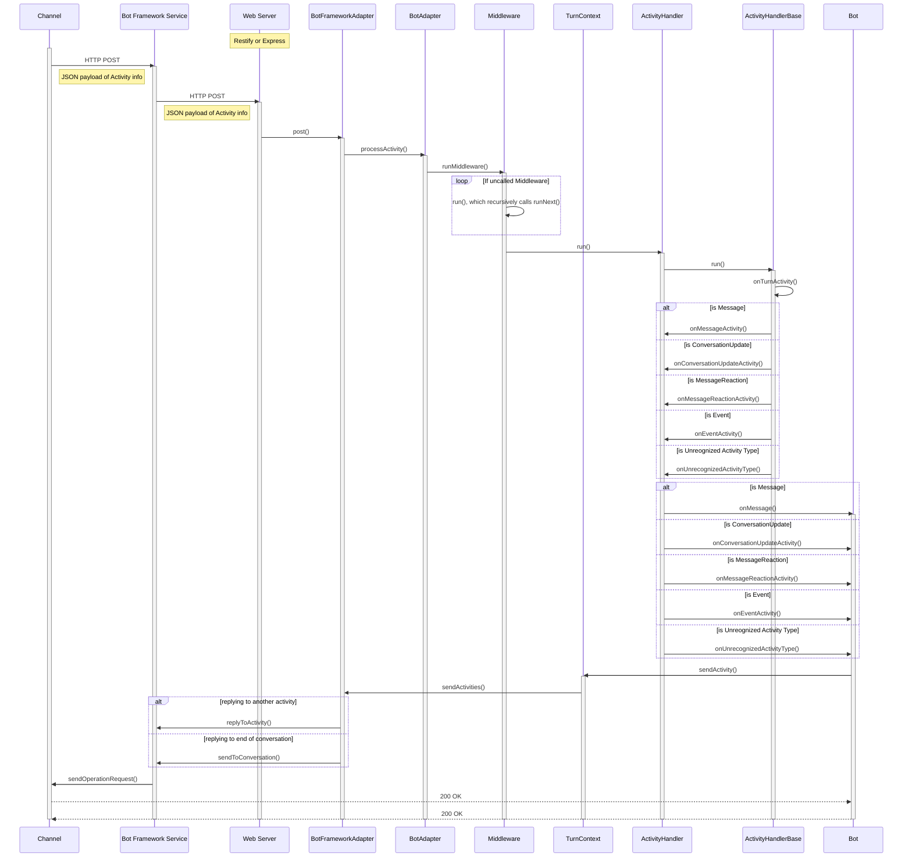

```mermaid
    sequenceDiagram
        participant Channel

        participant BFS as Bot Framework Service
        participant WebServer as Web Server
        Note over WebServer: Restify or Express
        participant BotFrameworkAdapter
        participant BotAdapter
        participant Middleware
        participant TurnContext
        participant ActivityHandler
        participant ActivityHandlerBase
        participant Bot

        activate Channel
        Channel ->> BFS: HTTP POST
        activate BFS
        Note right of Channel: JSON payload of Activity info

        BFS ->> WebServer: HTTP POST
        activate WebServer
        Note right of BFS: JSON payload of Activity info
        WebServer ->> BotFrameworkAdapter: post()
        activate BotFrameworkAdapter
        BotFrameworkAdapter ->> BotAdapter: processActivity()
        activate BotAdapter
        BotAdapter ->> Middleware: runMiddleware()
        activate Middleware

        loop If uncalled Middleware
            Middleware ->> Middleware: run(), which recursively calls runNext()
        end

        Middleware ->> ActivityHandler: run()
        activate ActivityHandler
        ActivityHandler ->> ActivityHandlerBase: run()
        activate ActivityHandlerBase
        ActivityHandlerBase ->> ActivityHandlerBase: onTurnActivity()
        alt is Message
                ActivityHandlerBase ->> ActivityHandler: onMessageActivity()
            
            else is ConversationUpdate
                ActivityHandlerBase ->> ActivityHandler: onConversationUpdateActivity()
            
            else is MessageReaction
                ActivityHandlerBase ->> ActivityHandler: onMessageReactionActivity()
            
            else is Event
                ActivityHandlerBase ->> ActivityHandler: onEventActivity()
            
            else is Unreognized Activity Type
                ActivityHandlerBase ->> ActivityHandler: onUnrecognizedActivityType()
        end

        alt is Message
            ActivityHandler ->> Bot: onMessage()
            activate Bot
            
            else is ConversationUpdate
                ActivityHandler ->> Bot: onConversationUpdateActivity()
            
            else is MessageReaction
                ActivityHandler ->> Bot: onMessageReactionActivity()
            
            else is Event
                ActivityHandler ->> Bot: onEventActivity()
            
            else is Unreognized Activity Type
                ActivityHandler ->> Bot: onUnrecognizedActivityType()
        end

        Bot ->> TurnContext: sendActivity()
        activate TurnContext
        TurnContext ->> BotFrameworkAdapter: sendActivities()
        
        alt replying to another activity
            BotFrameworkAdapter ->> BFS: replyToActivity()

            else replying to end of conversation
                BotFrameworkAdapter ->> BFS: sendToConversation()
        end

        BFS ->> Channel: sendOperationRequest()

        Channel -->> Bot: 200 OK
        Bot -->> Channel: 200 OK

        deactivate TurnContext
        deactivate Bot
        deactivate ActivityHandlerBase
        deactivate ActivityHandler

        deactivate Middleware
        deactivate BotAdapter
        deactivate BotFrameworkAdapter
        deactivate WebServer
        deactivate BFS
        deactivate Channel
```