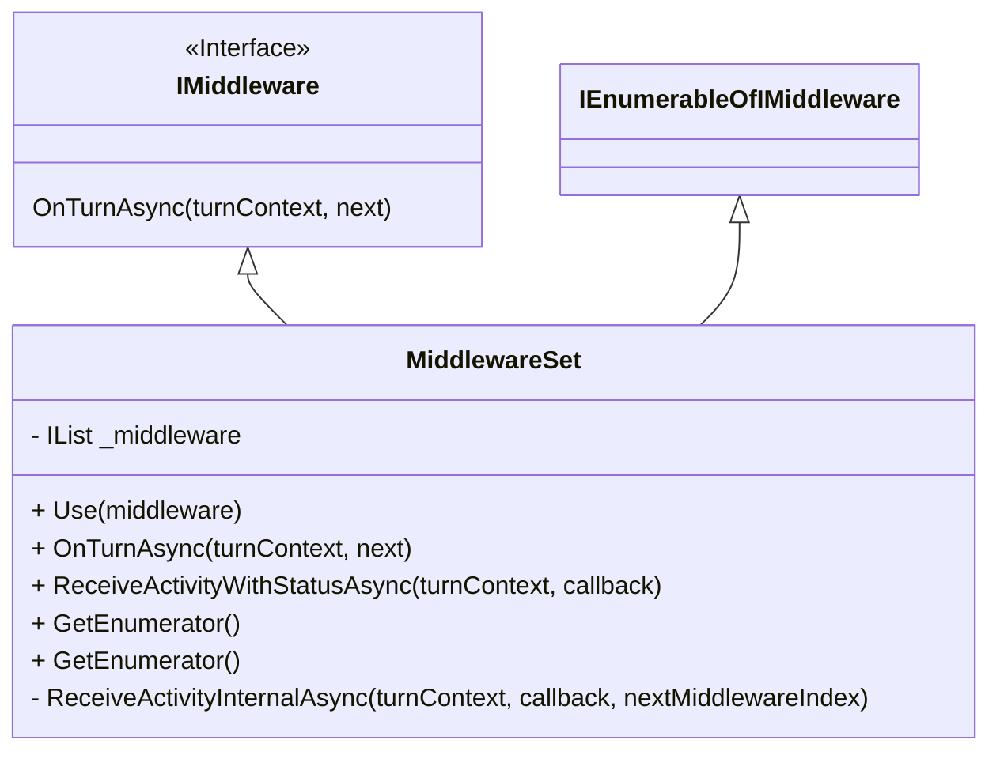

```mermaid
    classDiagram
        class IMiddleware {
            OnTurnAsync(turnContext, next)
        }
        <<Interface>> IMiddleware

        class MiddlewareSet {
            - IList<IMiddleware> _middleware
            + Use(middleware)
            + OnTurnAsync(turnContext, next)
            + ReceiveActivityWithStatusAsync(turnContext, callback)
            + GetEnumerator()
            + GetEnumerator()
            - ReceiveActivityInternalAsync(turnContext, callback, nextMiddlewareIndex)
        }

        IMiddleware <|-- MiddlewareSet
        IEnumerableOfIMiddleware <|-- MiddlewareSet
```