# Activity Flow

___

## *HTTP Protocol*

## Communication between a channel and a bot that's using *`BotFrameworkAdapter`*

The canonical Bot Framework protocol when using the `BotFrameworkAdater` includes communication between the **Channel** (Teams, Slack, Twilio, etc.), **Bot Framework Service**, **`BotFrameworkAdapter`**, and the **bot**.

The **Bot Framework Service** lives in the cloud and takes on the role of translating the data from multiple supported Channels' APIs into the Bot Framework protocol in a form that your local bot code can understand. This allows your bot to communicate with multiple channels, without having to understand which Channel the data is coming from.

The `BotFrameworkAdapter` passes the Channels' information off in the form of Activities for your bot to consume. 

1. Default adapter is the `BotFrameworkAdapter`.
2. Bot derives from `ActivityHandler`, which implements `IBot`.
3. Protocol between Channel & Bot Framework Service:
    * Exact communication details between Channel and Bot Framework Service varies per channel.
    * For example, here could be an HTTP POST request.
4. We *know for certainty* this is an HTTP POST request. 
5. Bot Framework REST API call.
    * The `BotFrameworkAdapter` creates a `ConnectorClient` that allows the bot to send activities to users on Channels configured in ABS.
    * The `ConnectorClient` speaks with the BF Service, which exposes different endpoints that your bot can call via HTTP request. 
    * Example APIs:
        * Replying to an Activity will POST to `"v3/conversations/{conversationId}/activities/{activityId}"`
        * Sending to end of conversation will POST to `"/v3/directline/conversations/{conversationId}/activities"`
        * See [Bot Framework REST API reference](https://docs.microsoft.com/en-us/azure/bot-service/rest-api/bot-framework-rest-connector-api-reference?view=azure-bot-service-4.0) for more details.

## Communication between a channel and bot with a *customer adapter*

1. Core SDK includes custom adapters (e.g. Slack Adapter, Facebook Adapter, Twilio Adapter, etc.)
2. Bot derives from `ActivityHandler`, which implements `IBot`
3. Protocol between Channel & BF SDK:
    * Exact communication details between Channel and custom adapters in the BF SDK varies per channel.
    * For example, it could be an HTTP POST request to "api/facebook".
4. REST HTTP calls directly to the 3rd party service's APIs.

___
## Detailed look into the SDK

### *Modeled after the C# EchoBot example code in ['How bots work'](https://docs.microsoft.com/en-us/azure/bot-service/bot-builder-basics?view=azure-bot-service-4.0&tabs=csharp#bot-logic) documentation.*

#### C#:

#### JS:

#### Generalized:

___

C#

### `ProcessAsync()` Flow

___

### `ProcessActivityAsync()` Flow

___
___
### *Hierarchies that I looked into in order to better understand and learn about the Activity flow*

### EchoBot's Adapter Class Diagram

### MiddlewareSet Class Diagram

### TurnContext Class Diagram
