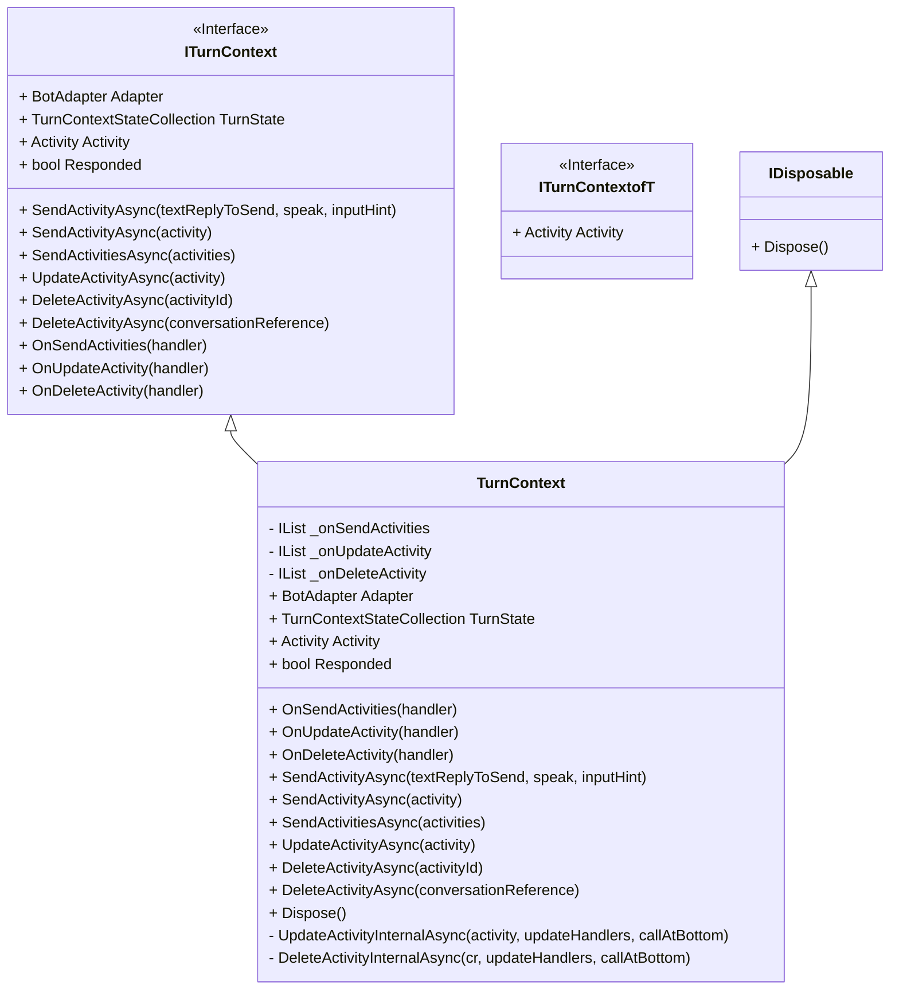

```mermaid
    classDiagram
        class ITurnContext {
            + BotAdapter Adapter
            + TurnContextStateCollection TurnState
            + Activity Activity
            + bool Responded
            + SendActivityAsync(textReplyToSend, speak, inputHint)
            + SendActivityAsync(activity)
            + SendActivitiesAsync(activities)
            + UpdateActivityAsync(activity)
            + DeleteActivityAsync(activityId)
            + DeleteActivityAsync(conversationReference)
            + OnSendActivities(handler)
            + OnUpdateActivity(handler)
            + OnDeleteActivity(handler)
            
        }
        <<Interface>> ITurnContext

        class ITurnContextofT {
            %% where T implements IActivity
            + Activity Activity
        }
        <<Interface>> ITurnContextofT

        class TurnContext {
            - IList<SendActivitiesHandler> _onSendActivities
            - IList<UpdateActivityHandler> _onUpdateActivity
            - IList<DeleteActivityHandler> _onDeleteActivity
            + BotAdapter Adapter
            + TurnContextStateCollection TurnState
            + Activity Activity
            + bool Responded
            + OnSendActivities(handler)
            + OnUpdateActivity(handler)
            + OnDeleteActivity(handler)
            + SendActivityAsync(textReplyToSend, speak, inputHint)
            + SendActivityAsync(activity)
            + SendActivitiesAsync(activities)
            + UpdateActivityAsync(activity)
            + DeleteActivityAsync(activityId)
            + DeleteActivityAsync(conversationReference)
            + Dispose()
            - UpdateActivityInternalAsync(activity, updateHandlers, callAtBottom)
            - DeleteActivityInternalAsync(cr, updateHandlers, callAtBottom)
        }

        class IDisposable {
            + Dispose()
        }

        ITurnContext <|-- TurnContext
        IDisposable <|-- TurnContext

        
```
Provides context for a turn of a bot.