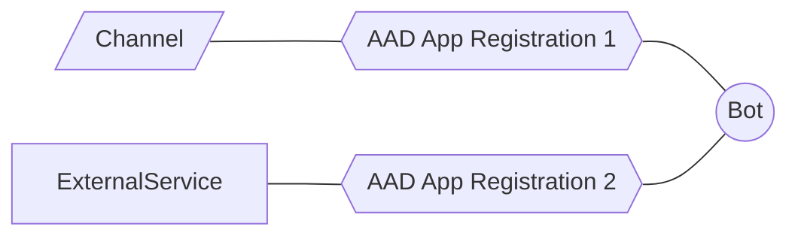
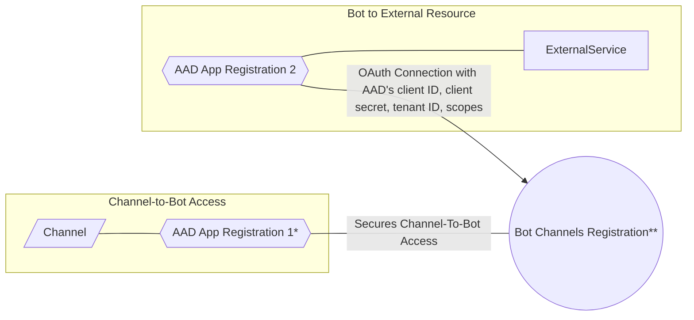

### Adding Authentication to Bot

#### Higher Level

* AAD is an Identity Provider, used as the Authorization Server to which:
    * User authenticates identity to
    * If authenticated, then Authz server provides Bot with Token
* External Services separately sepcify which Authz Servers they trust to issue Tokens
* Bot can use Token obtained from Authz Server in its requests to access External Services' APIs

#### Detailed View

* *Created automatically when creating a Web App Bot in Azure Portal
* ** Is "bot" just the "Bot Channels Registration" or does "bot" encompass more (App Service, Bot Channels Registration, cognitive keys, etc.)?
