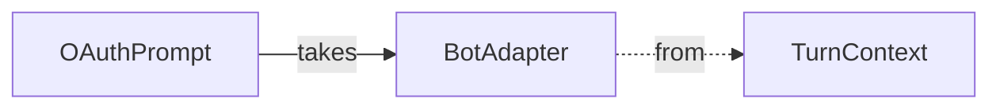

`OAuthPrompt` has various methods* that uses `BotAdapter` within its logic:

* `OAuthPrompt` methods that use `BotAdapter`: `BeginDialogAsync()`, `GetUserTokenAsync()`, `SignUserOutAsync()`, `SendOAuthCardAsync()`, `RecognizeTokenAsync()`