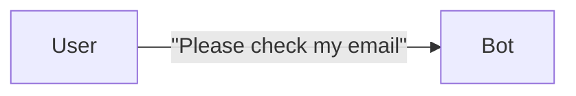
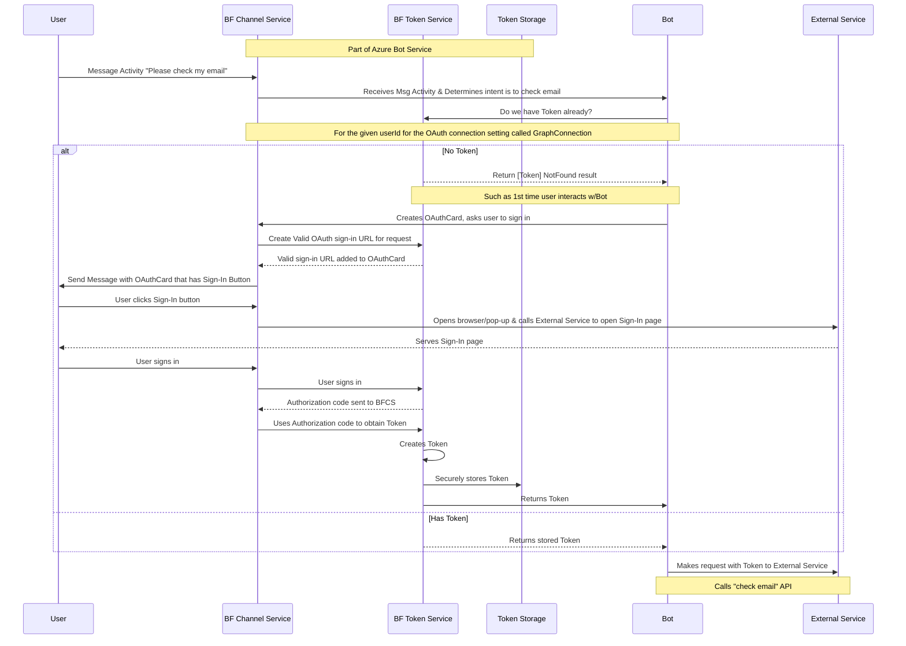
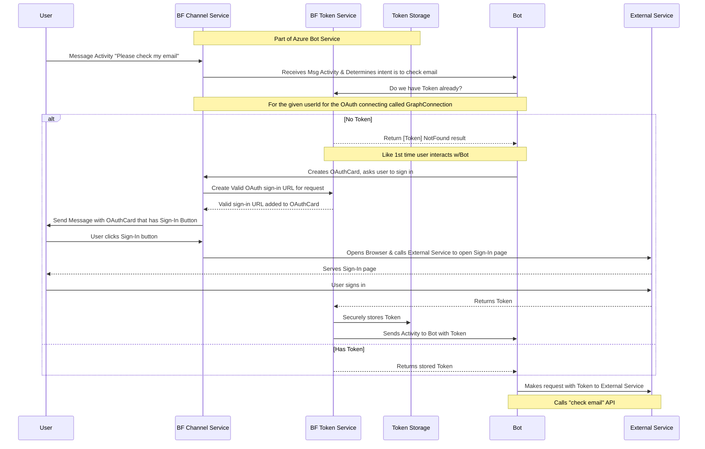
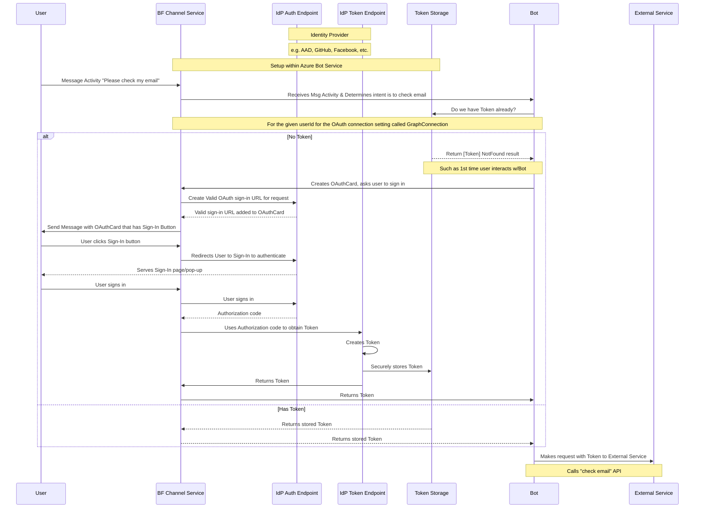

Illustrating example in [Authentication docs](https://docs.microsoft.com/en-us/azure/bot-service/bot-builder-concept-authentication?view=azure-bot-service-4.0#about-the-bot-framework-token-service) describing the "Bot Framework Token Service"

> For example, a bot that can check a user's recent emails, using the Microsoft Graph API, will require an Azure Active Directory user token. At design time, the bot developer would register an Azure Active Directory application with the Bot Framework Token Service (via the Azure Portal), and then configure an OAuth connection setting ( named GraphConnection) for the bot.

#### Goal

#### Detailed View

* Does the Token Return to BF Channel Service upon creation of Token or does it Return directly from Token Service to Bot?
* This part confuses me in the docs, because as far as I'm aware, External Service doesn't issue Tokens itself, that's the Authorization Server's job (which in this example is the "BF Token Service" as I understand it):
    > The user signs-in to this page for the external service. Once complete, the external service completes the OAuth protocol exchange with the Bot Framework Token Service, resulting in the external service sending the Bot Framework Token Service the user token. The Bot Framework Token Service securely stores this token and sends an activity to the bot with this token.

    * If it's true that the External Service makes Tokens itself, then the diagram would look like:

Using my knowledge of OAuth 2.0 in general though, and not following word-for-word what the docs say, I think the OAuth flow actually looks like this:

