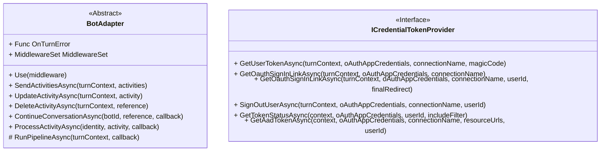

```mermaid
    classDiagram
        class BotAdapter {
            + Func<ITurnContext, Exception, Task> OnTurnError
            + MiddlewareSet MiddlewareSet
            + Use(middleware)
            + SendActivitiesAsync(turnContext, activities)
            + UpdateActivityAsync(turnContext, activity)
            + DeleteActivityAsync(turnContext, reference)
            + ContinueConversationAsync(botId, reference, callback)
            + ProcessActivityAsync(identity, activity, callback)
            # RunPipelineAsync(turnContext, callback)
        }
        <<Abstract>> BotAdapter

        class ICredentialTokenProvider {
            + GetUserTokenAsync(turnContext, oAuthAppCredentials, connectionName, magicCode)
            + GetOauthSignInLinkAsync(turnContext, oAuthAppCredentials, connectionName)
            + GetOauthSignInLinkAsync(turnContext, oAuthAppCredentials, connectionName, userId, finalRedirect)
            + SignOutUserAsync(turnContext, oAuthAppCredentials, connectionName, userId)
            + GetTokenStatusAsync(context, oAuthAppCredentials, userId, includeFilter)
            + GetAadTokenAsync(context, oAuthAppCredentials, connectionName, resourceUrls, userId)
        }
        <<Interface>> ICredentialTokenProvider

```