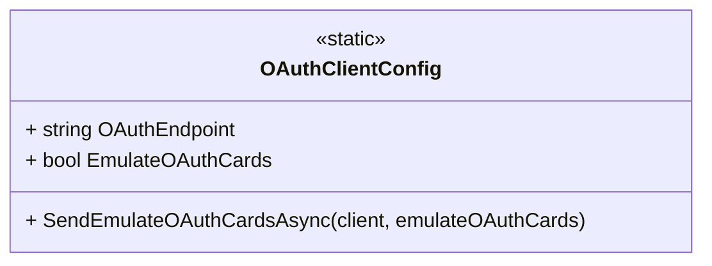

```mermaid
    classDiagram
        class OAuthClientConfig {
            + string OAuthEndpoint
            + bool EmulateOAuthCards
            + SendEmulateOAuthCardsAsync(client, emulateOAuthCards)
        }
        <<static>> OAuthClientConfig
```