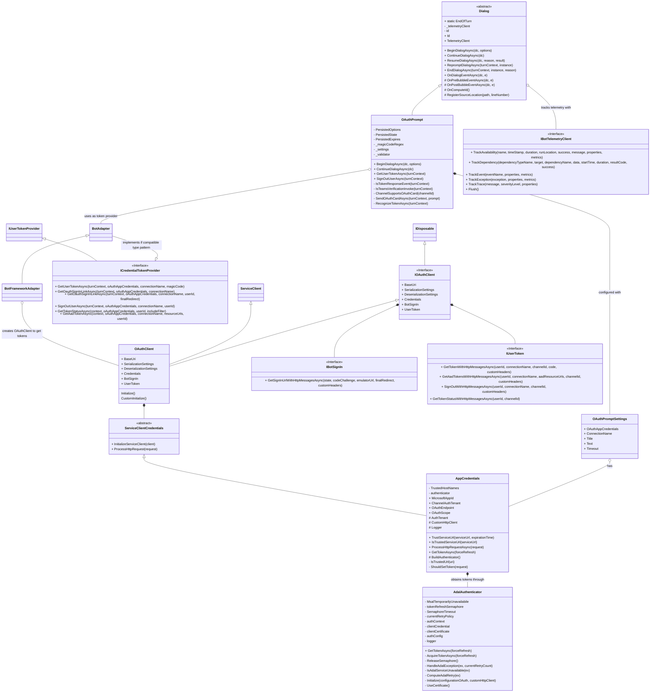

```mermaid
    classDiagram
        class OAuthPrompt {
            - PersistedOptions
            - PersistedState
            - PersistedExpires
            - _magicCodeRegex
            - _settings
            - _validator
            + BeginDialogAsync(dc, options)
            + ContinueDialogAsync(dc)
            + GetUserTokenAsync(turnContext)
            + SignOutUserAsync(turnContext)
            - IsTokenResponseEvent(turnContext)
            - IsTeamsVerificationInvoke(turnContext)
            - ChannelSupportsOAuthCard(channelId)
            - SendOAuthCardAsync(turnContext, prompt)
            - RecognizeTokenAsync(turnContext)
        }

        class Dialog {
            + static EndOfTurn
            - _telemetryClient
            - id
            + Id
            + TelemetryClient
            + BeginDialogAsync(dc, options)
            + ContinueDialogAsync(dc)
            + ResumeDialogAsync(dc, reason, result)
            + RepromptDialogAsync(turnContext, instance)
            + EndDialogAsync(turnContext, instance, reason)
            + OnDialogEventAsync(dc, e)
            # OnPreBubbleEventAsync(dc, e)
            # OnPostBubbleEventAsync(dc, e)
            # OnComputeId()
            # RegisterSourceLocation(path, lineNumber)
        }
        <<abstract>> Dialog

        class OAuthPromptSettings {
            + OAuthAppCredentials
            + ConnectionName
            + Title
            + Text
            + Timeout
        }

        class AppCredentials {
            - TrustedHostNames
            - authenticator
            + MicrosoftAppId
            + ChannelAuthTenant
            + OAuthEndpoint
            + OAuthScope
            # AuthTenant
            # CustomHttpClient
            # Logger
            + TrustServiceUrl(serviceUrl, expirationTime)
            + IsTrustedServiceUrl(serviceUrl)
            + ProcessHttpRequestAsync(request)
            + GetTokenAsync(forceRefresh)
            # BuildAuthenticator()
            - IsTrustedUrl(uri)
            - ShouldSetToken(request)
        }

        class AdalAuthenticator {
            - MsalTemporarilyUnavailabile
            - tokenRefreshSemaphore
            - SemaphoreTimeout
            - currentRetryPolicy
            - authContext
            - clientCredential
            - clientCertificate
            - authConfig
            - logger
            + GetTokenAsync(forceRefresh)
            - AcquireTokenAsync(forceRefresh)
            - ReleaseSemaphore()
            - HandleAdalException(ex, currentRetryCount)
            - IsAdalServiceUnavailable(ex)
            - ComputeAdalRetry(ex)
            - Initialize(configurationOAuth, customHttpClient)
            - UseCertificate()
        }

        class IBotTelemetryClient {
            + TrackAvailability(name, timeStamp, duration, runLocation, success, message, properties, metrics)
            + TrackDependency(dependencyTypeName, target, dependencyName, data, startTime, duration, resultCode, success)
            + TrackEvent(eventName, properties, metrics)
            + TrackException(exception, properties, metrics)
            + TrackTrace(message, severityLevel, properties)
            + Flush()
        }
        <<Interface>> IBotTelemetryClient

        class OAuthClient {
            + BaseUri
            + SerializationSettings
            + DeserializationSettings
            + Credentials
            + BotSignIn
            + UserToken
            Initialize()
            CustomInitialize()
        }

        class ServiceClientCredentials {
            + InitializeServiceClient(client)
            + ProcessHttpRequest(request)
        }
        <<abstract>> ServiceClientCredentials

        class IOAuthClient {
            + BaseUri
            + SerializationSettings
            + DeserializationSettings
            + Credentials
            + BotSignIn
            + UserToken
        }
        <<Interface>> IOAuthClient

        class IBotSignIn {
            + GetSignInUrlWithHttpMessagesAsync(state, codeChallenge, emulatorUrl, finalRedirect, customHeaders)
        }
        <<Interface>> IBotSignIn

        class IUserToken {
            + GetTokenWithHttpMessagesAsync(userId, connectionName, channelId, code, customHeaders)
            + GetAadTokensWithHttpMessagesAsync(userId, connectionName, aadResourceUrls, channelId, customHeaders)
            + SignOutWithHttpMessagesAsync(userId, connectionName, channelId, customHeaders)
            + GetTokenStatusWithHttpMessagesAsync(userId, channelId)
        }
        <<Interface>> IUserToken

        class ICredentialTokenProvider {
            + GetUserTokenAsync(turnContext, oAuthAppCredentials, connectionName, magicCode)
            + GetOauthSignInLinkAsync(turnContext, oAuthAppCredentials, connectionName)
            + GetOauthSignInLinkAsync(turnContext, oAuthAppCredentials, connectionName, userId, finalRedirect)
            + SignOutUserAsync(turnContext, oAuthAppCredentials, connectionName, userId)
            + GetTokenStatusAsync(context, oAuthAppCredentials, userId, includeFilter)
            + GetAadTokenAsync(context, oAuthAppCredentials, connectionName, resourceUrls, userId)
        }
        <<Interface>> ICredentialTokenProvider

        IUserTokenProvider <|-- ICredentialTokenProvider
        BotAdapter --|> ICredentialTokenProvider : implements if compatible type pattern
        OAuthPrompt o-- BotAdapter : uses as token provider

        BotAdapter <|-- BotFrameworkAdapter
        BotFrameworkAdapter o-- OAuthClient : creates OAuthClient to get tokens

        IDisposable <|-- IOAuthClient
        IOAuthClient *-- IBotSignIn
        IOAuthClient *-- IUserToken

        ServiceClient <|-- OAuthClient
        IOAuthClient <|-- OAuthClient

        Dialog o-- IBotTelemetryClient : tracks telemetry with

        OAuthClient *-- ServiceClientCredentials
        ServiceClientCredentials <|-- AppCredentials
        AppCredentials *-- AdalAuthenticator : obtains tokens through
        OAuthPromptSettings o-- AppCredentials : has
        
        OAuthPrompt *-- OAuthPromptSettings : configured with

        Dialog <|-- OAuthPrompt
        
```