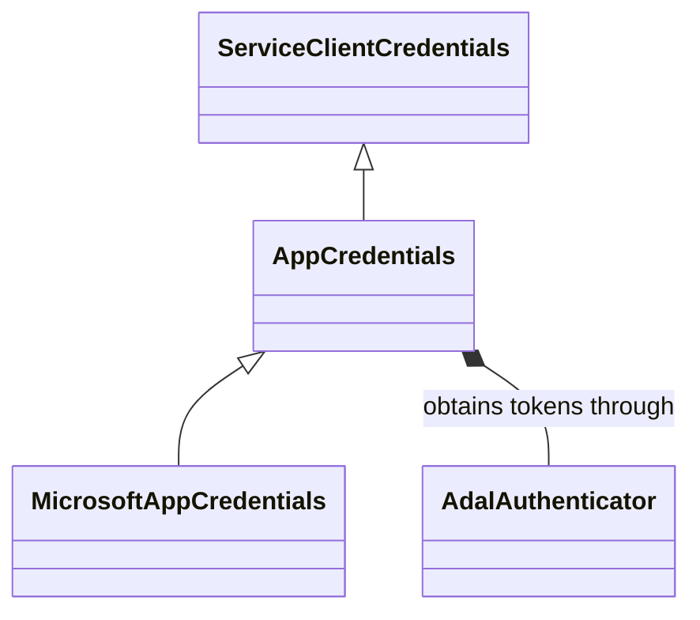

```mermaid
classDiagram

    ServiceClientCredentials <|-- AppCredentials
    AppCredentials <|-- MicrosoftAppCredentials

    AppCredentials *-- AdalAuthenticator : obtains tokens through
```

- `ServiceClientCredentials`: msrest class [.NET]() | [JS](https://docs.microsoft.com/en-us/javascript/api/@azure/ms-rest-js/serviceclientcredentials?view=azure-node-latest)
