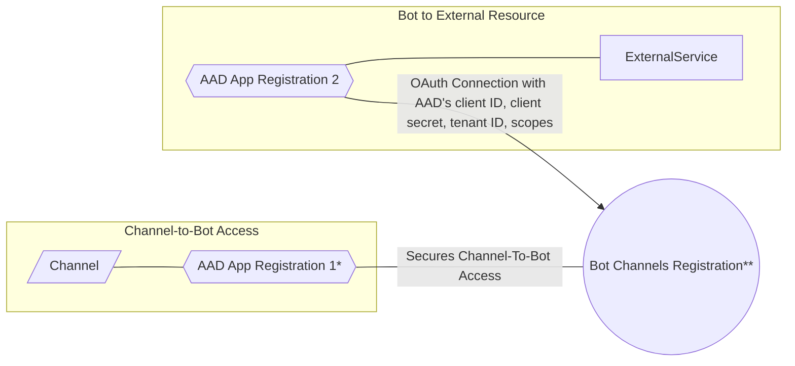

```mermaid
    graph LR
    
    subgraph Channel-to-Bot Access
        Channel[/Channel/] --- AAD1{{AAD App Registration 1*}}
    end
    AAD1 -- Secures Channel-To-Bot Access --- BotChannelsRegistration((Bot Channels Registration**))
    
    subgraph Bot to External Resource
        AAD2{{AAD App Registration 2}} --- ExternalService
    end
    AAD2 -- OAuth Connection with AAD's client ID, client secret, tenant ID, scopes--> BotChannelsRegistration

```