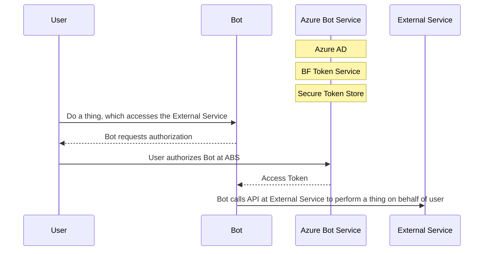

```mermaid
    sequenceDiagram

    participant User
    participant Bot
    participant ABS as Azure Bot Service
    Note over ABS: Azure AD
    Note over ABS: BF Token Service
    Note over ABS: Secure Token Store
    participant ExtService as External Service
    
    User ->> Bot: Do a thing, which accesses the External Service
    Bot -->> User: Bot requests authorization
    User ->> ABS: User authorizes Bot at ABS
    ABS -->> Bot: Access Token
    Bot ->> ExtService: Bot calls API at External Service to perform a thing on behalf of user
```