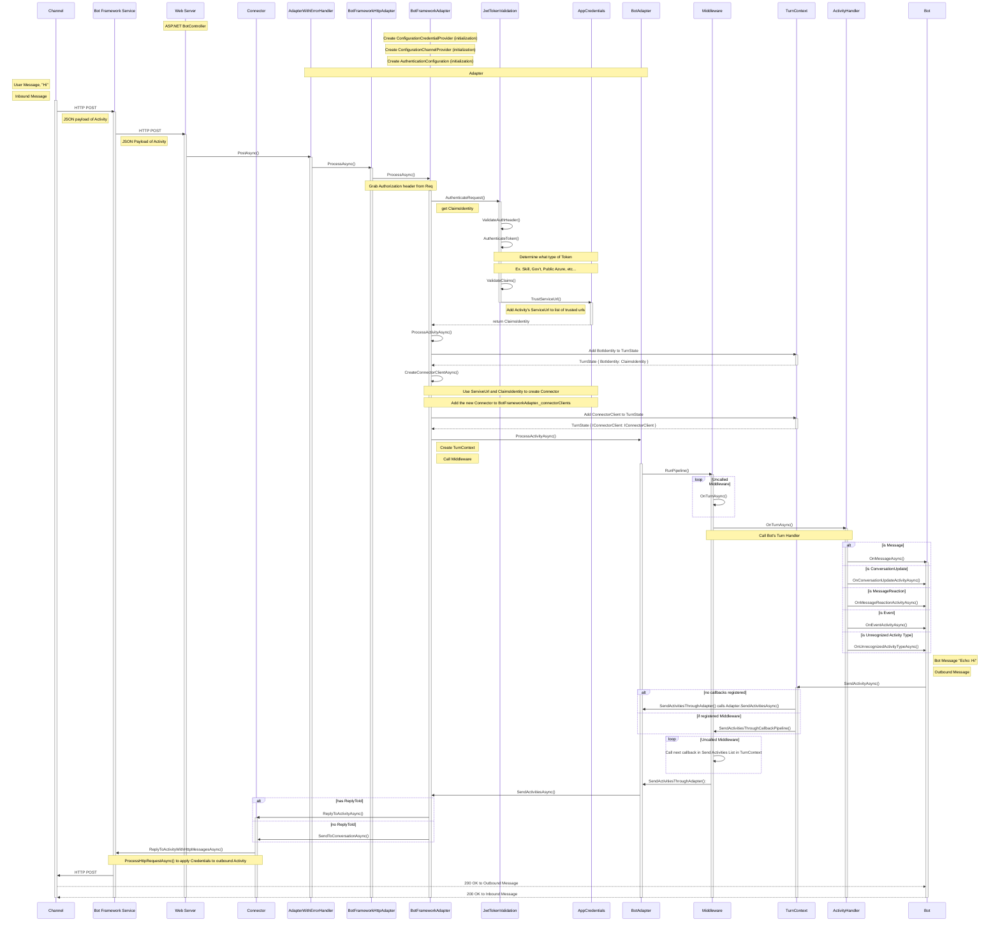

```mermaid
    sequenceDiagram
        participant Channel
        participant BFS as Bot Framework Service
        participant WebServer as Web Server
        Note over WebServer: ASP.NET BotController
        participant Connector
        participant Adapter as AdapterWithErrorHandler
        participant BotFrameworkHttpAdapter
        participant BotFrameworkAdapter
        Note over BotFrameworkAdapter: Create ConfigurationCredentialProvider (initialization)
        Note over BotFrameworkAdapter: Create ConfigurationChannelProvider (initialization)
        Note over BotFrameworkAdapter: Create AuthenticationConfiguration (initialization)
        participant JwtTokenValidation
        participant AppCredentials
        participant BotAdapter
        Note over Adapter, BotAdapter: Adapter
        participant Middleware
        participant TurnContext
        participant ActivityHandler
        participant Bot

        Note left of Channel: User Message, "Hi"
        Note left of Channel: Inbound Message
        activate Channel
        Channel ->> BFS: HTTP POST
        activate BFS
        Note right of Channel: JSON payload of Activity

        BFS ->> WebServer: HTTP POST
        activate WebServer
        Note right of BFS: JSON Payload of Activity

        WebServer ->> Adapter: PostAsync()
        activate Adapter
        
        Adapter ->> BotFrameworkHttpAdapter: ProcessAsync()
        activate BotFrameworkHttpAdapter
        BotFrameworkHttpAdapter ->> BotFrameworkAdapter: ProcessAsync()
        Note over BotFrameworkHttpAdapter, BotFrameworkAdapter: Grab Authorization header from Req
        activate BotFrameworkAdapter
        BotFrameworkAdapter ->> JwtTokenValidation : AuthenticateRequest()
        activate JwtTokenValidation
        Note right of BotFrameworkAdapter: get ClaimsIdentity
        JwtTokenValidation ->> JwtTokenValidation: ValidateAuthHeader()
        JwtTokenValidation ->> JwtTokenValidation: AuthenticateToken()
        Note over JwtTokenValidation, AppCredentials : Determine what type of Token
        Note over JwtTokenValidation, AppCredentials : Ex. Skill, Gov't, Public Azure, etc...
        JwtTokenValidation ->> JwtTokenValidation: ValidateClaims()
        JwtTokenValidation ->> AppCredentials: TrustServiceUrl()
        deactivate JwtTokenValidation
        activate AppCredentials
        Note right of JwtTokenValidation: Add Activity's ServiceUrl to list of trusted urls
        AppCredentials -->> BotFrameworkAdapter: return ClaimsIdentity
        deactivate AppCredentials

        BotFrameworkAdapter ->> BotFrameworkAdapter : ProcessActivityAsync()
        BotFrameworkAdapter ->> TurnContext : Add BotIdentity to TurnState
        activate TurnContext
        TurnContext -->> BotFrameworkAdapter:  TurnState { BotIdentity: ClaimsIdentity }
        deactivate TurnContext
        BotFrameworkAdapter ->> BotFrameworkAdapter: CreateConnectorClientAsync() 
        Note over BotFrameworkAdapter, AppCredentials: Use ServiveUrl and ClaimsIdentity to create Connector
        Note over BotFrameworkAdapter, AppCredentials: Add the new Connector to BotFrameworkAdapter._connectorClients
        BotFrameworkAdapter ->> TurnContext : Add ConnectorClient to TurnState
        activate TurnContext
        TurnContext -->> BotFrameworkAdapter:  TurnState { IConnectorClient: IConnectorClient }
        deactivate TurnContext
        BotFrameworkAdapter ->> BotAdapter : ProcessActivityAsync()
        Note right of BotFrameworkAdapter: Create TurnContext
        Note right of BotFrameworkAdapter: Call Middleware
        activate BotAdapter
            BotAdapter ->> Middleware: RunPipeline()
            activate Middleware
        loop Uncalled Middleware
            Middleware ->> Middleware: OnTurnAsync()
        end

        Middleware ->> ActivityHandler: OnTurnAsync()
        activate ActivityHandler
        Note over Middleware, ActivityHandler: Call Bot's Turn Handler
        alt is Message
                ActivityHandler ->> Bot: OnMessageAsync()
                activate Bot
            
            else is ConversationUpdate
                ActivityHandler ->> Bot: OnConversationUpdateActivityAsync()
            
            else is MessageReaction
                ActivityHandler ->> Bot: OnMessageReactionActivityAsync()
            
            else is Event
                ActivityHandler ->> Bot: OnEventActivityAsync()
            
            else is Unreognized Activity Type
                ActivityHandler ->> Bot: OnUnrecognizedActivityTypeAsync()
        end

        Note right of Bot: Bot Message "Echo: Hi"
        Note right of Bot: Outbound Message
        Bot ->> TurnContext: SendActivityAsync()
        activate TurnContext

        alt no callbacks registered
                TurnContext ->> BotAdapter: SendActivitiesThroughAdapter() calls Adapter.SendActivitiesAsync()
            else if registered Middleware
                TurnContext ->> Middleware: SendActivitiesThroughCallbackPipeline()
        end

        loop Uncalled Middleware
            Middleware ->> Middleware: Call next callback in Send Activities List in TurnContext
        end

        Middleware ->> BotAdapter: SendActivitiesThroughAdapter(): 
        BotAdapter ->> BotFrameworkAdapter: SendActivitiesAsync()
        alt has ReplyToId
            BotFrameworkAdapter ->> Connector: ReplyToActivityAsync() 
            activate Connector
        else no ReplyToId
            BotFrameworkAdapter ->> Connector: SendToConversationAsync()
        end

        Connector ->> BFS: ReplyToActivityWithHttpMessagesAsync()
        Note over BFS, Connector: ProcessHttpRequestAsync() to apply Credentials to outbound Activity

        BFS ->> Channel: HTTP POST

        Channel -->> Bot: 200 OK to Outbound Message
        Bot -->> Channel: 200 OK to Inbound Message

        deactivate TurnContext
        deactivate Bot
        deactivate ActivityHandler
        deactivate Middleware
        deactivate BotAdapter
        deactivate BotFrameworkAdapter
        deactivate BotFrameworkHttpAdapter
        deactivate Adapter
        deactivate WebServer
        deactivate Connector
        deactivate BFS
        deactivate Channel
        
```