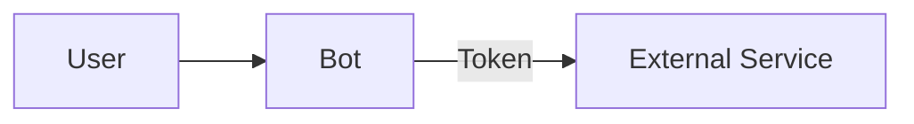
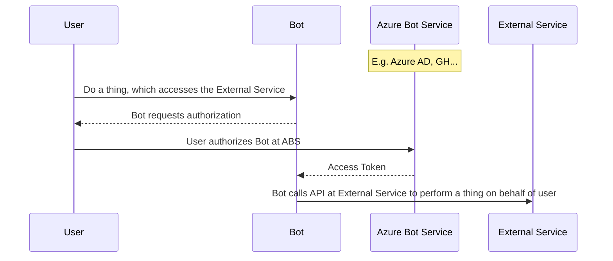

## High Level Authorization Flow
Within Bot Framework, an OAuth flow typically boils down to your *bot* wanting to access an *external service* on behalf of the *user*. In order to do this, we must verify that the user is someone who has the authority to access the external service and can, in turn, delegate part of their authority to the bot to access the service.

The external service accepts an access *token* as "proof" that the bot has been delegated permission to access the service. It acts as a limited-access key. 

The access token is used, because:
- It does not expose the user's log-in credentials for the external service to the bot
    - Bot cannot impersonate user
- Provides scopes (subset of functions or permissions) that the user allows bot to perform
    - This thus allows the user to limit the actions the bot can do on his/her behalf

**Give Bot Access to External Service**

Another participant in the OAuth flow is the authorization server or identity provider. An Azure Active Directory (AAD) app is an example of an identity provider in the cloud. AAD:
- authenticates users
- provides access tokens to authorized clients. 

You can register identity providers to your bot from within Azure Bot Service.

The external service trusts tokens issued from an identity provider.
When a user wants the bot to access the external service, the bot sends the user to the authorization server to allow the user to authorize the bot to access the external service. Once authorized, the authorization server sends the acess token to the bot. The bot can now use the external service, making sure to include the token in its calls to the service.

*High Level View of OAuth Flow in Bot Framework*

### An Example

Your bot is a food delivery bot. The user wants to order pizza, and upon checkout, the bot needs the user's information in order to complete the order. Your bot prompts the user to either create an account with your food delivery service from scratch or the user could continue the order by signing into a social media account (which has the user's info). The user chooses to continue pizza delivery checkout via social media account.

Participants in this scenario:
- User, who wants to have pizza (one who "owns" an account on the social media service)
- Food Delivery Bot
- Social Media Platform (external service)

