## High Level Authorization Flow
Within Bot Framework, an OAuth flow typically boils down to your *bot* wanting to access an *external service* on behalf of the *user*. In order to do this, we must verify that the user is someone who has the authority to access the external service and can, in turn, delegate part of their authority to the bot to access the service.

The external service accepts an access *token* as "proof" that the bot has been delegated permission to access the service. It acts as a limited-access key. 

The access token is used, because:
- It does not expose the user's log-in credentials for the external service to the bot
    - Bot cannot impersonate user
- Provides scopes (subset of functions or permissions) that the user allows bot to perform
    - This thus allows the user to limit the actions the bot can do on his/her behalf

**Give Bot Access to External Service**

Another participant in the OAuth flow is the authorization server or identity provider. An Azure Active Directory (AAD) app is an example of an identity provider in the cloud. AAD:
- authenticates users
- provides access tokens to authorized clients. 

You can register identity providers to your bot from within Azure Bot Service.

The external service trusts tokens issued from an identity provider.
When a user wants the bot to access the external service, the bot sends the user to the authorization server to allow the user to authorize the bot to access the external service. Once authorized, the authorization server sends the acess token to the bot. The bot can now use the external service, making sure to include the token in its calls to the service.

**High Level View of OAuth Flow in Bot Framework**

Note to self: maybe illustrate authorization code grant type flow?

^ Ok. Right now I added a [sequence diagram](#another-example-scenario-described-in-authentication-docs) of an example that I found in [Authentication](https://docs.microsoft.com/en-us/azure/bot-service/bot-builder-concept-authentication?view=azure-bot-service-4.0) docs that go into the OAuth pattern of token acquisition in more detail.

___

### An Example
You're using a retail store bot that sells yoga pants, that has a "wishlist" feature. It's the holiday season, and you wish you could just easily send out your yoga pants wishlist to friends and family without having to rebuild the whole thing from scratch in a new document like Word. You have an Outlook email account, and thankfully it has an API that the yoga bot knows how to talk to. You want to send an email detailing your wishlist to your contacts stored in your email account. You can accomplish this via an OAuth authentication flow.

*Participants in this scenario:*
- **User**, who wants to have the wishlist emailed to contacts (one who "owns" an account on the email service)
- Yoga Pants **Bot** (the OAuth client)
- Outlook **email** (external service)

*OAuth Flow with Yoga Pants Bot:*
- The user tells the bot to send the wishlist out via email to their contacts. 
- Bot realizes it needs an access token in order to access the email, an external service, so it sends the user to the authorization server. In our samples, the bots use AAD as the authorization server. 
- At AAD, the user can authorize the user to use (a subset) of the external service's functions on their behalf.
    - Once user authorizes bot, (if using authorization code grant type) AAD sends an authorization code to the bot (does this authorization code get handled in our bot or all encompassed within ABS?? find out)
    - Bot can send authorization code to the token endpoint of AAD to get a token
- If the code is valid, AAD sends the bot an access token
- Bot can now access Outlook to email contacts, using token in its requests to the external service

___
### Another Example, scenario described in [Authentication](https://docs.microsoft.com/en-us/azure/bot-service/bot-builder-concept-authentication?view=azure-bot-service-4.0) docs

**Needs review!** (I'm unsure of the pattern of who actually creates the Token)

Illustrating example in [Authentication docs](https://docs.microsoft.com/en-us/azure/bot-service/bot-builder-concept-authentication?view=azure-bot-service-4.0#about-the-bot-framework-token-service) describing the "Bot Framework Token Service"

> For example, a bot that can check a user's recent emails, using the Microsoft Graph API, will require an Azure Active Directory user token. At design time, the bot developer would register an Azure Active Directory application with the Bot Framework Token Service (via the Azure Portal), and then configure an OAuth connection setting ( named GraphConnection) for the bot.

#### Goal

#### Detailed View

Note: I'll add the activation vertical bars onto diagram, once I know the participants are calling in the proper order

* Does the Token Return to BF Channel Service upon creation of Token or does it Return directly from Token Service to Bot?
* This part confuses me in the docs, because as far as I'm aware, External Service doesn't issue Tokens itself, that's the Authorization Server's job (which in this example is the "BF Token Service" as I understand it):
    > The user signs-in to this page for the external service. Once complete, the external service completes the OAuth protocol exchange with the Bot Framework Token Service, resulting in the external service sending the Bot Framework Token Service the user token. The Bot Framework Token Service securely stores this token and sends an activity to the bot with this token.

    * If the quote from docs above is true that the External Service makes Tokens itself, then the diagram would look like:

___

### [Add authentication to your bot via Azure Bot Service](https://docs.microsoft.com/en-us/azure/bot-service/bot-builder-authentication?view=azure-bot-service-4.0&tabs=csharp)

This diagrams the concepts introduced in the [Add authentication to your bot via Azure Bot Service](https://docs.microsoft.com/en-us/azure/bot-service/bot-builder-authentication?view=azure-bot-service-4.0&tabs=csharp), which is linked in our authentication samples' READMEs. 

#### Higher Level

* AAD is an Identity Provider, used as the Authorization Server to which:
    * User authenticates identity to
    * If authenticated, then auth server provides Bot with Token
* External Services separately sepcify which auth servers they trust to issue Tokens
* Bot can use Token obtained from auth server in its requests to access External Services' APIs

#### Detailed View

* *Created automatically when creating a Web App Bot in Azure Portal
* ** Is "bot" just the "Bot Channels Registration" or does "bot" encompass more (App Service, Bot Channels Registration, cognitive keys, etc.)?
* *** Provider can be AAD, GitHub, Uber, FB, etc. 
    * IdP simply must be a provider that the External Service trusts and can consume Tokens issued from

___
## Detailed Authorization Flow in Bot Framework
### OAuth in EchoBot
*Use `Ctrl` + `+` to Zoom into diagram (such as in Edge, Chrome, Firefox, etc.)*

- Consider abstracting away details, to focus solely on OAuth? Or Does this detailed view help show how OAuth fit into "the whole picture"?
___
### `OAuthPrompt`

- In order to access an External Resource, the Bot must send the User (aka the "owner" of the protected resource at the External Service) to the Authorization Server or Identity Provider (in our samples we use AAD)
- Once user is at AAD, the user must:
    - Authenticate their identity (they are who they say they are)
    - Authorize the Bot to access the External Service (delegating limited power, not the user's entire power, in the form of approving certain scopes) on the User's behalf
        - In the process of designing the Bot, you already specified *what scopes (permissions)* the bot would need to perform whatever function that Bot was built to do, which are the scopes that the User is prompted to authorize
        - See [Add authentication to your bot via Azure Bot Service](https://docs.microsoft.com/en-us/azure/bot-service/bot-builder-authentication?view=azure-bot-service-4.0&tabs=csharp) for more detail on scopes
- Once authenticated and authorized, AAD sends Bot the Token needed to access External Resource

Bot Framework's `OAuthPrompt` provides a way to send the User to AAD in order to obtain a Token. Bot developers do not have to manage Token lifecycles, storage, nor proper redirects in the OAuth flow.

#### `OAuthPrompt.BeginDialogAsync()` Flow

")

#### `OAuthPrompt.ContinueDialogAsync()` Flow

*Higher Level*
")

*Detailed View*
")

___
### OAuth in Bot Framework Class Diagram (aka Giant Spaghetti Monster Mess)

- If OAuth class diagrams seem like they may be useful, then I would consider making more diagrams, with fewer classes in each...or perhaps just take the member details and use only class names?
- Might need to use a different tool other than Mermaid if block diagram is more appropriate (Mermaid doesn't have this type of diagram)
- Also probably should add in the JWT Validator
___
## Other Oauth Diagrams to Consider
- OAuth in Sockets
- OAuth in Skills
- Sequence Diagram for OAuth Prompt
    - Would need to include BF Dialog mechanics in this diagram
- Identity vs. Claims
- Don't think we need a diagram for this, but in our docs "somewhere" we should mention the difference between authentication and authorization
- The diagrams above were done only looking at C#--some of the higher level ones are applicable to any language, but the detailed sequence diagrams would need to be created especially for JS or create one that is "generalized" to be language-agnostic