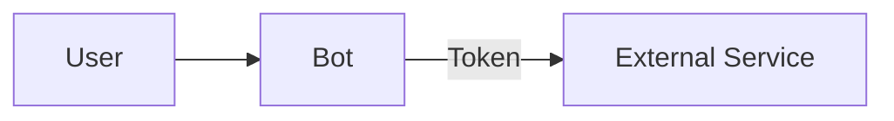
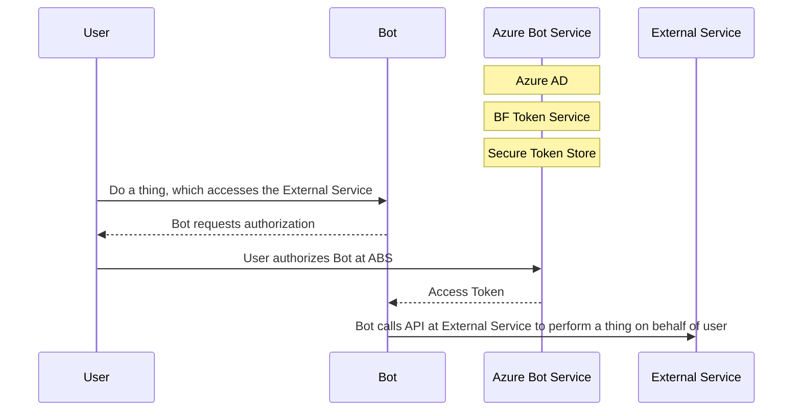

## High Level Authorization Flow
Within Bot Framework, an OAuth flow typically boils down to your *bot* wanting to access an *external service* on behalf of the *user*. In order to do this, we must verify that the user is someone who has the authority to access the external service and can, in turn, delegate part of their authority to the bot to access the service.

The external service accepts an access *token* as "proof" that the bot has been delegated permission to access the service. It acts as a limited-access key. 

The access token is used, because:
- It does not expose the user's log-in credentials for the external service to the bot
    - Bot cannot impersonate user
- Provides scopes (subset of functions or permissions) that the user allows bot to perform
    - This thus allows the user to limit the actions the bot can do on his/her behalf

**Give Bot Access to External Service**

Another participant in the OAuth flow is the authorization server or identity provider. An Azure Active Directory (AAD) app is an example of an identity provider in the cloud. AAD:
- authenticates users
- provides access tokens to authorized clients. 

You can register identity providers to your bot from within Azure Bot Service.

The external service trusts tokens issued from an identity provider.
When a user wants the bot to access the external service, the bot sends the user to the authorization server to allow the user to authorize the bot to access the external service. Once authorized, the authorization server sends the acess token to the bot. The bot can now use the external service, making sure to include the token in its calls to the service.

**High Level View of OAuth Flow in Bot Framework**

Note to self: maybe illustrate authorization code grant type flow?
___

### An Example
You're using a retail store bot that sells yoga pants, that has a "wishlist" feature. It's the holiday season, and you wish you could just easily send out your yoga pants wishlist to friends and family without having to rebuild the whole thing from scratch in a new document like Word. You have an Outlook email account, and thankfully it has an API that the yoga bot knows how to talk to. You want to send an email detailing your wishlist to your contacts stored in your email account. You can accomplish this via an OAuth authentication flow.

*Participants in this scenario:*
- **User**, who wants to have the wishlist emailed to contacts (one who "owns" an account on the email service)
- Yoga Pants **Bot** (the OAuth client)
- Outlook **email** (external service)

*OAuth Flow with Yoga Pants Bot:*
- The user tells the bot to send the wishlist out via email to their contacts. 
- Bot realizes it needs an access token in order to access the email, an external service, so it sends the user to the authorization server. In our samples, the bots use AAD as the Authz server. 
- At AAD, the user can authorize the user to use (a subset) of the external service's functions on their behalf.
- Once user authorizes bot, (if using authorization code grant type) AAD sends an authorization code to the bot (does this Authz code get handled in our bot or all encompassed within ABS?? find out)
- Bot can send authorization code to the token endpoint of AAD to get a token
- If the code is valid, AAD sends the bot an access token
- Bot can now access Outlook to email contacts, using token in its requests to the external service
