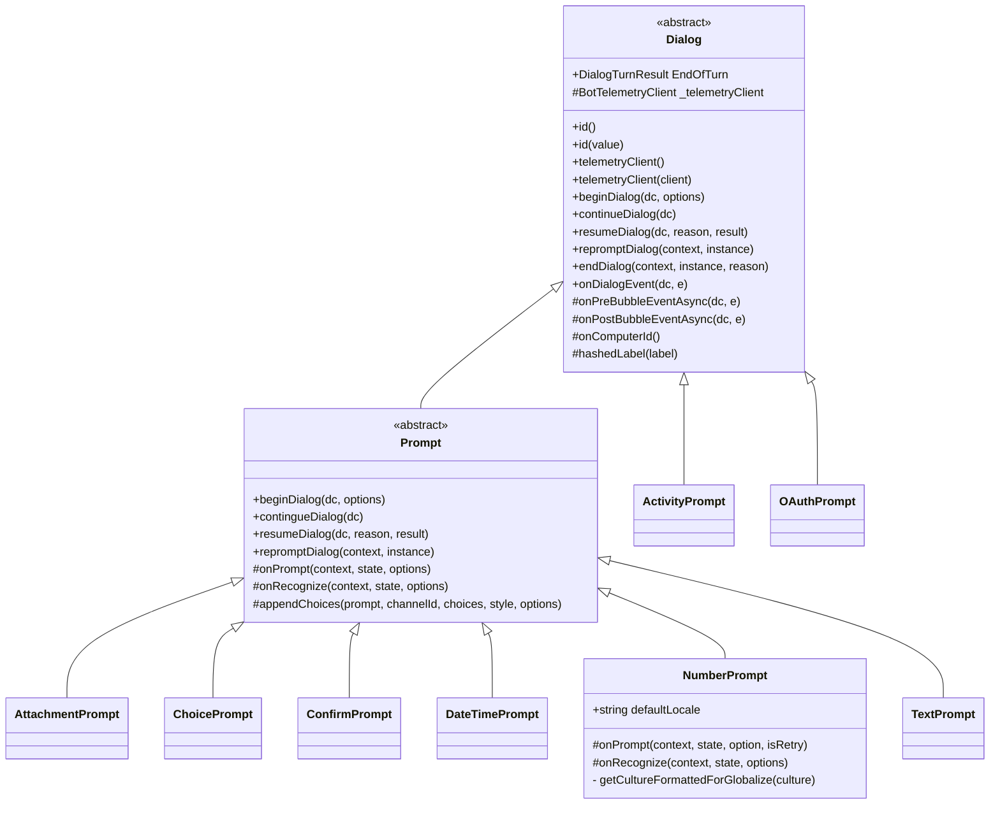

```mermaid
classDiagram
    class NumberPrompt{
        +string defaultLocale
        
        #onPrompt(context, state, option, isRetry)
        #onRecognize(context, state, options)
        - getCultureFormattedForGlobalize(culture)
    }

    class Prompt{
        +beginDialog(dc, options)
        +contingueDialog(dc)
        +resumeDialog(dc, reason, result)
        +repromptDialog(context, instance)
        #onPrompt(context, state, options)
        #onRecognize(context, state, options)
        #appendChoices(prompt, channelId, choices, style, options)
    }

    class Dialog{
        +DialogTurnResult EndOfTurn
        #BotTelemetryClient _telemetryClient
        +id()
        +id(value)
        +telemetryClient()
        +telemetryClient(client)
        +beginDialog(dc, options)
        +continueDialog(dc)
        +resumeDialog(dc, reason, result)
        +repromptDialog(context, instance)
        +endDialog(context, instance, reason)
        +onDialogEvent(dc, e)
        #onPreBubbleEventAsync(dc, e)
        #onPostBubbleEventAsync(dc, e)
        #onComputerId()
        #hashedLabel(label)
    }
    <<abstract>> Dialog
    <<abstract>> Prompt
    Dialog <|-- Prompt
    Dialog <|-- ActivityPrompt
    Prompt <|-- AttachmentPrompt
    Prompt <|-- ChoicePrompt
    Prompt <|-- ConfirmPrompt
    Prompt <|-- DateTimePrompt
    Prompt <|-- NumberPrompt
    Dialog <|-- OAuthPrompt
    Prompt <|-- TextPrompt
```