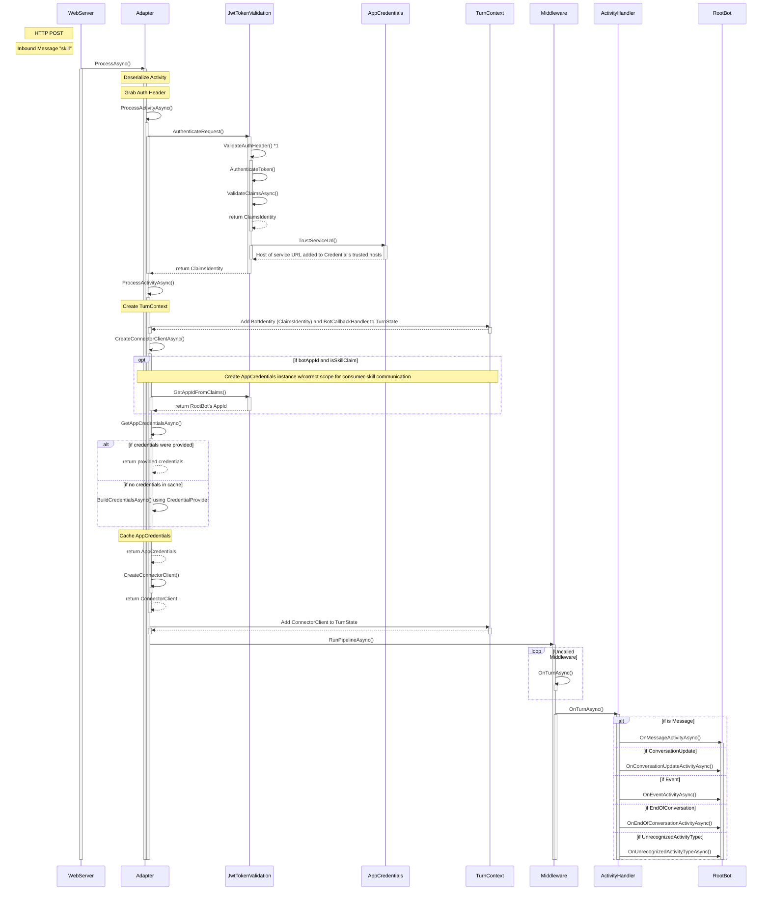

# Channel to Root Flow

```mermaid
sequenceDiagram

    participant WebServer
    participant Adapter
    participant JwtTokenValidation
    participant AppCredentials
    participant TurnContext
    participant Middleware
    participant ActivityHandler

    Note left of WebServer: HTTP POST 
    Note left of WebServer: Inbound Message "skill"
    WebServer ->> Adapter: ProcessAsync()
    activate WebServer
    activate Adapter
        Note over Adapter: Deserialize Activity
        Note over Adapter: Grab Auth Header
        Adapter ->> Adapter: ProcessActivityAsync()
        activate Adapter
            Adapter ->> JwtTokenValidation: AuthenticateRequest()
            activate Adapter
            activate JwtTokenValidation
                JwtTokenValidation ->> JwtTokenValidation: ValidateAuthHeader() *1
                activate JwtTokenValidation
                    JwtTokenValidation ->> JwtTokenValidation: AuthenticateToken()
                    JwtTokenValidation ->> JwtTokenValidation: ValidateClaimsAsync()
                    JwtTokenValidation -->> JwtTokenValidation: return ClaimsIdentity
                deactivate JwtTokenValidation 

                JwtTokenValidation ->> AppCredentials: TrustServiceUrl()
                activate JwtTokenValidation
                activate AppCredentials
                    AppCredentials -->> JwtTokenValidation: Host of service URL added to Credential's trusted hosts
                deactivate AppCredentials
                deactivate JwtTokenValidation

                JwtTokenValidation -->> Adapter: return ClaimsIdentity
            deactivate Adapter
            deactivate JwtTokenValidation

            Adapter ->> Adapter : ProcessActivityAsync()
            activate Adapter
                Note over Adapter: Create TurnContext
                
                Adapter ->> TurnContext: Add BotIdentity (ClaimsIdentity) and BotCallbackHandler to TurnState
                activate Adapter
                activate TurnContext
                    TurnContext -->> Adapter: 
                deactivate TurnContext
                deactivate Adapter

                Adapter ->> Adapter: CreateConnectorClientAsync()
                activate Adapter
                    opt if botAppId and isSkillClaim
                        Note over Adapter, TurnContext: Create AppCredentials instance w/correct scope for consumer-skill communication
                        Adapter ->> JwtTokenValidation: GetAppIdFromClaims()
                        activate Adapter
                        activate JwtTokenValidation
                            JwtTokenValidation -->> Adapter: return RootBot's AppId
                        deactivate JwtTokenValidation
                        deactivate Adapter
                    end

                    Adapter ->> Adapter: GetAppCredentialsAsync()
                    activate Adapter
                        alt if credentials were provided
                            Adapter -->> Adapter: return provided credentials
                            
                            else if no credentials in cache
                                Adapter ->> Adapter: BuildCredentialsAsync() using CredentialProvider
                        end
    
                        Note over Adapter: Cache AppCredentials    
                    deactivate Adapter
                    Adapter -->> Adapter: return AppCredentials

                    Adapter ->> Adapter: CreateConnectorClient()
                    activate Adapter
                    deactivate Adapter

                    Adapter -->> Adapter: return ConnectorClient
                deactivate Adapter

                Adapter ->> TurnContext: Add ConnectorClient to TurnState
                activate Adapter
                activate TurnContext
                    TurnContext -->> Adapter: 
                deactivate TurnContext
                deactivate Adapter

                Adapter ->> Middleware: RunPipelineAsync()
                activate Middleware
                    loop Uncalled Middleware
                        Middleware ->> Middleware: OnTurnAsync()
                        activate Middleware
                        deactivate Middleware
                    end

                    Middleware ->> ActivityHandler: OnTurnAsync()
                    activate Middleware
                    activate ActivityHandler
                        alt if is Message
                            ActivityHandler ->> RootBot: OnMessageActivityAsync()
                            activate RootBot

                            else if ConversationUpdate
                                ActivityHandler ->> RootBot: OnConversationUpdateActivityAsync()
                            else if Event
                                ActivityHandler ->> RootBot: OnEventActivityAsync()
                            else if EndOfConversation
                                ActivityHandler ->> RootBot: OnEndOfConversationActivityAsync()
                            else if UnrecognizedActivityType:
                                ActivityHandler ->> RootBot: OnUnrecognizedActivityTypeAsync()
                        end
                            deactivate RootBot
                    deactivate ActivityHandler
                    deactivate Middleware
                deactivate Middleware
            deactivate Adapter

        deactivate Adapter
    deactivate Adapter
    deactivate WebServer
```

- *1 See JwtTokenValidation.authenticateRequest diagram for more details on Token validation flow
- Note: double check the "opt" route