# Skill Response into Consumer's Skill Handler

```mermaid
sequenceDiagram

    participant Skill
    Note left of Skill: Message "skill" 
    participant ConsumerController as Consumer Controller *1
    participant SkillHandler as Skill Handler *2
    participant JwtTokenValidation
    participant ConvoIdFactory
    participant Activity
    participant Adapter
    participant TurnContext
    participant Middleware
    participant Connector
    participant Channel

    Note over Skill, SkillHandler: "v3/conversations/{conversationId}/activities/{activityId}"
    Skill ->> ConsumerController: HTTP POST
    activate Skill
    activate ConsumerController
        ConsumerController ->> ConsumerController: ReplyToActivityAsync()
        activate ConsumerController
            ConsumerController ->> SkillHandler: HandleReplyToActivityAsync()
            activate ConsumerController
            activate SkillHandler
                SkillHandler ->> SkillHandler: AuthenticateAsync()
                activate SkillHandler
                    SkillHandler ->> JwtTokenValidation: ValidateAuthHeader()
                    activate SkillHandler
                    activate JwtTokenValidation
                        JwtTokenValidation ->> JwtTokenValidation: AuthenticateToken()
                        JwtTokenValidation ->> JwtTokenValidation: ValidateClaimsAsync()
                        JwtTokenValidation -->> SkillHandler: return ClaimsIdentity
                    deactivate JwtTokenValidation
                    deactivate SkillHandler
                deactivate SkillHandler

                SkillHandler ->> SkillHandler: OnReplyToActivityAsync()
                activate SkillHandler
                    SkillHandler ->> SkillHandler: ProcessActivityAsync()
                    activate SkillHandler
                        SkillHandler ->> ConvoIdFactory: GetConversationReferenceAsync()
                        activate SkillHandler
                        activate ConvoIdFactory
                            ConvoIdFactory -->> SkillHandler: return original channel-consumer conversation reference
                        deactivate ConvoIdFactory
                        deactivate SkillHandler

                        SkillHandler ->> Activity: GetConversationReference()
                        activate SkillHandler
                        activate Activity
                            Activity -->> SkillHandler: return consumer-skill conversation reference
                        deactivate Activity
                        deactivate SkillHandler

                        SkillHandler ->> Adapter: ContinueConversationAsync()
                        activate SkillHandler
                        activate Adapter
                            Note over Adapter, TurnContext: Create new TurnContext
                            Note over Adapter, TurnContext: for user-consumer conversation
                            Note over Adapter, TurnContext: Note *3

                            Adapter ->> TurnContext: Add BotIdentity (ClaimsIdentity) and BotCallbackHandler to TurnState
                            activate Adapter
                            activate TurnContext
                                TurnContext -->> Adapter: 
                            deactivate TurnContext
                            deactivate Adapter

                            Adapter ->> Adapter: EnsureChannelConnectorClientIsCreatedAsync()
                            activate Adapter
                                Note over Adapter: Note *4
                            deactivate Adapter

                            Adapter ->> TurnContext: Add ConnectorClient to TurnState
                            activate Adapter
                            activate TurnContext
                                TurnContext -->> Adapter: 
                            deactivate TurnContext
                            deactivate Adapter

                            Adapter ->> Middleware: RunPipelineAsync()
                            activate Adapter                            
                            activate Middleware                            
                                loop Uncalled Middleware
                                    Middleware ->> Middleware: OnTurnAsync()
                                end

                                Middleware ->> SkillHandler: Invoke BotCallbackHandler defined in ProcessActivity()
                                activate Middleware
                                activate SkillHandler
                                    SkillHandler ->> TurnContext: Add Skill Conversation Reference to TurnState
                                    activate SkillHandler
                                    activate TurnContext
                                        TurnContext -->> SkillHandler: 
                                    deactivate TurnContext
                                    deactivate SkillHandler

                                    SkillHandler ->> Activity: ApplyConversationReference()
                                    activate SkillHandler
                                    activate Activity
                                        Note over ConvoIdFactory, TurnContext: Activity updates from being in Skill-Consumer to Channel-Consumer conversation
                                        Activity -->> SkillHandler: return Activity with Channel-Consumer conversation reference applied
                                    deactivate Activity
                                    deactivate SkillHandler

                                    alt ActivityTypes.EndOfConversation
                                        SkillHandler ->> ConvoIdFactory: DeleteConversationReferenceAsync()
                                        SkillHandler ->> SkillHandler: ApplyEoCToTurnContextActivity()
                                        
                                        else ActivityTypes.Event
                                            SkillHandler ->> SkillHandler: ApplyEventToTurnContextActivity()

                                        else Other Activity types
                                            SkillHandler ->> TurnContext: SendActivityAsync()
                                            activate SkillHandler
                                            activate TurnContext
                                                TurnContext ->> Adapter: SendActivitiesAsync()
                                                activate TurnContext
                                                activate Adapter
                                                    Adapter ->> TurnContext: Get Connector from TurnState
                                                    activate Adapter
                                                    activate TurnContext
                                                        TurnContext -->> Adapter: 
                                                    deactivate TurnContext
                                                    deactivate Adapter

                                                    Adapter ->> Connector: ReplyToActivityAsync()
                                                    activate Adapter
                                                    activate Connector
                                                        Connector ->> Channel: ReplyToActivityWithHttpMessagesAsync()
                                                        activate Connector
                                                        activate Channel
                                                            Note over Connector, Channel: POST Note *5
                                                        deactivate Channel
                                                        deactivate Connector
                                                    deactivate Adapter
                                                    deactivate Connector
                                                deactivate Adapter
                                                deactivate TurnContext

                                            deactivate TurnContext
                                            deactivate SkillHandler
                                    end
                                deactivate SkillHandler
                                deactivate Middleware
                            deactivate Middleware                            
                            deactivate Adapter                            
                        deactivate Adapter
                        deactivate SkillHandler
                    deactivate SkillHandler
                deactivate SkillHandler
            deactivate SkillHandler
            deactivate ConsumerController
        deactivate ConsumerController
    deactivate ConsumerController
    deactivate Skill
```

- *1 Consumer's Skill controller is a `ChannelServiceController`
- *2 Skill Handler is a `ChannelServiceHandler`
- *3 Here we create a new event-type activity with name "ContinueConversation", in order to initialize the new TurnContext in the Channel-Consumer conversation
    - This is done so we can call RunPipelineAsync() to continue the outbound conversation
- *4 When a parent bot is deployed to multiple instances the cache AppIds, ConnectorClients, and Trusted URL are not initialized if the server instance hasn't been hit by a request form the channel. THis code ensures that the required objects are created.
- *5 "v3/conversations/{conversationId}/activities/{activityId}"