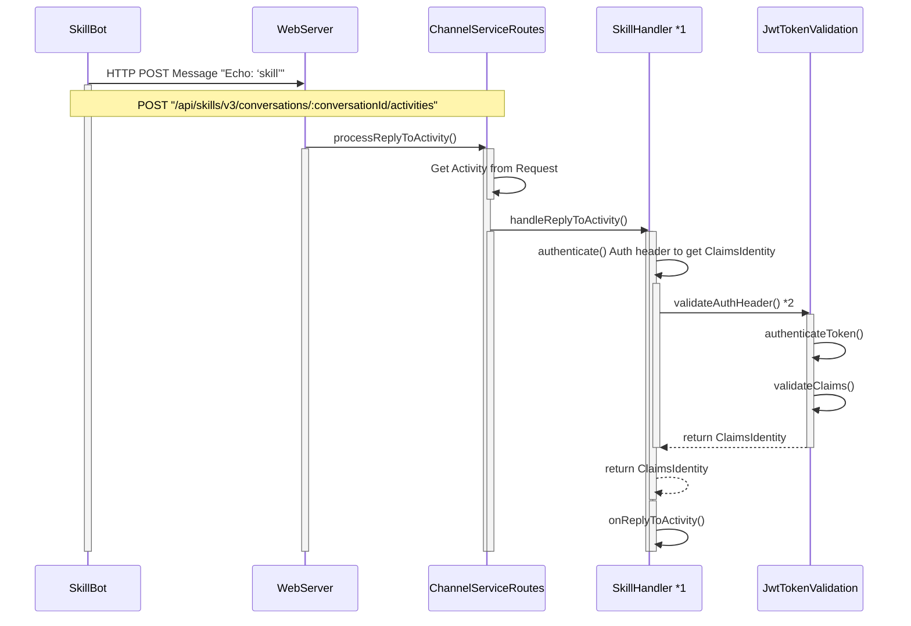

```mermaid
sequenceDiagram
    participant Skill as SkillBot
    participant WebServer
    participant ChannelServiceRoutes
    participant SkillHandler as SkillHandler *1
    participant JwtTokenValidation

    Skill ->> WebServer: HTTP POST Message "Echo: ‘skill’"
    activate Skill
    Note over Skill, ChannelServiceRoutes: POST "/api/skills/v3/conversations/:conversationId/activities"
        WebServer ->> ChannelServiceRoutes: processReplyToActivity()
        activate WebServer
        activate ChannelServiceRoutes
            activate ChannelServiceRoutes
            ChannelServiceRoutes ->> ChannelServiceRoutes: Get Activity from Request
            deactivate ChannelServiceRoutes
            
            ChannelServiceRoutes ->> SkillHandler: handleReplyToActivity()
            activate ChannelServiceRoutes
            activate SkillHandler
                activate SkillHandler
                    SkillHandler ->> SkillHandler: authenticate() Auth header to get ClaimsIdentity
                    activate SkillHandler
                        SkillHandler ->> JwtTokenValidation: validateAuthHeader() *2
                        activate JwtTokenValidation
                            JwtTokenValidation ->> JwtTokenValidation: authenticateToken()

                            JwtTokenValidation ->> JwtTokenValidation: validateClaims()

                            JwtTokenValidation -->> SkillHandler: return ClaimsIdentity
                        deactivate JwtTokenValidation
                    deactivate SkillHandler
                    SkillHandler -->> SkillHandler: return ClaimsIdentity
                deactivate SkillHandler
                
                activate SkillHandler
                    SkillHandler ->> SkillHandler: onReplyToActivity()
                deactivate SkillHandler
            deactivate SkillHandler
            deactivate ChannelServiceRoutes
        deactivate ChannelServiceRoutes
        deactivate WebServer
    deactivate Skill
```

- *1 Derives from `ChannelServiceHandler`
- *2 See `JwtTokenValidation.validateAuthHeader()` Sequence Diagram for more details on flow for validating Token