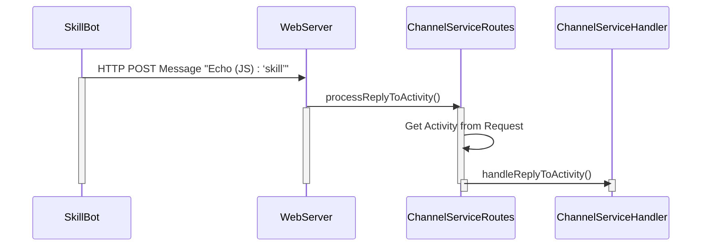

```mermaid
sequenceDiagram
    participant Skill as SkillBot
    participant WebServer
    participant ChannelServiceRoutes
    participant ChannelServiceHandler

    Skill ->> WebServer: HTTP POST Message "Echo (JS) : ‘skill’"
    activate Skill
        WebServer ->> ChannelServiceRoutes: processReplyToActivity()
        activate WebServer
        activate ChannelServiceRoutes
            ChannelServiceRoutes ->> ChannelServiceRoutes: Get Activity from Request
            ChannelServiceRoutes ->> ChannelServiceHandler: handleReplyToActivity()
            activate ChannelServiceRoutes
            activate ChannelServiceHandler
                
            deactivate ChannelServiceHandler
            deactivate ChannelServiceRoutes
        deactivate ChannelServiceRoutes
        deactivate WebServer
    deactivate Skill
```