# Skill Handler
A skill handler can receive requests and unpack activities from a Skill bot.

SkillBot -> RootBot -> User

Note: need to separate alternative (alt) routes, because it looks very confusing when nested

____
Diagram Source:

```mermaid
sequenceDiagram
    participant Skill as SkillBot
    participant WebServer
    participant ChannelServiceRoutes
    participant SkillHandler as SkillHandler *1
    participant JwtTokenValidation
    participant SkillConversationIdFactory
    participant Adapter
    participant TurnContext
    participant Middleware
    participant Root as RootBot
    participant Connector as ConnectorClient
    participant User as User at Channel

    Skill ->> WebServer: HTTP POST Message "Echo: ‘skill’"
    activate Skill
    Note over Skill, ChannelServiceRoutes: POST "/api/skills/v3/conversations/:conversationId/activities"
        WebServer ->> ChannelServiceRoutes: processReplyToActivity()
        activate WebServer
        activate ChannelServiceRoutes
            ChannelServiceRoutes ->> ChannelServiceRoutes: Get Activity from Request
            activate ChannelServiceRoutes
            deactivate ChannelServiceRoutes
            
            ChannelServiceRoutes ->> SkillHandler: handleReplyToActivity()
            activate ChannelServiceRoutes
            activate SkillHandler
                SkillHandler ->> SkillHandler: authenticate() Auth header to get ClaimsIdentity
                activate SkillHandler
                    SkillHandler ->> JwtTokenValidation: validateAuthHeader() *2
                    activate SkillHandler
                    activate JwtTokenValidation
                        JwtTokenValidation ->> JwtTokenValidation: authenticateToken()

                        JwtTokenValidation ->> JwtTokenValidation: validateClaims()

                        JwtTokenValidation -->> SkillHandler: return ClaimsIdentity
                    deactivate JwtTokenValidation
                    deactivate SkillHandler
                SkillHandler -->> SkillHandler: return ClaimsIdentity
                deactivate SkillHandler
            
                SkillHandler ->> SkillHandler: onReplyToActivity()
                activate SkillHandler
                    
                    SkillHandler ->> SkillHandler: processActivity()
                    activate SkillHandler

                        SkillHandler ->> SkillConversationIdFactory: getConversationReference()
                        activate SkillHandler
                            activate SkillConversationIdFactory
                                SkillConversationIdFactory -->> SkillHandler: return original user-root conversation reference(?)
                            deactivate SkillConversationIdFactory
                        deactivate SkillHandler

                        SkillHandler ->> TurnContext: getConversationReference()
                        activate SkillHandler
                            activate TurnContext
                                TurnContext -->> SkillHandler: return root-skill conversation reference
                            deactivate TurnContext
                        deactivate SkillHandler

                        SkillHandler ->> Adapter: continueConversation()
                        activate SkillHandler
                        activate Adapter
                            Note over SkillHandler, Adapter: Create Event-type Activity to continue conversation with user-root conversation reference

                            Adapter ->> TurnContext: applyConversationReference()
                            activate Adapter
                            activate TurnContext
                                Note over Adapter, TurnContext: Update Activity w/the delivery info
                                Note over Adapter, TurnContext: from existing user-root convo ref
                                TurnContext -->> Adapter: return Continue Conversation Event Activity
                            deactivate TurnContext
                            deactivate Adapter
                            
                            Note over Adapter: new TurnContext
                            Note over Adapter: for user-root convo
                            Adapter ->> Adapter: createContext()
                            activate Adapter
                            deactivate Adapter

                            Adapter ->> Middleware: runMiddleware() pipeline
                            activate Adapter
                            activate Middleware
                                loop Uncalled Middleware
                                Middleware ->> Middleware: run middleware, then call next()
                                end

                                Middleware ->> Adapter: Call callback registered in Adapter.ContinueConversation()
                                activate Adapter
                                    Note over SkillConversationIdFactory, TurnContext: Now we're arranging for an outbound Activity from Root to User

                                    Adapter ->> TurnContext: Cache BotIdentity & Skill Convo Ref in TurnState
                                    activate Adapter
                                    activate TurnContext
                                        TurnContext -->> Adapter: cached
                                    deactivate TurnContext
                                    deactivate Adapter

                                    Adapter ->> TurnContext: applyConversationReference()
                                    activate Adapter
                                    activate TurnContext
                                        Adapter -->> TurnContext: return Activity w/updated convo ref
                                    deactivate TurnContext
                                    deactivate Adapter

                                    Adapter ->> Adapter: createConnectorClient()
                                    activate Adapter
                                        Note over Adapter, TurnContext: Use Root's credentials and serviceUrl
                                        Note over Adapter, TurnContext: to create ConnectorClient
                                        Adapter -->> Adapter: return ConnectorClient
                                    deactivate Adapter

                                    Adapter ->> TurnContext: Cache ConnectorClient in TurnState
                                    activate Adapter
                                    activate TurnContext
                                        TurnContext -->> Adapter: cached
                                    deactivate Adapter
                                    deactivate TurnContext

                                    Note over Adapter, TurnContext: Act according to Activity Type
                                    alt EndOfConversation
                                        Adapter ->> SkillConversationIdFactory: deleteConversationReference()
                                        Adapter ->> SkillHandler: applyEoCToTurnContextActivity()
                                        Adapter ->> Root: run()
                                        
                                        else Event Activity
                                            Adapter ->> SkillHandler: applyEventToTurnContextActivity()
                                            Adapter ->> Root: run()

                                        else Other Activity Types
                                            Adapter ->> TurnContext: sendActivity() into sendActivities()
                                            activate Adapter
                                            activate TurnContext
                                                Note over TurnContext, Middleware: get user-root convo ref from TurnState

                                                TurnContext ->> TurnContext: applyConversationReference()
                                                activate TurnContext
                                                deactivate TurnContext

                                                TurnContext ->> Adapter: sendActivities()
                                                activate TurnContext
                                                activate Adapter
                                                alt has replyToId
                                                    Adapter ->> Connector: replyToActivity()
                                                    activate Adapter
                                                    activate Connector
                                                        Connector ->> Connector: sendOperationRequest()
                                                    deactivate Connector
                                                    deactivate Adapter

                                                    else no replyToId
                                                    Adapter ->> Connector: sendToConversations()
                                                    activate Connector
                                                        Connector ->> User: Http POST Message "Echo: 'skill'" *3
                                                        User -->> Connector: return response with id
                                                        Connector -->> Adapter: return response with id

                                                        Adapter -->> TurnContext: return responses *4
                                                        TurnContext -->> SkillHandler: return first response
                                                    deactivate Connector
                                                end
                                                deactivate TurnContext
                                            deactivate TurnContext
                                            deactivate Adapter    
                                    end

                                deactivate Adapter

                            deactivate Middleware
                            deactivate Adapter

                            Adapter -->> SkillHandler: 
                        deactivate Adapter
                        deactivate SkillHandler

                        SkillHandler -->> SkillHandler: return { id: UUID }

                    deactivate SkillHandler
                deactivate SkillHandler
                
                SkillHandler -->> ChannelServiceRoutes: return { id: UUID }
            deactivate SkillHandler
            deactivate ChannelServiceRoutes
        deactivate ChannelServiceRoutes
        deactivate WebServer
    deactivate Skill
```

- *1 Derives from `ChannelServiceHandler`
- *2 See `JwtTokenValidation.validateAuthHeader()` Sequence Diagram for more details on flow for validating Token
- *3 Ex.: "http://localhost:50032/v3/conversations/48xxxxx1-xxxx-xxxx-xxxx-cxxxxxxxx7d9%7Clivechat/activities/8exxxx30-xxxx-xxxx-xxxx-xxxxxxxxxxxx"
- *4 Example of responses array: [{id: "38ba54b0-3be0-11ea-932b-d7792e301756"}]