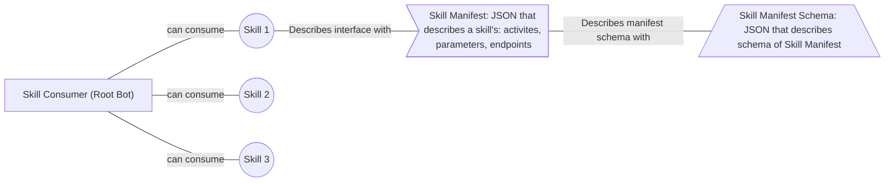

```mermaid
graph LR

SkillConsumer["Skill Consumer (Root Bot)"] -- can consume --- Skill1((Skill 1))
SkillConsumer -- can consume --- Skill2((Skill 2))
SkillConsumer -- can consume --- Skill3((Skill 3))

Skill1 -- Describes interface with --- Manifest>"Skill Manifest: JSON that describes a skill's: activites, parameters, endpoints"]

Manifest -- Describes manifest schema with --- ManifestSchema[/Skill Manifest Schema: JSON that describes schema of Skill Manifest\]

```