# Happy Path for `JwtTokenValidation.validateAuthHeader()`

```mermaid
sequenceDiagram
    participant JwtTokenValidation
    participant ChannelValidationClass
    Note over ChannelValidationClass: Examples:
    Note over ChannelValidationClass: SkillValidation
    Note over ChannelValidationClass: EmulatorValidation
    Note over ChannelValidationClass: Public Azure ChannelValidation
    Note over ChannelValidationClass: GovernmentChannelValidation
    Note over ChannelValidationClass: EnterpriseChannelValidation
    participant JwtTokenExtractor
    participant OpenIdMetadata
    participant CredentialProvider

        JwtTokenValidation ->> JwtTokenValidation: validateAuthHeader()
        activate JwtTokenValidation
            JwtTokenValidation ->> JwtTokenValidation: authenticateToken()
            activate JwtTokenValidation
                Note over JwtTokenValidation, JwtTokenExtractor: Validate Token w/auth validations for specified Channel
                Note over JwtTokenValidation, ChannelValidationClass: Can be done with or w/o service URL
                alt is Skill Token
                        JwtTokenValidation ->> ChannelValidationClass: SkillValidation.authenticateChannelToken()
                        activate JwtTokenValidation

                    else is Emulator Token
                        JwtTokenValidation ->> ChannelValidationClass: EmulatorValidation.authenticateEmulatorToken()
                    
                    else is Public Azure Channel
                        JwtTokenValidation ->> ChannelValidationClass: ChannelValidation.authenticateChannelToken()

                    else is Government Channel
                        JwtTokenValidation ->> ChannelValidationClass: GovernmentChannelValidation.authenticateChannelToken()

                    else is Enterprise Channel
                        JwtTokenValidation ->> ChannelValidationClass: EnterpriseChannelValidation.authenticateChannelToken()
                end

                Note over JwtTokenValidation, JwtTokenExtractor: SkillValidation.isSkillToken() path
                activate ChannelValidationClass
                    Note over ChannelValidationClass, OpenIdMetadata: Verify Auth header has Bearer Token (JWT)
                    Note over ChannelValidationClass, OpenIdMetadata: Decode JWT (header, payload, signature)
                    
                    ChannelValidationClass ->> ChannelValidationClass: isSkillClaim()
                    activate ChannelValidationClass
                        Note over ChannelValidationClass, JwtTokenExtractor: Assert that we have following claims:
                        Note over ChannelValidationClass, JwtTokenExtractor: "ver" (1.0 or 2.0)
                        Note over ChannelValidationClass, OpenIdMetadata: "aud" (for from Root to Skill, it's Skill's appId)
                        Note over ChannelValidationClass, JwtTokenExtractor: "appId" (v1.0) or "azp" (v2.0)
                        Note over ChannelValidationClass, JwtTokenExtractor: And "appId"/"azp" != "aud"
                        ChannelValidationClass -->> ChannelValidationClass: Return true, using isSkillClaim
                    deactivate ChannelValidationClass
                ChannelValidationClass -->> JwtTokenValidation: Return true, using isSkillToken
                deactivate ChannelValidationClass
                deactivate JwtTokenValidation
        
                JwtTokenValidation ->> ChannelValidationClass: SkillValidation.authenticateChannelToken()
                activate JwtTokenValidation
                activate ChannelValidationClass
                    Note over ChannelValidationClass: openIdMetadataUrl:
                    Note over ChannelValidationClass, CredentialProvider:"https://login.microsoftonline.com/common/v2.0/.well-known/openid-configuration" (non-gov't channel)
                    
                    ChannelValidationClass ->> JwtTokenExtractor: new JwtTokenExtractor
                    activate ChannelValidationClass
                    activate JwtTokenExtractor
                        Note over JwtTokenExtractor, CredentialProvider: Get cached OpenIdMetadata doc or create new one
                        JwtTokenExtractor ->> JwtTokenExtractor: getOrAddOpenIdMetadata()
                        JwtTokenExtractor -->> ChannelValidationClass: Return JwtTokenExtractor w/OpenIdMetadata document
                    deactivate JwtTokenExtractor
                    deactivate ChannelValidationClass

                    ChannelValidationClass ->> JwtTokenExtractor: getIdentity() to get ClaimsIdentity
                    activate ChannelValidationClass
                    activate JwtTokenExtractor
                        Note over JwtTokenExtractor, CredentialProvider: Verify that token was issued by a valid issuer
                        activate JwtTokenExtractor
                        JwtTokenExtractor ->> JwtTokenExtractor: hasAllowedIssuer()
                        deactivate JwtTokenExtractor

                        JwtTokenExtractor ->> JwtTokenExtractor: validateToken()
                        activate JwtTokenExtractor
                            Note over JwtTokenExtractor, OpenIdMetadata: Decode Token (header, payload, signature)
                            
                            JwtTokenExtractor ->> OpenIdMetadata: Get signing key using "kid" from Token header
                            activate JwtTokenExtractor
                            activate OpenIdMetadata
                            OpenIdMetadata -->> JwtTokenExtractor: return IOpenIdMetadataKey
                            deactivate JwtTokenExtractor
                            deactivate OpenIdMetadata

                            Note over JwtTokenExtractor, CredentialProvider: Validate that token was signed w/valid signing keys
                            Note over JwtTokenExtractor, CredentialProvider: and endorsed, if any endoresments associated with key
                            Note over JwtTokenExtractor, CredentialProvider: and that valid signing algorithm was used to sign token
                            Note over JwtTokenExtractor, CredentialProvider: Get claims from Token payload
                            
                            JwtTokenExtractor -->> JwtTokenExtractor: return new ClaimsIdentity created w/claims from payload
                        deactivate JwtTokenExtractor
                        JwtTokenExtractor -->> ChannelValidationClass: return ClaimsIdentity
                    deactivate JwtTokenExtractor
                        ChannelValidationClass -->> ChannelValidationClass: return ClaimsIdentity
                    deactivate ChannelValidationClass

                    ChannelValidationClass ->> ChannelValidationClass: validateIdentity()
                    activate ChannelValidationClass
                        Note over ChannelValidationClass, JwtTokenExtractor: Validate that ClaimsIdentity:
                        Note over ChannelValidationClass, JwtTokenExtractor: - isAuthenticated
                        Note over ChannelValidationClass, JwtTokenExtractor: - Has claims: "ver", "aud", and "appId"/"azp"

                        ChannelValidationClass ->> CredentialProvider: isValidAppId()
                        activate CredentialProvider
                            Note over ChannelValidationClass, CredentialProvider: Does the AppId from Token match AppId on Bot's CredentialProvider? 

                            CredentialProvider -->> ChannelValidationClass: return true
                        deactivate CredentialProvider
                    deactivate ChannelValidationClass

                    ChannelValidationClass -->> JwtTokenValidation: return ClaimsIdentity
                deactivate ChannelValidationClass
                JwtTokenValidation -->> JwtTokenValidation: return ClaimsIdentity
                deactivate JwtTokenValidation
            deactivate JwtTokenValidation
            
            activate JwtTokenValidation
                JwtTokenValidation ->> JwtTokenValidation: validateClaims()
            deactivate JwtTokenValidation

            Note over JwtTokenValidation, ChannelValidationClass: return ClaimsIdentity to original caller
            Note over JwtTokenValidation, ChannelValidationClass: Notes *1 and *2
        deactivate JwtTokenValidation
        
```

- *1 `validateAuthHeader()` is called first inbound to Skill from Consumer
    - `BotFrameworkAdapter` calls `JwtTokenValidation.authenticatRequest()`, which within its logic calls **`JwtTokenValidation.validateAuthHeader()`**
    - `ClaimsIdentity` returns to `JwtTokenValidation` itself at this point

- *2 `validateAuthHeader()` is also called inbound to Consumer's Skill Handler, from Skill
    - `ChannelServiceHandler` calls **`JwtTokenValidation.validateAuthHeader()`** from within `ChannelServiceHandler.authenticate()` method
    - `ClaimsIdentity` returns to `ChannelServiceHandler` at this point