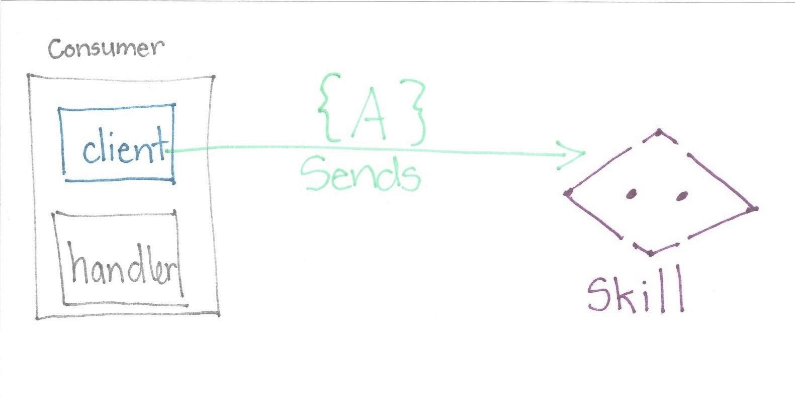
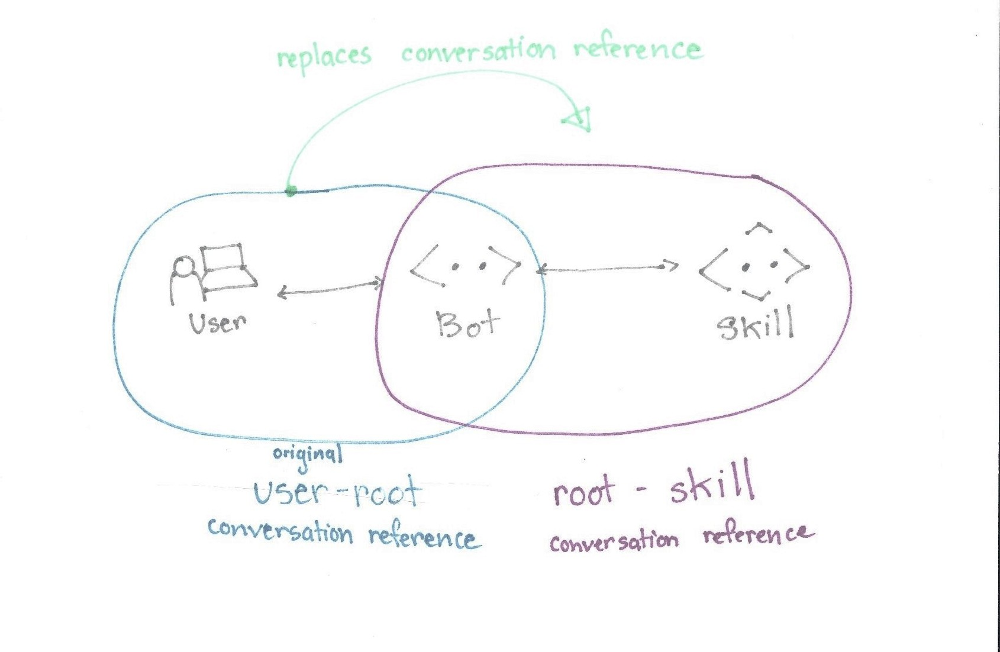
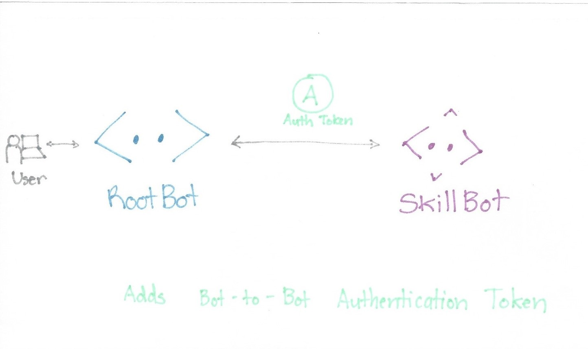
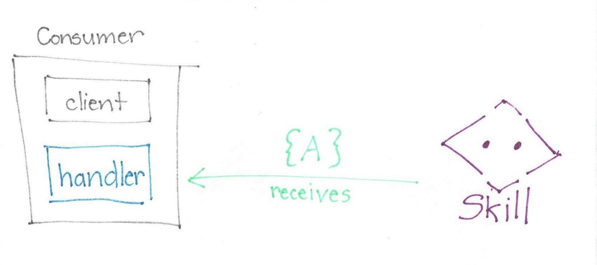
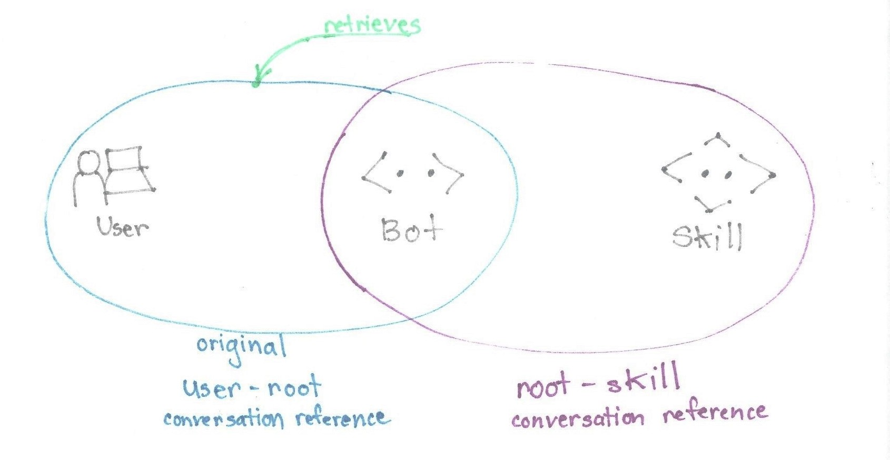
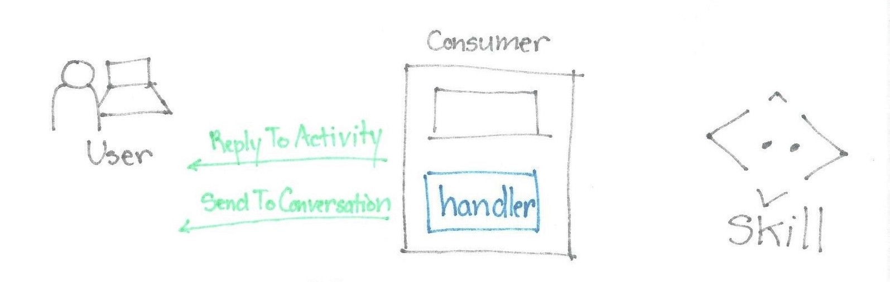
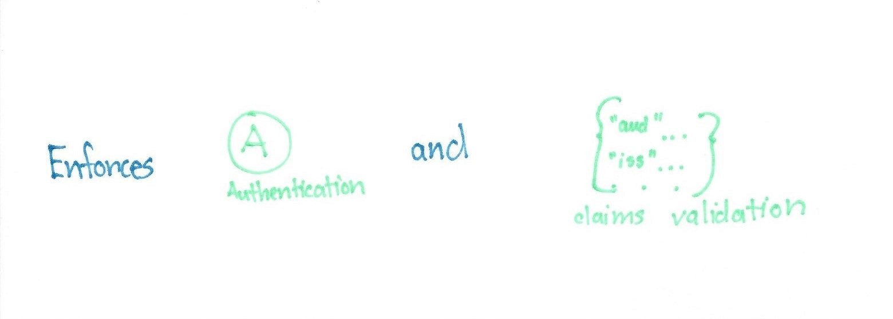

# Skills

## Intro to Skills Pieces

### Consuming Skills

* A *root bot* can consume many *skills*
* A *skill* can be consumed by many *bots*

### Manifest

* A *skill consumer* does not necessarily have access to a *skill's code*
* Use a *skill manifest* to describe activities the skill can receive and generate, its input and output parameters, and the skill's endpoints

### Parent to Child Flow Overview

___

## Diagram Sketched Drafts

Need to see if I can convert these to Mermaid diagrams or if I would need to use some other graphing source.

### Skill Client

*Skill client* sends Activities to a Skill. The Activity could be from the *user* or the *skill consumer*.

The *skill client* replaces the original user-root conversation reference with the root-skill converation reference.

The *skill client* adds the bot-to-bot auth Token.

___

### Skill Handler

The *skill consumer* uses a *skill handler* to receive Activites from a *skill*.

The *skill handler* retrieves the original conversation reference (user-root).

Handles ReplyToActivity and SendToConversation channel service API methods.

Enforces authentication and claims validation.
