# Skills

## Intro to Skills Pieces

### Consuming Skills

* A *root bot* can consume many *skills*
* A *skill* can be consumed by many *bots*

### Manifest

* A *skill consumer* does not necessarily have access to a *skill's code*
* Use a *skill manifest* to describe activities the skill can receive and generate, its input and output parameters, and the skill's endpoints

### Parent to Child Flow Overview

