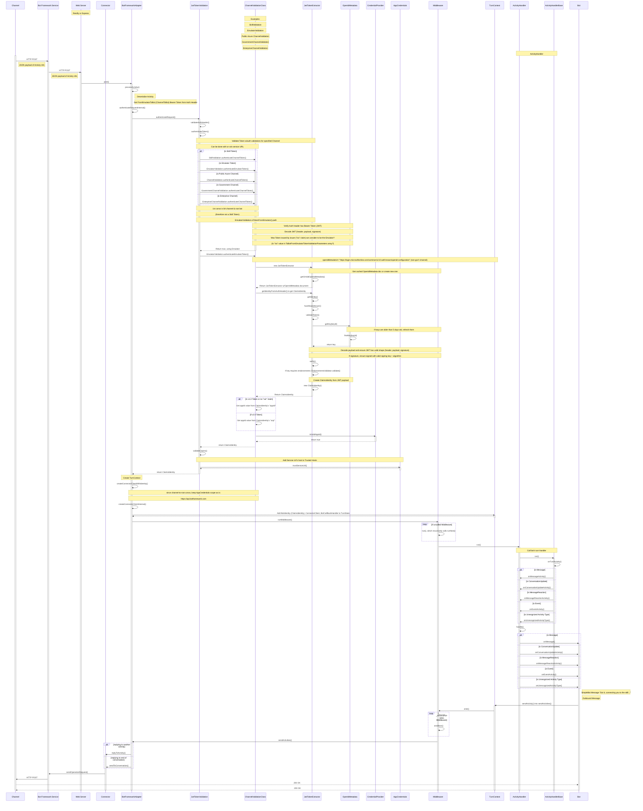

```mermaid
sequenceDiagram
        participant Channel
        participant BFS as Bot Framework Service
        participant WebServer as Web Server
        Note over WebServer: Restify or Express
        participant Connector
        participant BotFrameworkAdapter
        participant JwtTokenValidation
        participant ChannelValidationClass
        Note over ChannelValidationClass: Examples:
        Note over ChannelValidationClass: SkillValidation
        Note over ChannelValidationClass: EmulatorValidation
        Note over ChannelValidationClass: Public Azure ChannelValidation
        Note over ChannelValidationClass: GovernmentChannelValidation
        Note over ChannelValidationClass: EnterpriseChannelValidation
        participant JwtTokenExtractor
        participant OpenIdMetadata
        participant CredentialProvider
        participant AppCredentials

        participant Middleware
        participant TurnContext
        participant ActivityHandler
        participant ActivityHandlerBase
        Note over ActivityHandler, ActivityHandlerBase: ActivityHandler
        participant Bot

        activate Channel
        Channel ->> BFS: HTTP POST
        activate BFS
        Note right of Channel: JSON payload of Activity info

        BFS ->> WebServer: HTTP POST
        activate WebServer
        Note right of BFS: JSON payload of Activity info
        WebServer ->> BotFrameworkAdapter: post()
        activate BotFrameworkAdapter
        BotFrameworkAdapter ->> BotFrameworkAdapter: processActivity()
        Note right of BotFrameworkAdapter: Deserialize Activity
        Note right of BotFrameworkAdapter: Get FromEmulatorToBot (ChannelToBot) Bearer Token from Auth Header
        BotFrameworkAdapter ->> BotFrameworkAdapter: authenticateRequestInternal()
        BotFrameworkAdapter ->> JwtTokenValidation: authenticateRequest()
        activate JwtTokenValidation
        
        JwtTokenValidation ->> JwtTokenValidation: validateAuthHeader()
        JwtTokenValidation ->> JwtTokenValidation: authenticateToken()
        Note over JwtTokenValidation, JwtTokenExtractor: Validate Token w/auth validations for specified Channel
        Note over JwtTokenValidation, ChannelValidationClass: Can be done with or w/o service URL
        alt is Skill Token
                JwtTokenValidation ->> ChannelValidationClass: SkillValidation.authenticateChannelToken()

            else is Emulator Token
                JwtTokenValidation ->> ChannelValidationClass: EmulatorValidation.authenticateEmulatorToken()
                activate ChannelValidationClass
            
            else is Public Azure Channel
                JwtTokenValidation ->> ChannelValidationClass: ChannelValidation.authenticateChannelToken()

            else is Government Channel
                JwtTokenValidation ->> ChannelValidationClass: GovernmentChannelValidation.authenticateChannelToken()

            else is Enterprise Channel
                JwtTokenValidation ->> ChannelValidationClass: EnterpriseChannelValidation.authenticateChannelToken()
        end

        Note over JwtTokenValidation, ChannelValidationClass: 1st convo is b/t channel & root bot
        Note over JwtTokenValidation, ChannelValidationClass: (therefore not a Skill Token)
        Note over JwtTokenValidation, JwtTokenExtractor: EmulatorValidation.isTokenFromEmulator() path
        Note over ChannelValidationClass, OpenIdMetadata: Verify Auth header has Bearer Token (JWT)
        Note over ChannelValidationClass, OpenIdMetadata: Decode JWT (header, payload, signature)
        Note over ChannelValidationClass, OpenIdMetadata: Was Token issued by issuer ("iss" claim) we consider to be the Emulator?
        Note over ChannelValidationClass, OpenIdMetadata: (Is "iss" value in ToBotFromEmulatorTokenValidationParameters array?)
        ChannelValidationClass -->> JwtTokenValidation: Return true, using Emulator
        deactivate ChannelValidationClass
        
        JwtTokenValidation ->> ChannelValidationClass: EmulatorValidation.authenticateEmulatorToken()
        activate ChannelValidationClass
        Note over ChannelValidationClass, TurnContext: openIdMetadatUrl: "https://login.microsoftonline.com/common/v2.0/.well-known/openid-configuration" (non-gov't channel)
        ChannelValidationClass ->> JwtTokenExtractor: new JwtTokenExtractor
        activate JwtTokenExtractor
        Note over JwtTokenExtractor, Middleware: Get cached OpenIdMetadata doc or create new one
        JwtTokenExtractor ->> JwtTokenExtractor: getOrAddOpenIdMetadata()
        JwtTokenExtractor -->> ChannelValidationClass: Return JwtTokenExtractor w/OpenIdMetadata document
        deactivate JwtTokenExtractor
        
        ChannelValidationClass ->> JwtTokenExtractor: getIdentityFromAuthHeader() to get ClaimsIdentity
        activate JwtTokenExtractor
        JwtTokenExtractor ->> JwtTokenExtractor: getIdentity()
        JwtTokenExtractor ->> JwtTokenExtractor: hasAllowedIssuer()
        JwtTokenExtractor ->> JwtTokenExtractor: validateToken()
        
        JwtTokenExtractor ->> OpenIdMetadata: getKey(keyId)
        activate OpenIdMetadata
        Note over OpenIdMetadata, Middleware: If keys are older than 5 days old, refresh them
        OpenIdMetadata ->> OpenIdMetadata: findKey(keyId)
        OpenIdMetadata -->> JwtTokenExtractor: return key
        deactivate OpenIdMetadata

        Note over JwtTokenExtractor, Middleware: Decode payload and ensure JWT has valid shape (header, payload, signature)
        Note over JwtTokenExtractor, Middleware: If signature, ensure signed with valid signing key + algorithm
        JwtTokenExtractor ->> JwtTokenExtractor: verify()
        JwtTokenExtractor ->> JwtTokenExtractor: If key requires endorsements: EndorsementsValidator.validate()
        Note over JwtTokenExtractor, OpenIdMetadata: Create ClaimsIdentity from JWT payload
        JwtTokenExtractor ->> JwtTokenExtractor: new ClaimsIdentity()
        JwtTokenExtractor -->> ChannelValidationClass: Return ClaimsIdentity
        deactivate JwtTokenExtractor

        alt Is v1.0 Token or no "ver" claim
            ChannelValidationClass ->> ChannelValidationClass: Get appId value from ClaimsIdentity's "appId"

            else if v2.0 Token
                ChannelValidationClass ->> ChannelValidationClass: Get appId value from ClaimsIdentity's "azp"
        end

        ChannelValidationClass ->> CredentialProvider: isValidAppId()
        activate CredentialProvider
        CredentialProvider -->> ChannelValidationClass: return true
        deactivate CredentialProvider

        ChannelValidationClass -->> JwtTokenValidation: return ClaimsIdentity
        JwtTokenValidation ->> JwtTokenValidation: validateClaims()
        Note over JwtTokenValidation, AppCredentials: Add Servive Url's host to Trusted Hosts
        
        JwtTokenValidation ->> AppCredentials: trustServiceUrl()
        activate AppCredentials
        AppCredentials -->> JwtTokenValidation: 
        deactivate AppCredentials

        JwtTokenValidation -->> BotFrameworkAdapter: return ClaimsIdentity
        deactivate JwtTokenValidation

        Note over BotFrameworkAdapter: Create TurnContext
        BotFrameworkAdapter ->> BotFrameworkAdapter: createConnectorClientWithIdentity()
        Note over BotFrameworkAdapter, ChannelValidationClass: since channel-to-root convo, keep AppCredentials scope as is:
        Note over BotFrameworkAdapter, ChannelValidationClass: https://api.botframework.com
        BotFrameworkAdapter ->> BotFrameworkAdapter: createConnectorClientInternal()
        BotFrameworkAdapter ->> TurnContext: Add BotIdentity (ClaimsIdentity), ConnectorClient, BotCallBackHandler to TurnState
        activate TurnContext
        TurnContext -->> BotFrameworkAdapter: 
        deactivate TurnContext

        BotFrameworkAdapter ->> Middleware: runMiddleware()
        activate Middleware

        loop If uncalled Middleware
            Middleware ->> Middleware: run(), which recursively calls runNext()
        end

        Middleware ->> ActivityHandler: run()
        activate ActivityHandler
        Note over ActivityHandler, ActivityHandlerBase: Call bot's turn handler
        ActivityHandler ->> ActivityHandlerBase: run()
        activate ActivityHandlerBase
        ActivityHandlerBase ->> ActivityHandlerBase: onTurnActivity()
        alt is Message
                ActivityHandlerBase ->> ActivityHandler: onMessageActivity()
            
            else is ConversationUpdate
                ActivityHandlerBase ->> ActivityHandler: onConversationUpdateActivity()
            
            else is MessageReaction
                ActivityHandlerBase ->> ActivityHandler: onMessageReactionActivity()
            
            else is Event
                ActivityHandlerBase ->> ActivityHandler: onEventActivity()
            
            else is Unreognized Activity Type
                ActivityHandlerBase ->> ActivityHandler: onUnrecognizedActivityType()
        end

        ActivityHandler ->> ActivityHandler: handle()

        alt is Message
            ActivityHandler ->> Bot: onMessage()
            activate Bot
            
            else is ConversationUpdate
                ActivityHandler ->> Bot: onConversationUpdateActivity()
            
            else is MessageReaction
                ActivityHandler ->> Bot: onMessageReactionActivity()
            
            else is Event
                ActivityHandler ->> Bot: onEventActivity()
            
            else is Unreognized Activity Type
                ActivityHandler ->> Bot: onUnrecognizedActivityType()
        end

        Note right of Bot: SimpleBot Message "Got it, connecting you to the skill..."
        Note right of Bot: Outbound Message

        Bot ->> TurnContext: sendActivity() into sendActivities()
        activate TurnContext

        TurnContext ->> Middleware: emit()
        loop ______ _onSendActivites Middleware
            Middleware ->> Middleware: emitNext()
        end

        Middleware ->> BotFrameworkAdapter: sendActivities()
        
        
        alt replying to another activity
            BotFrameworkAdapter ->> Connector: replyToActivity()
            activate Connector
    
            else replying to end of conversation
                BotFrameworkAdapter ->> Connector: sendToConversation()
        end

        Connector ->> BFS: sendOperationRequest() 
        BFS ->> Channel: HTTP POST

        Channel -->> Bot: 200 OK
        Bot -->> Channel: 200 OK

        deactivate TurnContext
        deactivate Bot
        deactivate ActivityHandlerBase
        deactivate ActivityHandler

        deactivate Middleware
        deactivate BotFrameworkAdapter
        deactivate Connector
        deactivate WebServer
        deactivate BFS
        deactivate Channel

```