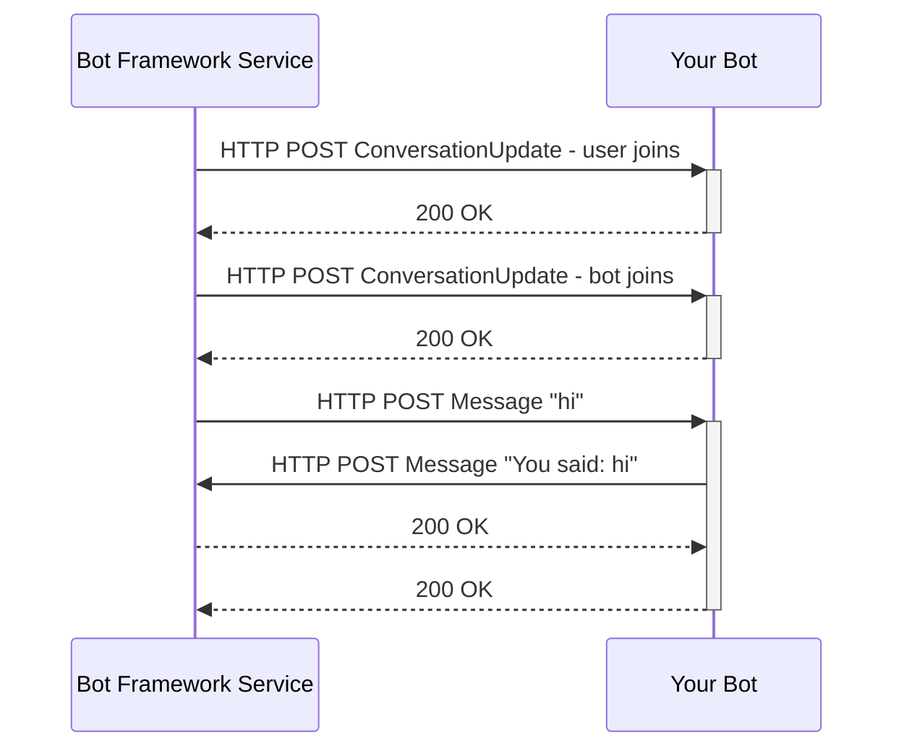

```mermaid
    sequenceDiagram
      participant BFS as Bot Framework Service
      participant Your Bot

      BFS->>+Your Bot: HTTP POST ConversationUpdate - user joins
      Your Bot-->>-BFS: 200 OK

      BFS->>+Your Bot: HTTP POST ConversationUpdate - bot joins
      Your Bot-->>-BFS: 200 OK

      BFS->>+Your Bot: HTTP POST Message "hi"
      Your Bot->>BFS: HTTP POST Message "You said: hi"

      BFS-->>Your Bot: 200 OK
      Your Bot-->>-BFS: 200 OK
```