# Mermaid UML Diagrams
Diagrams created using [Mermaid](https://github.com/mermaid-js/mermaid), modeling portions of Microsoft Bot Framework.

## Sequence Diagrams
### Message Sequence Diagram
Clone of diagram from documentation on [How bots work](https://docs.microsoft.com/en-us/azure/bot-service/bot-builder-basics?view=azure-bot-service-4.0&tabs=csharp).

Note: I'm not quite sure why default styling made this diagram so GIANT, but at least with Mermaid you have the option of tinkering around with [styling of your sequence diagrams](https://mermaidjs.github.io/#/sequenceDiagram?id=styling), if your heart so desired.

____

### State Sequence Diagram
Clone of diagram from documentation on [Managing state](https://docs.microsoft.com/en-us/azure/bot-service/bot-builder-concept-state?view=azure-bot-service-4.0).

> This diagram illustrates parts of the interaction sequence between these layers, with the solid arrows representing a method call, and the dashed arrows representing the response (with or without a return value).

____

## Class Diagrams

### Prompt Class Diagram
Abbreviated work by only showing details of NumberPrompt class out of the subclasses of Prompt class.

### ChoicePrompt Association

____

## How were these graphs created?
1. In VS Code, created md file to write the Mermaid code for the graphs
    * Made sure to use Mermaid extension that would render graphs in VS Code to preview md while building the models

2. Went to Mermaid's [live editor](https://mermaidjs.github.io/mermaid-live-editor/#/edit/eyJjb2RlIjoiZ3JhcGggVERcbkFbQ2hyaXN0bWFzXSAtLT58R2V0IG1vbmV5fCBCKEdvIHNob3BwaW5nKVxuQiAtLT4gQ3tMZXQgbWUgdGhpbmt9XG5DIC0tPnxPbmV8IERbTGFwdG9wXVxuQyAtLT58VHdvfCBFW2lQaG9uZV1cbkMgLS0-fFRocmVlfCBGW2ZhOmZhLWNhciBDYXJdXG4iLCJtZXJtYWlkIjp7InRoZW1lIjoiZGVmYXVsdCJ9fQ) to create SVGs of the models coded up in VS Code
    * Note: should dig into using [mermaid CLI](https://github.com/mermaidjs/mermaid.cli) to generate svg/png/pdf files

3. Included SVGs in GH repo to refer to in README
___
## Summary

### The good?
* Mermaid is text-based
    * Allows you to write inside Markdown fenced code block, using Markdown-like syntax to create diagrams
    * From the Mermaid syntax, you can then create svg, png, or pdf files
* (The *sort of* good): GitHub-friendly, because the file types you can create from Mermaid can play nicely with GitHub
* From their GH
    > "The most exciting use of technology" - [JS Open Source Awards (2019)](https://osawards.com/javascript/#nominees)
* Open Source with 116 contributors
    * To compare, botbuilder-dotnet has 114 contributors (11/27/19)

### The bad?
* Not directly GitHub-friendly
    * GH does not directly render Mermaid syntax into graphs
        * Whereas other sites like GitLab do have Mermaid baked-in
        * In turn, cannot directly edit diagrams on GH
* (The *maybe* bad): when you want to create a structural model, Mermaid is a bit more limited in how much detail you can put in
    * Asynchronicity?
    * Denoting types?
    * Abstract methods?
    * Optional parameter?