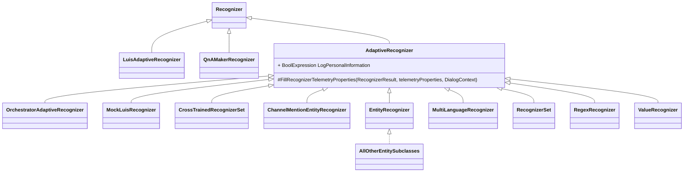

```mermaid
classDiagram
    Recognizer <|-- LuisAdaptiveRecognizer
    Recognizer <|-- QnAMakerRecognizer
    Recognizer <|-- AdaptiveRecognizer
    AdaptiveRecognizer <|-- OrchestratorAdaptiveRecognizer
    AdaptiveRecognizer <|-- MockLuisRecognizer
    AdaptiveRecognizer <|-- CrossTrainedRecognizerSet
    AdaptiveRecognizer <|-- ChannelMentionEntityRecognizer
    AdaptiveRecognizer <|-- EntityRecognizer
    EntityRecognizer <|.. AllOtherEntitySubclasses
    AdaptiveRecognizer <|-- MultiLanguageRecognizer
    AdaptiveRecognizer <|-- RecognizerSet
    AdaptiveRecognizer <|-- RegexRecognizer
    AdaptiveRecognizer <|-- ValueRecognizer

    class AdaptiveRecognizer {
        + BoolExpression LogPersonalInformation
        
        #FillRecognizerTelemetryProperties(RecognizerResult, telemetryProperties, DialogContext)
    }
```