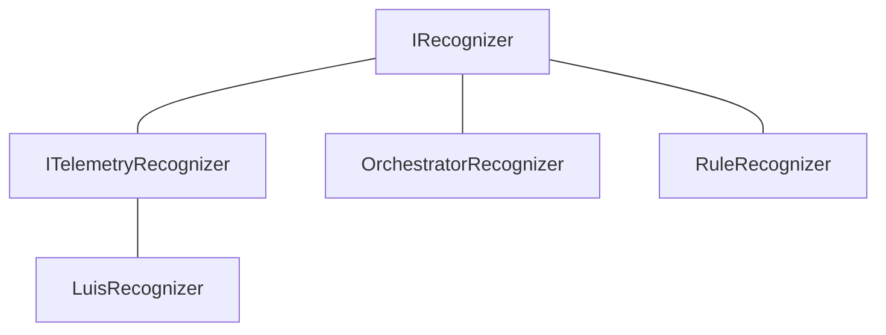
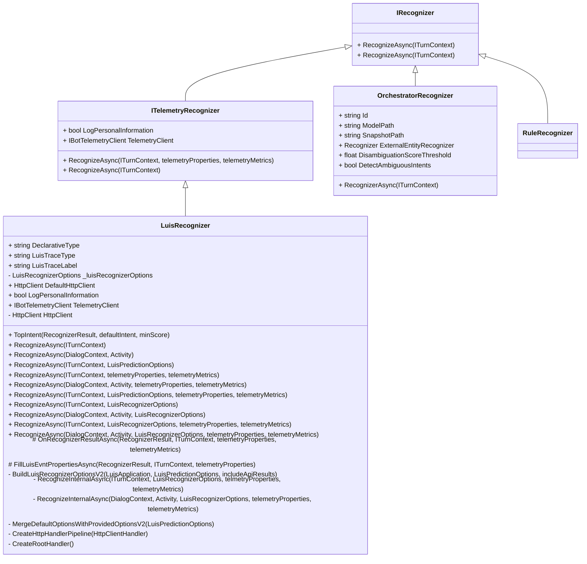
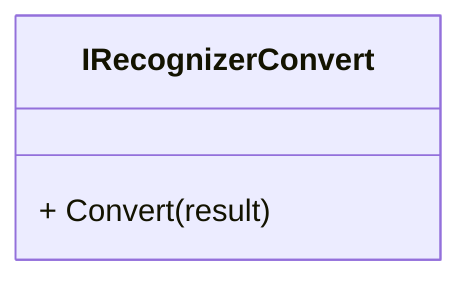

- `RuleRecognizer` test class has 0 references...
    - Test Class in .Dialgos.Declarative.Tests

- Classes that have properties as `PropertyExpression`:
    - none!

- `LuisRecognizer` has `FillLuisEventPropertiesAsync`

- Compare the adpative recognizers vs. their non-adaptive counterparts
    - `OrchestratorRecognizer` and `OrchestratorAdaptiveRecognizer` are...

- Consider making an `IAdaptiveRecognizer` interface
    - Also would be useful to reference this in areas where there's a cref to `IRecognizer`, like in `RecognizerResult`, but this is not the only kind of recognizer that could return a `RecognizerResult`
        - Classes that derive from `Recognizer` also can return `RecognizerResult`, like `RegexRecognizer`

- Consider diving into another diagram that has more detail--everything that has the word "Recognizer" and how they are used
    - `LuisPredictionOptions.Timeout` references `IRecognizer`
        - This class is obselete now, and says to use `LuisRecognizerOptionsV2` to set the value of `Timeout`
        - `LuisRecognizerOptionV2` derives from `LuisRecognizerOptions`, with `RecognizerInternalAsync` overrides
        - `LuisRecognizerOptions` seems to be the new luis recognizer options base class then
            - has `LogPersonalInformation` as `bool`, therefore seems to be something that tries to appease non-adaptive dialog
            - also has 2 overloads for `RecognizerInternalAsync` -- one for adaptive (dc param) and another for non-adaptive (ITurnContext param)

- It seems weird that the classes that look like they should be adpative--like `RuleRecognizer` would implement `IRecognizer`, when it looks like non-adaptive recognizers are what have been implementing it so far
    - Ah, it looks like `CustomRecognizer` in `MiscTest.cs` does both:
        - Implements `IRecognizer`
        - Derives from `Recognizer`

- NOTE: `IRecognizer` has 2 `RecognizeAsync` with different returns:
    - **`Task<RecognizerResult>`** or **`Task<T>`**.
    - I just can't put it in the diagram, since mermaid diagramming tool doesn't allow for method return values =(
- All async methods also have cancellation token, but I excluded to better highlight the differences in each member

- `ITelemetryRecognizer`
    - `RecognizerAsync(ITurnContext, telemetryProperties, telemetryMetrics)` returns:
        1. `Task<RecognizerResult>`
        2. `Task<T> where T : IRecognizerConvert, new()`
    - `RecognizeAsync(ITurnContext)` returns `Task<T> where T: IRecognizerConvert, new()`

### Recognizer Results

