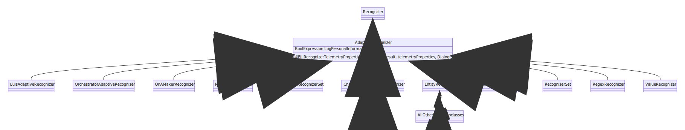
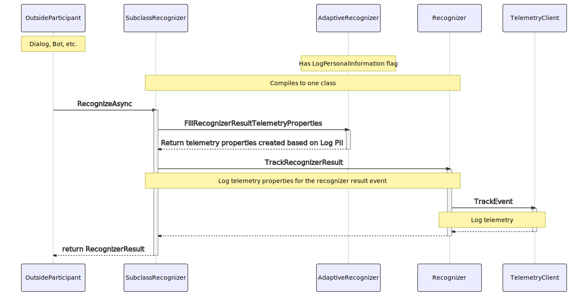

# The Issue
- Recognizers always log personal identifiable information (PII). They should only log it if log PII flag is true.
- Only 2 of 29 recognizers deriving from `Recognizer` actually have a log PII flag, even though all have the ability, through the base class to log telemetry.

# Context
In the SDK, we have `IRecognizer` and `Recognizer` that classes implement/derive from `IRecognizer` & `Recognizer`. See comparison:

| `IRecognizer`                       | `Recognizer`                                                                          | Both                                                     |
|   :----:                            |   :----:                                                                              |   :----:                                                 |
| Implemented by non-adaptive classes | Derived from by adaptive classes                                                      | Have `RecognizeAsync` method (diff. signatures though)   |
| `LogPersonalInformation` is `bool`  | `LogPersonalInformation` not on base class                                            |                                                          |
|                                     | `LogPersonalInformation` in 2 subclasses is `BoolExpression`                          |                                                          |
|                                     | `LogPersonalInformation` exists only in `LuisAdaptiveRecognizer` & `QnAMakerRecognizer` |                                                          |
|                                     | All subclasses can log telemetry, but most don't have log PII flag                    |                                                          |

### Potential Confusion
- The "gotcha" first looking into the recognizers into our SDK that you'll discover is **`Recognizer` does not implement `IRecognizer`.**
    - It can't, since their `RecognizerAsync` methods have different signatures
- *However* when looking at `tests.schema`, you can see that *all* recognizers, regardless of deriving/implementing `Recognizer`/`IRecognizer` are categoriezed as `Microsoft.IRecognizer` kind.

### Class Diagram of Recognizers in the SDK Currently

### IRecognizer Class Diagram

# Proposed Solution

#### `Recognizer` Class Diagram with `AdaptiveRecognizer`
Add a base `AdaptiveRecognizer` class, from which the adaptive recognizers can inherit from and can gain `LogPersonalInformation` flag with a `FillRecognizerResultTelemetryProperties` method override to determine whether or not to log PII in telemetry.

#### Sequence diagram illustrating the behavior of logging event.

1. Something calls RecognizeAsync on SubclassRecognizer (sub classes such as `LuisAdaptiveRecognizer`, `QnARecognizer`, `RegexRecognizer`, etc.)
2. SubclassRecognizer by default will use `AdaptiveRecognizer.FillRecognizerResultTelemetryProperties` and `Recognizer.TrackRecognizerResult` methods to log telemetry
3. Returns `RecognizerResult` to original caller of `RecognizeAsync`

# Why Can't We Just...
Why can't we just add `LogPerosnalInformation` to the already-existing `Recognizer` class?
* `Recognizer` class is in `Microsoft.Bot.Builder.Dialogs` library, which does not have the `BoolExpression` type, which we get from `AdaptiveExpressions` library.
* We need `LogPersonalInformation` to be `BoolExpression` for adaptive recognizers to be able to set flag's value in configuration files like appsettings.json (also necessary for Composer)
* In non-adaptive classes like `LuisRecognizer`, which implements `IRecognizer`, `LogPersonalInformation` is `bool`.
    * This might indicate that we should probably also create a base class for non-adaptive recognizers
        * IDK if this will break backwards compat
        * It also seems less likely that any new recognizer classes we'll add wouldn't derive instead from `Recognizer`/`AdaptiveRecognizer`, and therefore less pressing