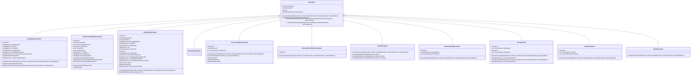

```mermaid
classDiagram
    Recognizer <|-- LuisAdaptiveRecognizer
    Recognizer <|-- OrchestratorAdaptiveRecognizer
    Recognizer <|-- QnAMakerRecognizer
    Recognizer <|-- MockLuisRecognizer
    Recognizer <|-- CrossTrainedRecognizerSet
    Recognizer <|-- ChannelMentionEntityRecognizer
    Recognizer <|-- EntityRecognizer
    Recognizer <|-- MultiLanguageRecognizer
    Recognizer <|-- RecognizerSet
    Recognizer <|-- RegexRecognizer
    Recognizer <|-- ValueRecognizer

    class Recognizer {
        + string ChooseIntent
        + string NoneIntent
        + string Id
        + IBotTelemetryClient TelemetryClient
        + RecognizeAsync(DialogContext, Activity, CancellationToken, telemetryProperties, telemetryMetrics)
        # CreateChooseIntentResult(recognizerResults)
        # FillRecognizerResultTelemetryProperties(RecognizerResult, telemetryProperties, DialogContext)
        # TrackRecognizerResult(DialogContext, eventName, telemetryProperties, telemetryMetrics)
    }

    class LuisAdaptiveRecognizer {
        + string Kind
        + StringExpression ApplicationId
        + StringExpression Version
        + StringExpression Endpoint
        + StringExpression EndpointKey
        + Recognizer ExternalEntityRecognizer
        + ArrayExpression_Of_Luis_DynamicList DynamicList
        + HttpClientHandler HttpClient
        + BoolExpression LogPersonalInformation

        + RecognizeAsync(DialogContext, Activity, CancellationToken, telemetryProperties, telemetryMetrics)
        + RecognizerOptions(DialogContext)
        # FillRecognizerTelemetryProperties(RecognizerResult, telemetryProperties, DialogContext)
    }

    class OrchestratorAdaptiveRecognizer {
        + string Kind
        + string ResultProperty
        - float UnknownIntentFilterScore
        - Orchestrator orchestrator
        - string _modelPath
        - string _snapshotPath
        - ILabelResolver _resolver

        + StringExpression ModelPath
        + StringExpression SnapshotPath
        + Recognizer ExternalEntityRecognizer
        + NumberExpression DisambiguationScoreThreshold
        + BoolExpression DetectAmbiguousIntents
        + RecognizeAsync(DialogContext)
        - InitializeModel()
    }

    class QnAMakerRecognizer {
        + string Kind
        + string QnAMatchIntent
        + string IntentPrefix

        + StringExpression KnowledgeBaseId
        + StringExpression HostName
        + StringExpression EndpointKey
        + IntExpression Top
        + NumberExpression Threshold
        + bool IsTest
        + StringeExpression RankerType
        + JoinOperator StrictFiltersJoinOperator
        + BoolExpression IncludeDialogNameInMetedata
        + ArrayExpression_Of_Metadata Metadata
        + ObjectExpression_Of_QnARequestContext Context
        + IntExpression QnAId
        + HttpClient HttpClient
        + BoolExpression LogPersonalInformation

        + RecognizeAsync(DialogContext, Activity, CancellationToken, telemetryProperties, telemetryMetrics)
        # GetQnAMakerClientAsync(DialogContext)
    }

    class CrossTrainedRecognizerSet {
        + string Kind
        + string DeferPrefix
        
        + List_Of_Recognizer Recognizers
        
        + RecognizeAsync(DialogContext, Activity, CancellationToken, telemetryProperties, telemetryMetrics)
        + ProcessResults(IEnumberable_Of_RecognizerResults)
        - IsRedirect(intent)
        - GetRedirectId(intent)
        - EnsureRecognizerIds()
    }

    class ChannelMentionEntityRecognizer {
        + string Kind
        + RecognizeAsync(DialogContext, Activity, CancellationToken, telemetryProperties, telemetryMetrics)     
    }

    class EntityRecognizer {
        + RecognizeAsync(DialogContext, Activity, CancellationToken, telemetryProperties, telemetryMetrics)
        + RecognizeEntitiesAsync(DialogContext, entites)
        + RecognizeEntitiesAsync(DialogContext, Activity, entities)
        + RecognizeEntitiesAsync(DialogContext, text, local, entities)
    }

    class MultiLanguageRecognizer {
        + string Kind

        + LanguagePolicy LanguagePolicy
        + Dict_Of_Recognizer Recognizers
        + RecognizeAsync(DialogContext, Activity, CancellationToken, telemetryProperties, telemetryMetrics)
    }

    class RecognizerSet {
        + string Kind

        + List_Of_Recognizer Recognizers

        + RecognizeAsync(DialogContext, Activity, CancellationToken, telemetryProperties, telemetryMetrics)
        - MergeResults(Array_Of_RecognizerResult)
    }

    class RecognizerSet {
        + string Kind

        + List_Of_Recognizer Recognizers

        + RecognizeAsync(DialogContext, Activity, CancellationToken, telemetryProperties, telemetryMetrics)
        - MergeResults(Array_Of_RecognizerResult)
    }

    class RegexRecognizer {
        + string Kind

        + List_Of_IntentPattern Intents
        + List_Of_EntityRecognizer Entities
        
        + RecognizerAsync(DialogContext, Activity, CancellationToken, telemetryProperties, telemetryMetrics)
    }

    class ValueRecognizer {
        + RecognizeAsync(DialogContext, Activity, CancellationToken, telemetryProperties, telemetryMetrics)
    }
```